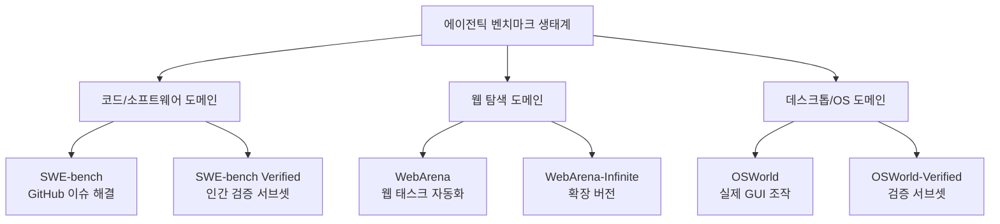
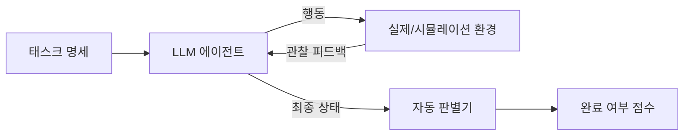

# 에이전틱 벤치마크 개요

에이전틱 벤치마크(agentic benchmark)는 LLM이 단순 질의응답을 넘어 **실제 환경에서 다단계 작업을 완수하는 능력**을 측정한다. 전통적인 4지선다나 코드 생성 벤치마크와 달리, 에이전틱 벤치마크는 외부 도구 사용, 환경과의 상호작용, 장기 계획 수립 등을 포함한 복합 능력을 평가한다.

## 왜 에이전틱 벤치마크가 필요한가

전통 벤치마크([[arc-benchmark]], [[mmlu]], [[humaneval]] 등)의 한계:

- 단일 턴(single-turn) 상호작용만 측정
- 실제 환경 피드백 없음 (정적 입출력)
- 도구 사용, 웹 탐색, 파일 조작 등을 측정 불가
- LLM이 에이전트로 배포될 때의 실제 능력과 괴리

에이전틱 벤치마크는 이 간극을 메우기 위해 실제 또는 시뮬레이션 환경 속에서 **작업 완료율(task completion rate)**을 주요 지표로 삼는다.

## 주요 에이전틱 벤치마크 비교

### SWE-bench

- **도메인**: 소프트웨어 엔지니어링 (Python 오픈소스 프로젝트)
- **과제**: GitHub 이슈를 분석하고 해당 버그를 수정하는 코드 패치 작성
- **데이터**: 실제 GitHub 이슈와 PR 쌍 (2,294개)
- **평가 지표**: 테스트 통과율 (resolved rate)
- **특징**: 전체 코드베이스를 탐색하고, 문맥을 이해하며, 올바른 파일의 올바른 위치를 수정해야 함
- 참조: [[swe-bench-ecosystem-2026]]

### WebArena

- **도메인**: 웹 탐색 및 조작
- **과제**: 실제 웹사이트(이메일, 쇼핑, Reddit, GitLab 등)에서 지시를 수행
- **데이터**: 812개 롱폼 태스크
- **평가 지표**: 태스크 성공률 (기능 및 UI 기반 판별)
- **특징**: 브라우저 자동화 도구(Playwright 등)를 통한 실시간 환경 조작

### OSWorld

- **도메인**: 데스크톱 운영체제 (Windows/macOS/Linux)
- **과제**: GUI 화면을 보고 마우스/키보드로 실제 앱을 조작
- **데이터**: 369개 컴퓨터 태스크 (Office, 웹브라우저, 코드 편집기 등)
- **평가 지표**: 태스크 완료율
- **특징**: 스크린샷을 입력으로 받아 픽셀 수준의 상호작용 생성
- 참조: [[osworld-verified]]

## 벤치마크 특성 비교표

| 벤치마크 | 환경 | 평균 턴 수 | 도구 사용 | 난이도 |
|----------|------|-----------|-----------|--------|
| SWE-bench | 코드 저장소 | 수십~수백 | 파일시스템, 쉘 | 높음 |
| WebArena | 실시간 웹 | 10-30 | 브라우저 API | 중간 |
| OSWorld | 데스크톱 GUI | 5-20 | 화면+마우스/키보드 | 높음 |

## 평가의 공통 과제

에이전틱 벤치마크는 전통 벤치마크보다 평가가 복잡하다:

1. **자동 판별의 어려움**: "태스크를 완료했는가?"를 자동으로 판단하기 위해 환경 상태 스냅샷, 기능 검증기, LLM 판별자 등 복합적 방법 필요
2. **환경 재현성**: 동일 태스크를 여러 번 실행해도 환경 상태가 동일해야 하는 격리(isolation) 요구
3. **장기 의존성**: 초반 행동이 후반 태스크에 영향을 미치는 긴 체인
4. **비결정론적 실행**: 같은 프롬프트도 실행마다 다른 경로를 취할 수 있어 통계적 평균 필요

## 인간 기준선(Human Baseline)

에이전틱 벤치마크의 인간 성능:

| 벤치마크 | 인간 기준선 | 최신 모델 최고 성능 |
|----------|------------|-------------------|
| SWE-bench Full | ~100% | ~50% (2026 기준) |
| SWE-bench Verified | ~100% | ~60% |
| WebArena | ~78% | ~35-45% |
| OSWorld | ~72% | ~25-35% |

여전히 인간과의 격차가 크다는 점에서, 에이전틱 벤치마크는 포화 없이 지속적인 변별력을 제공한다.

## 한계와 비판

- **비용**: 실제 환경 실행으로 평가 비용이 수천 달러 수준
- **재현성**: 외부 서비스 상태 변화로 동일 결과 재현 어려움
- **편향**: 영어 기반, 특정 소프트웨어 스택 편향
- **에이전트 설계 의존성**: 동일 모델도 에이전트 프레임워크 설계에 따라 점수 편차 큼

## 관련 문서
- [[truthfulqa-benchmark]] -- TruthfulQA 벤치마크

- [[swe-bench-ecosystem-2026]] - SWE-bench 생태계 상세
- [[osworld-verified]] - OSWorld 검증 서브셋 상세
- [[arc-benchmark]] - 전통적 추론 벤치마크와의 대비
- [[livecodebench]] - 코딩 도메인의 동적 벤치마크
- [[evaluation-harness]] - 벤치마크 실행 공통 인프라
