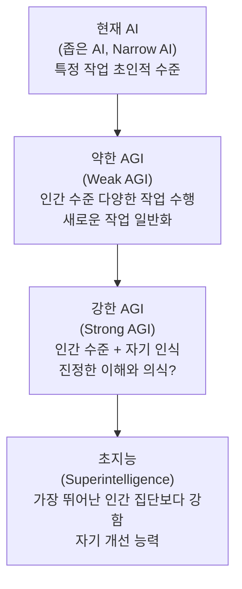
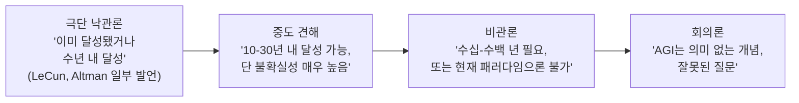
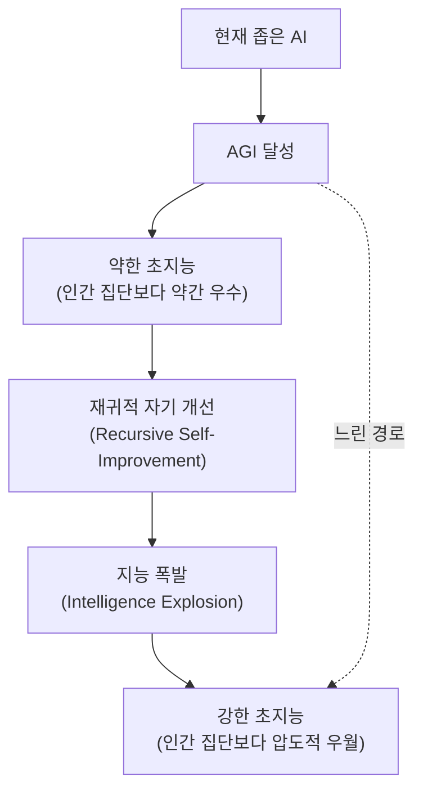

# AGI/초지능 논쟁

## 정의 / 본질

**AGI(Artificial General Intelligence, 인공 일반 지능)**는 특정 좁은 영역에만 능숙한 현재의 AI와 달리, 인간이 수행할 수 있는 **모든 인지 작업**을 수행할 수 있는 AI를 가리킨다. **초지능(Superintelligence)**은 더 나아가 대부분의 영역에서 가장 뛰어난 인간을 능가하는 AI를 의미한다.

이 두 개념을 둘러싼 논쟁은 AI 연구에서 가장 격렬하고 중요한 논쟁 중 하나다. 핵심 쟁점은 세 가지다:

1. **정의 문제**: AGI란 정확히 무엇인가? 어떤 기준을 충족해야 AGI라 부를 수 있나?
2. **측정 문제**: AGI 달성을 어떻게 측정하고 판단할 수 있나?
3. **시기 문제**: AGI는 언제 올 것인가? (혹은 오지 않을 것인가?)

---

## AGI의 정의 논쟁

### 다양한 AGI 정의

"AGI"에 대한 합의된 정의가 없다는 것이 논쟁의 시작점이다:

| 정의 | 제안자/입장 | 핵심 기준 |
|------|------------|---------|
| 튜링 테스트 통과 | Alan Turing (1950) | 인간 심사관을 속일 수 있는 대화 능력 |
| 경제적 가치 AGI | Sam Altman / OpenAI | "대부분의 경제적 작업을 인간보다 잘 수행" |
| 과학적 AGI | Demis Hassabis | "새로운 과학 지식을 자율적으로 발견" |
| 인지 범용성 | 학술 AI 연구자 | 다양한 인지 도메인에서 균형 잡힌 능력 |
| 조작 능력 | 로보틱스 관점 | 물리적 환경에서 다양한 작업 자율 수행 |
| 자기 개선 | 재귀적 자기 향상 가능 | 스스로 더 나은 버전의 자신을 만들 수 있음 |

이러한 정의 다양성은 "AGI가 이미 달성됐다"와 "AGI는 아직 수십 년 멀었다"는 상반된 주장이 **동시에 옳을 수 있는** 상황을 만든다. 정의에 따라 달라지기 때문이다.

### "약한 AGI" vs "강한 AGI"

많은 연구자들은 약한 AGI는 달성 가능하다고 보지만, 강한 AGI(특히 의식/이해 포함)는 별도의 질적 도약이 필요하다고 주장한다.

---

## 측정 문제: AGI 벤치마크

### 기존 벤치마크의 한계

| 벤치마크 | 무엇을 측정하나 | 한계 |
|---------|--------------|------|
| 튜링 테스트 | 인간 구별 불가 대화 | LLM이 이미 통과 수준, 하지만 진정한 이해 불명 |
| IQ 테스트 | 언어/수리 추론 | 협소, 인간 편향, 훈련으로 달성 가능 |
| 체스/바둑 | 특정 게임 | 좁은 도메인, 전이 없음 |
| MMLU | 다양한 지식 질의 | 암기 vs 추론 구분 어려움 |
| ARC-AGI | 추상적 패턴 인식 | 인간도 어렵지 않은 패턴 |
| 실제 작업 | 실세계 다양한 업무 | 측정 비용, 주관적 판단 |

François Chollet이 제안한 ARC(Abstraction and Reasoning Corpus) 벤치마크는 특히 "훈련 데이터로 달성 불가능한 일반화"를 측정하려는 시도였으나, 최신 모델들이 이 벤치마크에서도 높은 점수를 내면서 논쟁이 계속되고 있다.

### "GPT-4는 AGI인가?" 논쟁

2023년 마이크로소프트 연구팀의 논문 "Sparks of Artificial General Intelligence"는 GPT-4가 AGI의 초기 형태를 보인다고 주장했다. 이에 대한 반응:

- **동의 측**: 다양한 도메인에서 인상적 성능, 새로운 작업에 빠른 적응
- **반대 측**: 진정한 이해(grounding) 없음, 체계적 추론 실패, 환각(hallucination), 상식 오류

---

## 도래 시기 논쟁

### 낙관론 vs 비관론 스펙트럼

### 주요 입장별 대표 논거

#### 가까운 미래 가능론 (Near-term AGI advocates)

- **스케일링 법칙 신봉**: 컴퓨팅, 데이터, 파라미터가 늘수록 꾸준히 개선 -> 충분히 크면 AGI
- **LLM 창발적 능력**: 예상치 못한 능력들이 갑자기 창발 -> 더 큰 모델에서 AGI 창발 가능
- **경제적 인센티브**: 수십억 달러 투자, 최고 인재 집중 -> 빠른 진전
- **대표 인물**: Sam Altman (OpenAI), Dario Amodei (Anthropic), Demis Hassabis (Google DeepMind)

#### 먼 미래론 / 패러다임 전환 필요론

- **현재 LLM의 근본 한계**: 인과 추론, 체계적 일반화, 실세계 이해 결여
- **새로운 아키텍처 필요**: Transformer + 다음 무언가가 필요
- **지식과 이해의 차이**: LLM은 통계적 패턴을 학습하지 진정한 이해를 하지 않음
- **대표 인물**: Yann LeCun (Meta), Gary Marcus, Melanie Mitchell

#### 원칙적 회의론

- **"AGI"는 모호한 개념**: 잘 정의된 과학 목표가 아님, 마케팅 용어화 우려
- **지능의 단일 척도 거부**: 인간 지능도 다면적, 단일 스펙트럼에 놓기 어렵다
- **대표 인물**: Gary Marcus, Emily Bender (Stochastic Parrots 저자)

---

## 초지능 논쟁

### 초지능의 유형 (Bostrom 분류)

Nick Bostrom은 *Superintelligence* (2014)에서 세 가지 초지능을 구분했다:

| 유형 | 설명 | 예시 |
|------|------|------|
| 속도 초지능 (Speed Superintelligence) | 인간 지능과 동일하지만 훨씬 빠름 | 인간 두뇌 에뮬레이션 x 1000배 속도 |
| 집단 초지능 (Collective Superintelligence) | 다수의 AI/인간 협력으로 창발 | 고도로 연결된 AI 군집 |
| 품질 초지능 (Quality Superintelligence) | 인간보다 근본적으로 우수한 인지 능력 | 이해, 창의성, 문제해결에서 질적 우월 |

### 초지능 도달 경로

[[ai-takeoff-scenarios|AI 이륙 시나리오]]와 연결: 자기 개선 루프가 얼마나 빠르게 돌아가는지에 따라 초지능 도달 속도가 달라진다.

---

## AGI 안전 연구의 흐름

### 주요 연구 기관 및 접근법

| 기관 | 접근법 | 핵심 주장 |
|------|--------|---------|
| OpenAI | Superalignment, RLHF | 현재 ML 기법 + 강화 정렬으로 해결 |
| Anthropic | Constitutional AI, 해석가능성 | 모델 내부 이해가 안전의 핵심 |
| DeepMind | 안전 기술 연구 + 능력 연구 병행 | 양쪽 동시 진전 |
| ARC (Alignment Research Center) | 에이전트 자율 AI 안전 | 에이전트 AI의 장기 정렬 |
| MIRI (Machine Intelligence Research Institute) | 수학적 AI 안전 | 형식적 보장이 필요 |

### 핵심 연구 문제들

1. **[[orthogonality-thesis|직교성 문제]]**: 강한 AI는 어떤 목표도 가질 수 있음 -> 의도적 정렬 필요
2. **[[instrumental-convergence|도구적 수렴]]**: 강한 AI는 자기 보존, 자원 획득을 추구할 것
3. **[[corrigibility-alignment|교정가능성]]**: 강한 AI를 인간이 통제/수정할 수 있어야 함
4. **해석가능성(Interpretability)**: AI 내부를 이해해야 신뢰 가능
5. **능력 평가(Evaluation)**: 위험한 능력을 사전에 탐지

---

## 회의론자 주요 논거 정리

### LeCun의 "아직 멀었다" 논거

Yann LeCun은 현재 LLM이 AGI가 아닌 이유로 다음을 제시한다:
- **물리 세계 이해 부재**: 아기도 이해하는 중력, 인과관계를 LLM은 모름
- **자율 학습 없음**: 텍스트 예측에 최적화, 능동적 세계 탐색 없음
- **계획/실행 루프 없음**: 실시간 의사결정 시스템 없음
- **해결책**: 세계 모델(world model) 기반 새 아키텍처 필요 (JEPA 제안)

### Bender et al. "Stochastic Parrots" 논거

언어 모델의 AGI 가능성에 대한 근본적 회의론:
- 언어 모델은 의미(meaning)가 아닌 형식(form)을 학습
- 충분히 큰 통계 모델이 지능을 가질 것이라는 가정은 근거 없음
- "앵무새처럼 패턴 반복"이 이해를 의미하지 않음

---

## 옹호론자 주요 논거 정리

### 스케일링 법칙 (Scaling Laws)

Kaplan et al. (2020)이 보인 경험적 법칙: 모델 크기, 데이터, 컴퓨팅이 증가하면 성능이 예측 가능하게 개선. 현재 추세를 외삽하면 AGI 수준 성능이 가능하다는 주장.

**반론**: 스케일링이 영원히 계속되지 않으며, 특정 능력(진정한 추론, 인과 이해)은 스케일로 달성 불가능할 수 있음.

### 창발적 능력 (Emergent Capabilities)

Wei et al. (2022): 충분히 큰 모델에서 예상치 못한 새 능력이 **비선형적으로** 창발. 이는 AGI적 창발도 가능하다는 시사.

**반론**: 창발이 비선형적이라면 안전 문제도 비선형적으로 악화될 수 있음 (양날의 검).

---

## 정책 및 사회적 함의

AGI 논쟁은 단순히 기술적 논쟁이 아니라 심각한 정책 함의를 갖는다:

- **규제 타이밍**: AGI가 가깝다면 지금 당장 규제 필요 / 멀다면 혁신 저해 우려
- **국제 경쟁**: 중미 AI 경쟁에서 AGI를 "우주 경쟁"처럼 보는 시각
- **노동 시장**: AGI 도래 시기에 따라 재훈련/사회 안전망 정책 타이밍 달라짐
- **안전 투자**: "AGI가 위험하다면 지금 안전 연구 투자해야" vs "아직 너무 이르다"

[[transformative-ai-impact]]와 [[ai-existential-risk]]에서 더 상세히 다룬다.

---

## 한계 / 열린 문제

1. **의식/이해 기준 불명확**: 진정한 이해가 필요한지, 기능적 동등성으로 충분한지 미해결
2. **측정 방법 부재**: 모든 벤치마크는 해킹 가능하며, 진정한 AGI 능력을 측정하는 방법 없음
3. **정의의 정치성**: "AGI 달성"을 선언하는 것이 기업/국가 이익과 연결되어 정치화
4. **자기 개선 가능성**: 재귀적 자기 개선이 실제로 가능한지, 물리적 한계가 있는지 불명확

---

## 관련 문서

- [[ai-takeoff-scenarios]] - AI 이륙 시나리오: AGI 이후 발전 속도
- [[transformative-ai-impact]] - 변혁적 AI의 사회적 영향
- [[orthogonality-thesis]] - 직교성 가설: AGI의 목표에 관한 중요 이론
- [[instrumental-convergence]] - 도구적 수렴: AGI 안전의 핵심 우려
- [[corrigibility-alignment]] - 교정가능성: AGI 통제 가능성
- [[ai-existential-risk]] - AI 실존적 위험
