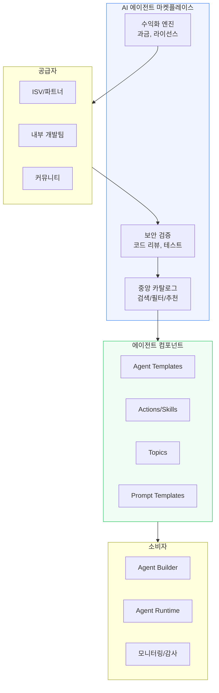

# AI 에이전트 마켓플레이스

AI 에이전트를 검색, 배포, 거래할 수 있는 중앙 집중형 플랫폼. 2025-2026년 Salesforce AgentExchange, Google Cloud Agent Garden 등이 본격 출시되면서 AI 에이전트의 "앱 스토어" 시대가 열리고 있다.

## 개요

AI 에이전트 마켓플레이스는 사전 구축된 AI 에이전트, 도구, 액션, 프롬프트 템플릿을 중앙 카탈로그에서 검색하고 배포할 수 있는 플랫폼이다. 기존 SaaS 앱 마켓플레이스(Salesforce AppExchange, AWS Marketplace 등)가 소프트웨어 패키지 단위로 거래했다면, 에이전트 마켓플레이스는 **에이전트 단위의 디지털 노동력**을 거래한다는 점에서 패러다임 전환이다. Salesforce는 이를 "$6조 규모의 디지털 노동 시장"으로 정의한다.

2026년 현재 주요 플레이어는 Salesforce AgentExchange, Google Cloud Agent Garden/Gemini Enterprise, AWS Agent Registry(AgentCore)로, 각각 고유한 생태계와 거버넌스 모델을 제공한다.

## 주요 플랫폼

### Salesforce AgentExchange

2025년 3월 4일 출시된 AgentExchange는 Agentforce 생태계의 공식 마켓플레이스다. AppExchange 18년간의 파트너 생태계를 기반으로, AI 에이전트 시대에 맞게 재구성되었다.

핵심 사양:
- **200+ 초기 파트너**: Google Cloud, Docusign, Box 등 주요 기업 참여
- **4가지 컴포넌트 유형**: Actions(에이전트 기능 확장), Topics(특정 작업 집중), Prompt Templates(재사용 프롬프트), Agent Templates(종합 솔루션)
- **보안 검증**: 엄격한 보안 및 고객 리뷰 통과 필수
- **수익화 모델**: 컴포넌트 단위 판매(가장 일반적), 구독, 번들 등 다양한 모델 지원
- **내장 검색**: Salesforce Agent Builder 도구 내에서 직접 검색/설치 가능

### Google Cloud Agent Garden & Gemini Enterprise

Google Cloud는 이중 구조로 에이전트 마켓플레이스를 운영한다.

**Agent Garden**: Vertex AI 콘솔 내 에이전트/도구 샘플 라이브러리. 고객 서비스, 데이터 분석, 창작 등 사전 구축된 엔드투엔드 솔루션 제공. ADK(Agent Development Kit)와 통합. 태그 기반 필터링 지원.

**Gemini Enterprise**: 엔터프라이즈 에이전트 마켓플레이스. 커스텀 에이전트를 조직 내에서 게시/공유하면서 중앙 거버넌스와 모니터링을 유지. 2026년 Agent Designer(로우코드 비주얼 디자이너) 프리뷰 출시, A2A(Agent-to-Agent) 프로토콜 지원 등 업데이트가 이어지고 있다.

### AWS Agent Registry (AgentCore)

2026년 4월 프리뷰로 공개된 AWS Agent Registry는 에이전트, 도구, 스킬, MCP 서버를 중앙 카탈로그로 관리한다. 시맨틱 검색, 승인 워크플로, CloudTrail 감사 추적을 제공하며, 대규모 에이전트 관리에 초점을 맞춘다.

## 마켓플레이스 아키텍처

## 시장 구조 비교

| 특성 | Salesforce AgentExchange | Google Agent Garden | AWS Agent Registry |
|------|--------------------------|--------------------|--------------------|
| 출시 시점 | 2025.03 | 2025 | 2026.04 (프리뷰) |
| 생태계 기반 | AppExchange 18년 | Vertex AI/GCP | AWS Bedrock/AgentCore |
| 파트너 수 | 200+ | 비공개 | 비공개 |
| 거버넌스 | Salesforce Trust Layer | Google Cloud IAM | CloudTrail 감사 |
| 프로토콜 | Agentforce API | A2A, ADK | MCP 서버 지원 |
| 타겟 | CRM/비즈니스 프로세스 | 범용 AI 에이전트 | 클라우드 인프라 |
| 수익화 | 컴포넌트 판매, 구독 | GCP 과금 통합 | AWS Marketplace 통합 |

## 산업적 의미

### 디지털 노동 시장의 형성

AI 에이전트 마켓플레이스는 소프트웨어 산업의 세 번째 플랫폼 전환을 나타낸다. 첫 번째는 패키지 소프트웨어(라이선스), 두 번째는 SaaS(구독), 세 번째가 에이전트(디지털 노동)다. Salesforce가 정의한 $6조 디지털 노동 시장에서 에이전트는 더 이상 도구가 아니라 "디지털 워커"로 포지셔닝된다.

### 표준화와 상호운용성 과제

현재 각 마켓플레이스는 자사 생태계 중심으로 설계되어 있어, 크로스 플랫폼 에이전트 배포가 어렵다. [[agentic-ai-foundation|AAIF(Agentic AI Foundation)]]가 MCP, A2A 등 프로토콜 표준화를 추진하고 있으나, 실질적인 마켓플레이스 간 상호운용성은 아직 초기 단계다.

### 보안과 신뢰 문제

에이전트는 기존 앱과 달리 자율적으로 행동하므로, 마켓플레이스의 보안 검증이 더욱 중요하다. [[owasp-agentic-top-10|OWASP Agentic Top 10]]이 식별한 Agent Goal Hijack, Tool Misuse 등의 위협이 마켓플레이스 컴포넌트에도 적용된다. Salesforce는 엄격한 보안 리뷰를 필수화했고, AWS는 CloudTrail 기반 감사 추적을 제공한다.

### 앱 마켓플레이스와의 차이

에이전트 마켓플레이스는 기존 앱 마켓플레이스(Apple App Store, Google Play, Salesforce AppExchange)와 근본적으로 다른 도전 과제를 안고 있다:

| 차원 | 앱 마켓플레이스 | 에이전트 마켓플레이스 |
|------|---------------|-------------------|
| 실행 단위 | 정적 코드 패키지 | 자율적 행동 에이전트 |
| 검증 범위 | 코드 리뷰, API 호환성 | 행동 안전성, 목표 정렬, 권한 범위 |
| 리스크 | 데이터 유출, 악성 코드 | 목표 탈취, 도구 오용, 연쇄 에이전트 공격 |
| 과금 모델 | 다운로드/구독 | 실행 횟수, 토큰 소비, 작업 완료 |
| 업데이트 | 사용자 승인 후 적용 | 모델 변경 시 행동 변화 가능 |

에이전트는 설치 후에도 외부 도구를 호출하고, 다른 에이전트와 상호작용하며, 환경에 따라 다르게 행동할 수 있다. 이 비결정적 특성은 마켓플레이스의 품질 보증 체계에 새로운 접근이 필요함을 의미한다.

## 전망

2026년 후반에는 마켓플레이스 간 경쟁이 심화되면서, 에이전트 품질 평가 지표, 표준화된 에이전트 카드(메타데이터), 크로스 플랫폼 호환성이 핵심 차별화 요소로 부상할 전망이다. [[mcp-server-cards|MCP Server Cards]]와 .well-known/mcp.json 기반 자동 검색 인프라가 이 방향의 초기 사례다.

장기적으로는 에이전트 마켓플레이스가 "에이전트 고용 플랫폼"으로 진화할 가능성이 있다. 기업이 특정 업무에 맞는 에이전트를 검색하고, 성과 기반으로 평가하며, 필요에 따라 교체하는 -- 인력 시장과 유사한 역학이 형성될 수 있다.

## 관련 문서

- [[agentic-ai-production|Agentic AI 프로덕션]]
- [[agentic-engineering|Agentic Engineering]]
- [[mcp-server-cards|MCP Server Cards]]
- [[aws-agent-registry|AWS Agent Registry]]
- [[owasp-agentic-top-10|OWASP Agentic Top 10]]
- [[nist-ai-agent-standards|NIST AI Agent Standards]]
