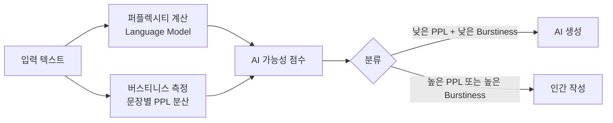
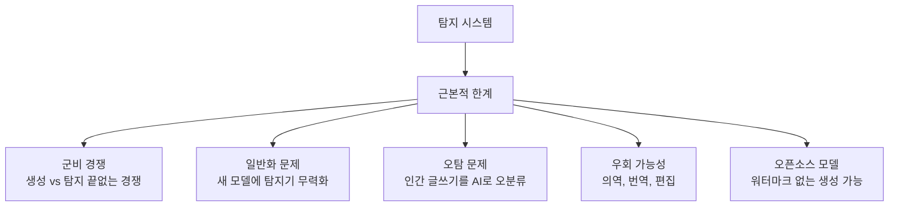

# AI 생성 콘텐츠 탐지 (AI-Generated Content Detection)

## 개요

AI 생성 콘텐츠 탐지(AI-Generated Content Detection, AIGC Detection)는 텍스트, 이미지, 오디오, 비디오 등 다양한 미디어에서 AI 모델이 생성한 콘텐츠를 자동으로 식별하는 기술 분야다. ChatGPT, Stable Diffusion, Sora 등 강력한 생성 모델의 대중화로, AI 생성 콘텐츠가 학술 부정행위, 허위 정보, 딥페이크, 저작권 침해 등 다양한 사회적 문제의 매개체가 되면서 탐지 기술의 중요성이 급증하였다.

탐지 기술은 크게 두 접근으로 분류된다:
- **능동적(Proactive) 탐지**: 생성 시 [[ai-watermarking|워터마크]]를 삽입하여 사후 탐지를 용이하게 함
- **수동적(Passive) 탐지**: 워터마크 없이 콘텐츠의 통계적·구조적 특성으로 탐지

이 페이지는 **수동적 탐지** 기법을 중심으로 다룬다. 능동적 워터마킹은 [[ai-watermarking]]을 참조.

---

## 텍스트 탐지

### 통계적 접근법

AI 생성 텍스트는 인간 텍스트와 다른 통계적 분포를 보인다는 관찰에 기반한다.

**퍼플렉시티(Perplexity) 기반**:
- 언어 모델의 퍼플렉시티는 입력 텍스트가 해당 모델에게 "얼마나 놀라운가"의 척도
- AI 생성 텍스트는 해당 모델(또는 유사 모델)에게 낮은 퍼플렉시티를 가짐
- 한계: 오픈 소스 모델 여러 개를 앙상블로 사용하면 탐지기 LLM과 생성 LLM이 달라 효과가 감소

**엔트로피 기반**:
- AI 텍스트는 전체적으로 낮은 엔트로피(높은 예측 가능성)를 보이는 경향
- 하지만 고품질 AI 텍스트는 창의성을 시뮬레이션하여 엔트로피를 높임 -> 구별 어려워짐

### GPTZero

Edward Tian이 2023년 1월에 공개한 AI 텍스트 탐지 도구. 두 가지 핵심 지표를 사용한다:

1. **퍼플렉시티(Perplexity)**: 전체 텍스트에 대한 언어 모델의 당혹도. 낮을수록 AI 생성 가능성 높음
2. **버스티니스(Burstiness)**: 퍼플렉시티의 변동성. 인간 텍스트는 복잡한 문장과 단순한 문장이 교차하여 버스티니스가 높고, AI 텍스트는 균일하게 매끄러워 버스티니스가 낮음



**GPTZero의 한계**:
- 영어에 최적화. 다른 언어 성능 저하
- 어린이 글쓰기, 외국어 화자 글쓰기도 AI로 오분류하는 사례 보고
- 의역이나 편집으로 탐지 우회 가능
- GPT-4 등 최신 고성능 모델일수록 탐지가 어려워짐

### DetectGPT

Mitchell et al. (2023)의 제로샷 AI 텍스트 탐지 방법. 핵심 아이디어: **AI가 생성한 텍스트는 해당 모델의 로그 확률 공간에서 로컬 최댓값(local maximum) 근처에 있다**.

1. 원본 텍스트의 로그 확률 계산
2. 텍스트를 소폭 변형(마스킹 언어 모델 활용)하여 수십 개의 변형본 생성
3. 변형본들의 로그 확률이 원본보다 낮은 비율 측정
4. 인간 텍스트보다 AI 텍스트에서 이 비율이 높을 것으로 예측

**장점**: 탐지기를 별도로 학습할 필요 없음 (zero-shot)  
**단계**: 탐지 모델과 생성 모델이 같을 때 효과적. 다른 모델에서는 성능 저하.

### 워터마크 기반 텍스트 탐지

[[ai-watermarking]]에서 설명한 그린-레드 리스트 방식을 생성 시 적용하면, 이후 탐지기가 동일 키로 그린 토큰 비율을 측정하여 통계 검정(이항 검정, z-검정)으로 판별한다. OpenAI, Google 등 주요 생성 모델 제공사가 워터마크 탐지 API를 제공하는 방향으로 이동하고 있다.

### 미세 조정 분류기 (Fine-tuned Classifier)

특정 모델(GPT-4, Claude, Llama 등)이 생성한 텍스트와 인간 텍스트를 학습 데이터로 사용하여 이진 분류기를 미세 조정하는 방법. OpenAI, Turnitin 등이 사용하는 주요 접근법.

**성능 사례**:
- GPT-4로 작성된 에세이에 대해 최신 탐지기: AUC 0.90~0.95
- 하지만 ChatGPT 수정을 거친 인간 작성 텍스트나 인간이 수정한 AI 텍스트에서는 정확도 급락

---

## 이미지 탐지

### GAN 지문 분석

각 GAN 아키텍처는 업샘플링 방식 특성으로 인해 고유한 "지문(fingerprint)"을 이미지에 남긴다. 이를 주파수 도메인에서 식별:

- GAN은 업샘플링(ConvTranspose, Bilinear 등) 시 반복적 패턴이 발생
- 2D FFT(고속 푸리에 변환)로 이미지 스펙트럼을 분석하면 격자 패턴이 관찰됨
- 이 패턴은 인간이 제작한 이미지에는 없는 특징

```python
import numpy as np
import cv2

def detect_gan_fingerprint(image_path):
    """GAN 주파수 지문 분석 (개념 코드)"""
    img = cv2.imread(image_path, cv2.IMREAD_GRAYSCALE)
    
    # 2D FFT
    f = np.fft.fft2(img)
    fshift = np.fft.fftshift(f)
    magnitude = 20 * np.log(np.abs(fshift) + 1)
    
    # 격자 패턴 강도 측정
    # 실제 구현에서는 학습된 분류기로 판별
    center = magnitude.shape[0] // 2
    periodic_score = measure_periodic_pattern(magnitude, center)
    
    return periodic_score > threshold

def measure_periodic_pattern(magnitude, center):
    """주기적 패턴 측정 (실제 구현은 더 복잡)"""
    # 중심에서 방사상으로 주기적 피크 탐색
    pass
```

### 확산 모델 생성 이미지 탐지

GAN 기반 탐지기는 확산 모델 이미지에는 효과가 낮다. 확산 모델은 다른 생성 방식으로 인해 GAN 특유의 주파수 아티팩트가 없다.

확산 모델 이미지의 탐지 단서:
- **과도하게 매끄러운 텍스처**: 실제 이미지의 노이즈 특성과 다름
- **의미적 부자연스러움**: 손가락 개수, 텍스트, 글로벌 일관성 오류
- **EXIF 메타데이터 부재**: 카메라 기종, 셔터 속도 등 메타데이터 없음
- **카메라 노이즈 패턴**: 실제 카메라 센서 노이즈(Shot noise, Read noise 등)의 부재

### SynthID 탐지 (능동적)

Google DeepMind의 SynthID는 이미지 생성 시 불감지 워터마크를 삽입하고, 탐지기가 이를 식별한다. 자세한 내용은 [[ai-watermarking]] 참조.

### CLIP 기반 제로샷 탐지

CLIP의 대규모 사전 학습 표현을 활용하여 실제/AI 생성 이미지를 구분:
- CLIP 특성 공간에서 AI 생성 이미지는 일관된 클러스터를 형성
- 새로운 생성 모델에 대한 일반화 능력이 GAN 지문 방식보다 우수

---

## 오디오 탐지

AI 생성 오디오(TTS, 음성 복제)의 탐지:

### 스펙트럼 기반 특성

- **멜 스펙트로그램**: 합성 음성의 특정 주파수 대역(특히 4kHz 이상)이 과도하게 매끄럽거나 비자연적인 패턴
- **위상 일관성**: 자연 음성의 위상 관계는 합성 음성보다 복잡
- **포먼트 전이**: 음소 간 전이에서의 자연스러움 분석

### 딥러닝 탐지기

- **LCNN(Light CNN)**: 경량 CNN으로 스펙트로그램 분류
- **RawNet2**: 원시 파형에서 직접 학습
- **Wav2Vec 2.0 기반**: 사전 학습 음성 표현을 프로브로 활용

---

## 탐지의 근본적 한계



**오탐(False Positive) 문제**는 실무에서 가장 심각한 이슈다:
- GPTZero 등 도구가 인간이 쓴 학술 논문을 AI 생성으로 오분류하는 사례 다수 보고
- ESL(영어가 제2외국어인) 화자, 아동, 단순한 문체로 쓴 텍스트에서 오탐 증가
- 이를 근거로 한 학생 처벌 등 실제 피해 사례 발생

**AI 지원 글쓰기의 회색지대**:
- AI가 초안을 작성하고 인간이 수정한 경우
- 인간이 작성하고 AI가 교정한 경우
- 어디까지가 "AI 생성"인지 법적·윤리적 정의 미확정

---

## 평가 지표

탐지 시스템 평가에 사용하는 표준 지표:

| 지표 | 설명 | 중요성 |
|------|------|------|
| AUC-ROC | 임계값 무관 탐지 성능 | 전반적 성능 비교 |
| 정밀도(Precision) | 탐지된 것 중 실제 AI 비율 | 오탐 비용이 클 때 |
| 재현율(Recall) | 실제 AI 중 탐지된 비율 | 미탐 비용이 클 때 |
| F1 Score | 정밀도와 재현율의 조화 평균 | 균형 평가 |
| FPR @ 5% FNR | 특정 미탐율에서 오탐율 | 실무 배포 시나리오 |

---

## 실무 배포 고려사항

### 교육 분야

Turnitin AI Writing Detection이 대표 사례. GPT-4 도입 이후 표절 탐지에서 AI 생성 탐지로 확장. 오탐의 심각성으로 탐지 결과를 참고용으로만 사용하도록 권고.

### 미디어 및 저널리즘

Associated Press, BBC 등은 AI 생성 기사 탐지 도구를 편집 워크플로우에 통합하는 실험 중. C2PA 기반 콘텐츠 출처 메타데이터가 더 신뢰할 수 있는 접근법으로 주목받음.

### 소셜 미디어 플랫폼

Meta, YouTube 등은 AI 생성 영상에 레이블링 의무화. 자발적 신고에 의존하거나, 자체 탐지 시스템과 병행.

---

## 향후 방향

- **프로액티브 표준화**: C2PA와 같은 출처 메타데이터 표준이 수동 탐지보다 더 신뢰할 수 있는 장기 해결책
- **LLM-기반 탐지**: GPT-4 등 강력한 LLM 자체를 탐지기로 사용하는 연구. Chain-of-Thought로 탐지 근거 제시
- **앙상블 탐지**: 단일 탐지기의 한계를 극복하기 위한 다양한 방법 조합
- **멀티모달 탐지**: 텍스트+이미지+메타데이터를 동시에 분석하는 통합 접근

---

## 관련 문서

- [[ai-watermarking]] - 워터마크 삽입으로 탐지를 용이하게 하는 능동적 접근
- [[deepfake-detection]] - 딥페이크 비디오/이미지 탐지 상세
- [[privacy-preserving-ml]] - 탐지 시스템에서의 프라이버시 고려
- [[ai-content-moderation]] - 탐지 이후 정책 적용 및 플랫폼 운영
- [[differential-privacy]] - 생성 모델의 학습 데이터 보호

---

## 참고 자료

- Mitchell, E. et al. (2023). "DetectGPT: Zero-Shot Machine-Generated Text Detection using Probability Curvature." ICML 2023.
- Wang, Z. et al. (2024). "M-VADER: A Model for Detecting AI-Generated Video through Audio and Visual Evidence Reasoning." arXiv 2024.
- Corvi, R. et al. (2023). "On the Detection of Synthetic Images Generated by Diffusion Models." ICASSP 2023.
- Guo, B. et al. (2023). "How Close is ChatGPT to Human Experts? Comparison Corpus, Evaluation, and Detection." arXiv 2023.
