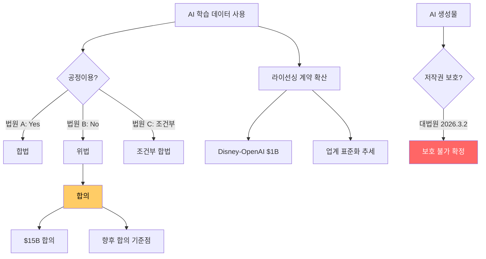

# AI 저작권 및 IP 소송

AI 학습 데이터 사용, AI 생성물의 저작권 보호, 라이선싱 등을 둘러싼 대규모 법적 분쟁의 전개.

## 개요

2026년 AI 저작권 소송은 전례 없는 규모로 확대되고 있다. Anthropic은 저자 집단소송에서 $15B(15억 달러) 합의를 진행 중이며, 미국 대법원은 2026년 3월 2일 AI 생성물에 대한 저작권 보호를 공식 거부했다(Thaler v. Perlmutter). 현재 50건 이상의 AI 저작권 소송이 계류 중이다. 법원마다 "학습이 공정이용인가"에 대한 판단이 갈리고 있어, 판례가 확립되기까지 상당 기간의 법적 불확실성이 예상된다.

## 핵심 개념

### 주요 소송 사례

| 소송 | 핵심 쟁점 | 결과/현황 |
|------|-----------|-----------|
| Thaler v. Perlmutter | AI 생성물 저작권 인정 여부 | 대법원 상고 기각 (2026.3.2) -- AI 저작권 보호 불가 확정 |
| Bartz et al. v. Anthropic | 학습 데이터 저작권 침해 | $15B 합의 진행 중 (저작당 ~$3,000) |
| Thomson Reuters v. Ross | 법률 AI 학습용 헤드노트 사용 | Thomson Reuters 승소, 제3순회 항소 중 |
| Kadrey et al. v. Meta | 불법 복제본으로 LLM 학습 | 학습은 공정이용으로 판단, 일부 계속 진행 |
| In Re OpenAI Copyright | 12건 통합소송 | 700만+ 산출 로그 제출 명령 |
| Disney et al. v. Midjourney | 이미지 생성 AI 저작권 | Disney-OpenAI 라이선싱 계약($1B 투자)과 병행 |

### 법적 쟁점의 분화

AI 저작권 소송에서 법원 간 판단이 가장 크게 갈리는 영역은 공정이용(Fair Use) 분석이다.

- **Bartz 판결**: "학습은 공정이용이나, 불법 복제본 저장은 위반"
- **Kadrey 판결**: "불법 출처 학습도 공정이용에 해당"
- **공통 쟁점**: 제4요소(시장 영향)에서 법원 간 의견 불일치가 가장 심각

### 음악 산업의 대응

음악 업계는 AI에 대한 가장 공격적인 법적 대응을 전개하고 있다.

- **BMG v. Anthropic** (2026.3.18): Bruno Mars, Rolling Stones 등 가사 무단 학습
- **Universal/Concord/ABKCO v. Anthropic** (2026.1.28): $3.1B 소송, "불법 복제 자료로 Claude 구축" 주장
- **GEMA v. OpenAI** (2025.11.11): 뮌헨 법원, 독일 저작권법 위반 판결

## 기술 상세

### AI 저작권 소송 생태계

### 소송 타임라인 (2025-2026)

- **2025.06**: Kadrey v. Meta 부분 기각 -- Meta 학습 공정이용 인정
- **2025.11**: 뮌헨 법원, OpenAI 독일 저작권법 위반 판결
- **2025.12**: Disney-OpenAI $1B 라이선싱 계약, NYT v. Perplexity 소송
- **2026.01**: Universal 등 v. Anthropic $3.1B 소송, Musk v. OpenAI 재판 승인
- **2026.03**: 대법원 AI 저작권 보호 거부, Anthropic $15B 합의, BMG v. Anthropic
- **2026.04**: Perplexity 데이터 공유 집단소송

### 라이선싱 추세

Disney-OpenAI 계약($1B 투자 + 캐릭터 라이선싱)이 업계 표준의 방향을 시사한다. 소송보다 라이선싱이 경제적으로 효율적이라는 인식이 확산되면서, 대형 콘텐츠 보유자와 AI 기업 간 전략적 제휴가 증가하고 있다.

### 기업 실무 시사점

Norton Rose Fulbright는 기업에 네 가지 실무 조치를 권고한다:
1. **AI 도구 실사**: 학습 데이터 출처와 라이선싱 현황 확인
2. **산출물 모니터링**: AI 생성물의 저작권 침해 가능성 상시 검토
3. **정책 수립**: AI 사용에 관한 내부 정책과 가이드라인 마련
4. **라이선싱 검토**: 필요시 콘텐츠 권리자와 사전 라이선싱 계약 체결

## 관련 문서

- [[ai-regulation-us|미국 AI 규제]]
- [[ai-safety-alignment-2026|AI 안전성과 정렬 (2026)]]
- [[sovereign-ai|주권 AI / 국가 AI 전략]]
