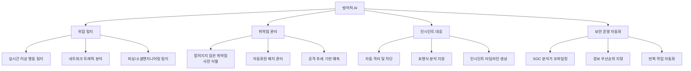
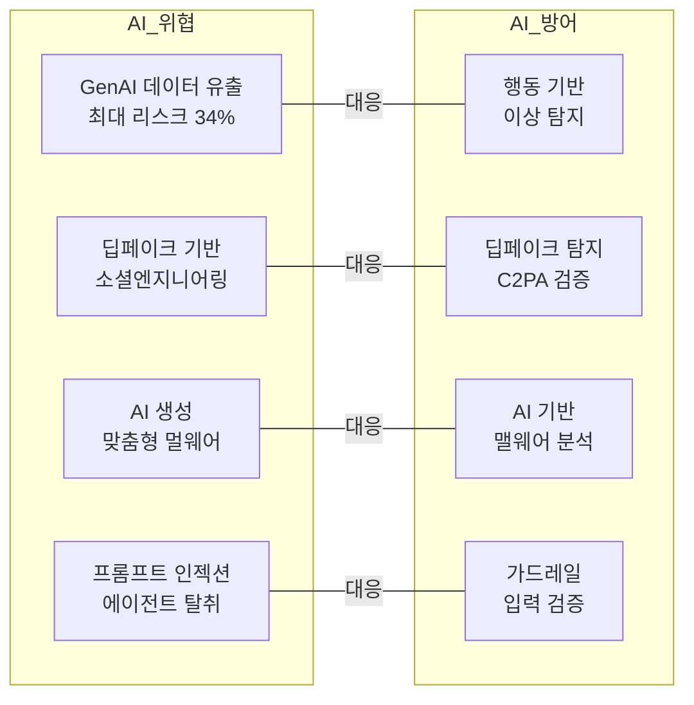

# AI Cybersecurity (Defensive AI)

조직의 77%가 GenAI를 보안 운영에 활용하고 있지만, 공식 정책을 보유한 곳은 37%에 불과하다. 가장 큰 리스크는 GenAI를 통한 데이터 유출(34%)이며, 73%의 조직이 이미 AI 기반 위협의 영향을 체감하고 있다. 방어적 AI는 사이버보안의 "칼과 방패" 양면에서 핵심 역할을 수행한다.

## 개요

2026년 사이버보안은 AI가 공격과 방어 양쪽에서 핵심 도구로 자리잡은 비대칭 전쟁의 양상이다. 방어적 AI(Defensive AI)는 위협 탐지, 취약점 사전 식별, 자동 대응, SOC(보안 운영 센터) 자동화 등에서 인간 분석가의 역량을 증폭시키는 "코파일럿" 역할을 한다. 그러나 AI 도구 자체가 새로운 공격 표면을 만들어내는 역설적 상황에 대한 거버넌스가 아직 미성숙하다.

## 방어적 AI 핵심 영역

### 위협 탐지 및 예측

AI 기반 위협 탐지 시스템은 글로벌 데이터와 공격 추세를 분석하여 위협을 사전에 예측하고 대응한다. 기존 시그니처 기반 탐지를 넘어, 행동 패턴 기반의 이상 탐지(anomaly detection)로 제로데이 공격에도 대응력을 확보한다.

ISACA에 따르면 "AI는 공개적으로 알려지기 전에 취약점을 식별하고 수정하는 방향으로 진화"하고 있다. 클라우드 환경에서의 지속적 모니터링은 실시간 데이터를 AI 시스템에 투입하여 자동으로 학습하고, 조정하며, 보호를 개선한다.

### SOC 자동화

사이버보안 인력 부족이 글로벌 과제인 상황에서, AI는 반복적 작업 자동화와 저수준 의사결정 증강 역할을 한다. 핵심은 AI를 "대체(replacement)"가 아닌 "코파일럿(copilot)"으로 활용하여 인간 분석가가 고수준 판단에 집중할 수 있게 하는 것이다.

| SOC 영역 | AI 역할 |
|----------|---------|
| 경보 분류 | 오탐 필터링, 우선순위 자동 지정 |
| 위협 인텔리전스 | 다중 소스 상관관계 분석, 패턴 식별 |
| 인시던트 조사 | 자동 타임라인 구성, 영향 범위 분석 |
| 대응 조치 | 플레이북 기반 자동 격리/차단 |
| 보고 | 인시던트 보고서 자동 생성 |

### 자동화된 패치 관리

AI가 취약점의 심각도, 악용 가능성, 시스템 의존성을 종합 분석하여 패치 우선순위를 결정하고 자동 배포하는 시스템이 보안 설계의 새로운 기준으로 부상 중이다.

## AI가 만드는 새로운 위협

### GenAI 데이터 유출 리스크

조직의 GenAI 사용이 확산되면서 민감 데이터가 외부 AI 서비스로 유출되는 리스크가 최대 우려 사항(34%)으로 부상했다. 직원이 고객 데이터, 소스 코드, 전략 문서 등을 GenAI 도구에 입력하는 "섀도우 AI" 사용이 통제되지 않고 있다.

### AI 기반 공격 고도화

73%의 조직이 AI 기반 위협의 영향을 이미 체감하고 있다. AI로 생성된 피싱 이메일, [[deepfake-detection-c2pa|딥페이크]] 기반 사칭, 맞춤형 멀웨어 등 공격의 정교함과 규모가 동시에 증가하고 있다.

## 거버넌스와 규제

### AI 보안 정책 격차

77%가 GenAI를 보안 운영에 사용하지만 공식 정책 보유는 37%에 불과한 "거버넌스 격차"가 가장 시급한 과제다.

### 주요 규제 프레임워크

| 프레임워크 | 설명 |
|------------|------|
| NIST AI RMF | AI 위험 관리 프레임워크 |
| ISO/IEC 42001 | AI 관리 시스템 국제 표준 |
| EU AI법 | 고위험 AI 시스템 규제 |
| GDPR | AI 처리 개인 데이터 보호 |
| [[llm-security-owasp|OWASP Top 10 for LLM/Agentic]] | LLM 및 에이전틱 애플리케이션 위협 목록 |

ISACA는 AI 시스템이 "처음부터 투명성과 책임성을 염두에 두고" 구축되어야 한다고 강조한다.

### Zero Trust for AI Agents

[[agent-prompt-injection-defense|에이전트 보안]]의 핵심 방향으로 AI 에이전트에 대한 Zero Trust 적용이 부상 중이다. NHI(비인간 신원)가 인간 대비 80:1 이상 비율로 존재하는 환경에서, Microsoft, Cisco, CSA가 에이전트 신원 관리, 최소 권한 원칙, 지속적 검증 프레임워크를 제시하고 있다.

## 실무 권고사항

1. **GenAI 사용 정책 수립**: 허용/금지 도구 목록, 데이터 분류 기준, 사용 가이드라인 제정
2. **AI 보안 거버넌스**: CISO 산하 AI 보안 전담 조직 구성
3. **지속적 모니터링**: AI 시스템의 입출력, 행동 패턴, 데이터 흐름 실시간 감시
4. **직원 교육**: AI 도구의 안전한 사용, 데이터 유출 방지, 피싱 대응 훈련
5. **인시던트 대응 계획**: AI 관련 보안 사고에 특화된 대응 플레이북 수립

## 관련 페이지

- [[llm-security-owasp|LLM 보안 OWASP]]
- [[agent-prompt-injection-defense|에이전트 프롬프트 인젝션 방어]]
- [[deepfake-detection-c2pa|딥페이크 탐지 C2PA]]
- [[ai-safety-alignment-2026|AI 안전성 & 정렬 연구 (2026)]]
- [[ai-finance|AI 금융]]
- [[ai-manufacturing|AI 제조 / 디지털 트윈]]

## 참고 자료

- [Kiteworks: AI Cybersecurity 2026 Trends Report](https://www.kiteworks.com/cybersecurity-risk-management/ai-cybersecurity-2026-trends-report/)
- [ISACA: 6 Cybersecurity Trends That Will Shape 2026](https://www.isaca.org/resources/news-and-trends/industry-news/2026/the-6-cybersecurity-trends-that-will-shape-2026)
- [WEF: Global Cybersecurity Outlook 2026](https://www.weforum.org/publications/global-cybersecurity-outlook-2026/in-full/3-the-trends-reshaping-cybersecurity/)
