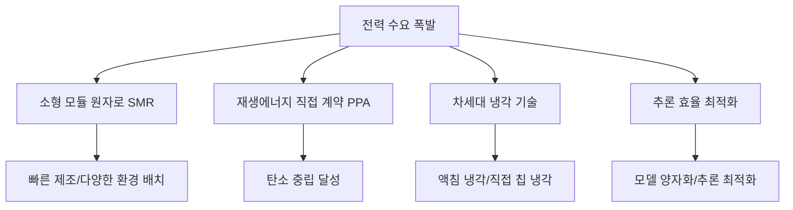

# AI 데이터센터 전력 위기

AI 워크로드 급증으로 인한 글로벌 데이터센터 전력 수요 폭발과 전력망 인프라 위기.

## 개요

IEA(국제에너지기구) 데이터에 따르면, 글로벌 데이터센터 전력 소비는 2024년 약 415 TWh(전 세계 전력 소비의 약 1.5%)에서 2030년 약 945 TWh(약 3%)로 2배 이상 증가할 전망이다. 이 성장의 가장 중요한 동인은 AI이며, 이는 [[ai-sustainability-paradox|AI 지속가능성 역설]]을 심화시키고 있다. 최근 데이터센터 전력 사용의 5-15%를 차지하던 AI 워크로드는 2030년까지 35-50%로 확대될 것으로 예측된다. 신규 데이터센터의 약 1/3이 전력망 독립형(grid-independent)으로 설계되고 있다.

## 핵심 개념

### 전력 수요 폭발의 규모

| 지표 | 2024년 | 2030년 전망 |
|------|--------|-------------|
| 데이터센터 전력 소비 | 415 TWh | 945 TWh |
| 글로벌 전력 대비 비중 | ~1.5% | ~3% |
| AI 워크로드 비중 | 5-15% | 35-50% |

### 전력망 스트레스

데이터센터는 전기차와 달리 특정 지역에 집중되는 경향이 있어 전력망 통합이 더 어렵다:

- 미국 버지니아주는 2023년 기준 전체 전력의 약 26%를 데이터센터가 소비
- 2024년 버지니아 페어팩스 카운티에서 발생한 경미한 장애로 60개 데이터센터가 백업 발전기로 전환, 약 1,500 MW의 급격한 부하 손실이 발생하여 광범위한 전력망 장애를 촉발할 뻔 함 -- 이는 보스턴 전체 전력 수요에 해당하는 규모
- **미국 전력망의 70%가 수명 말기**에 접근 중 (1950-1970년대 건설된 인프라)
- 주요 미국 시장(버지니아, 시카고, 애틀랜타, 피닉스)의 데이터센터 **공실률 1.6%** -- 사상 최저
- 대규모 빌드(10MW+)의 임대료가 **최대 19% 상승**, 74%가 선임대(pre-leasing) 계약

### 글로벌 규제 대응

각국이 데이터센터 전력 소비에 대한 규제를 강화하고 있다:

- **아일랜드**: 신규 데이터센터는 수요 대비 동등한 현장 발전/저장 설비를 갖추고 재생에너지 80% 목표를 달성해야 함
- **텍스트(미국)**: Senate Bill 6로 긴급 시 전력망 운영자에게 데이터센터 연결 해제 권한 부여

### 그리드 독립형 설계

신규 데이터센터의 상당수가 공공 전력망에 의존하지 않는 자체 발전 시설을 갖추는 방향으로 설계되고 있다. 이는 전력망 용량 부족과 연결 지연(grid interconnection queue) 문제를 우회하기 위한 전략이다. 데이터센터가 "수동적 에너지 소비자"에서 **"전력망 이해관계자"**로 전환하고 있으며, 유틸리티와 인프라 업그레이드에 공동 투자하고, 부하 유연성(load flexibility) 및 부하 차감(load shedding) 역량을 제공한다.

## 기술 상세

### 에너지 솔루션 동향

- **소형 모듈 원자로(SMR)**: 빠른 제조, 다양한 환경 배치 가능, 낮은 초기 비용. 데이터센터 사업자와 원자력 발전소 간 파트너십이 증가하고 있다
- **재생에너지 PPA**: 풍력/태양광 직접 전력구매계약을 통한 탄소 중립 전략. 현재 데이터센터 전력의 **27%가 재생에너지**이며, 재생에너지 발전은 **연 22% 성장**하여 2030년까지 데이터센터 전력 수요 증가분의 절반 가까이 충족 전망
- **냉각 혁신**: 전통적 공냉 방식의 한계로 액침(immersion) 냉각, 직접 칩 냉각 등 차세대 기술 도입 가속
- **현장 발전 및 저장**: 천연가스 터빈(탄소 포집 포함), HVO 연료 백업 발전기, 배터리 저장 시스템, 지열 등 다양한 현장 전원 도입
- **추론 효율 최적화**: 모델 양자화, 추측적 디코딩, 하드웨어 가속기 효율 개선으로 와트당 처리량 향상

### 투자 규모

McKinsey는 AI 주도 수요를 충족하기 위해 2030년까지 **7조 달러**의 자본 투자가 필요하다고 추정한다. Gartner는 2025년 데이터센터 전력 소비가 **전년 대비 16% 증가**했다고 집계했다.

### 장애 비용

Uptime Institute(2025)에 따르면 장애 빈도와 심각도는 4년 연속 감소 추세이나, 여전히 운영자 5명 중 1명이 건당 **100만 달러 이상**의 심각한 장애를 경험하고, 54%가 건당 **10만 달러 이상**의 손실을 보고한다. 2025년 10월 AWS 장애의 보험 손실 추정치는 **3,800만~5.81억 달러**에 달한다.

### 산업 영향

AI 추론 워크로드가 학습 워크로드를 넘어서면서, 추론 인프라의 에너지 효율이 데이터센터 설계의 핵심 과제가 되었다. [[nvidia-vera-rubin|NVIDIA Vera Rubin]]과 같은 차세대 플랫폼은 이 효율 문제를 하드웨어 통합으로 해결하려 한다. Goldman Sachs는 2030년까지 데이터센터 전력 수요가 **165% 증가**할 것으로 전망한다. IEA 기준으로 2030년 데이터센터 전력 소비 945 TWh는 **일본 전체 전력 사용량과 동등**한 규모다.

## 관련 문서

- [[ai-hot-topics-2026-04|2026년 4월 AI 개발 핫토픽 100선]]
