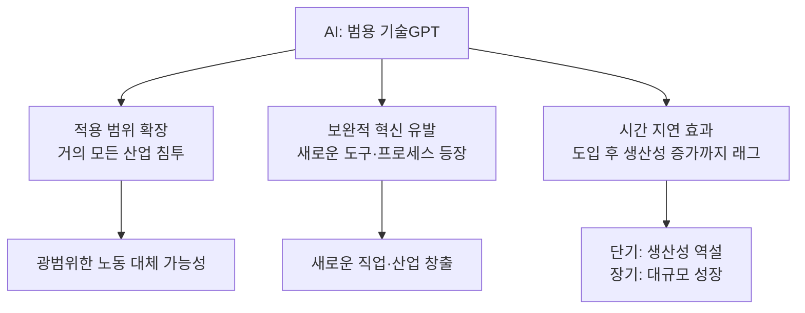
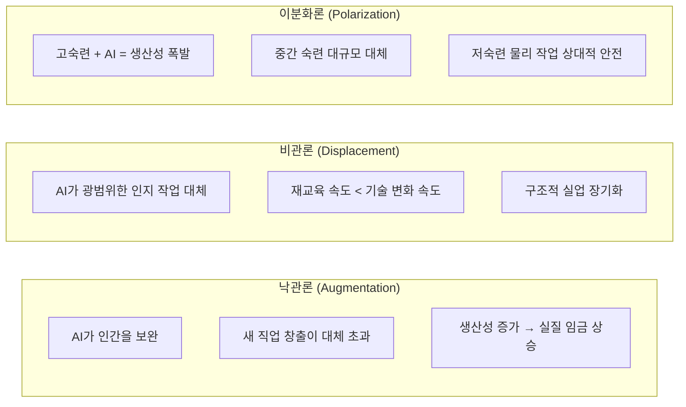
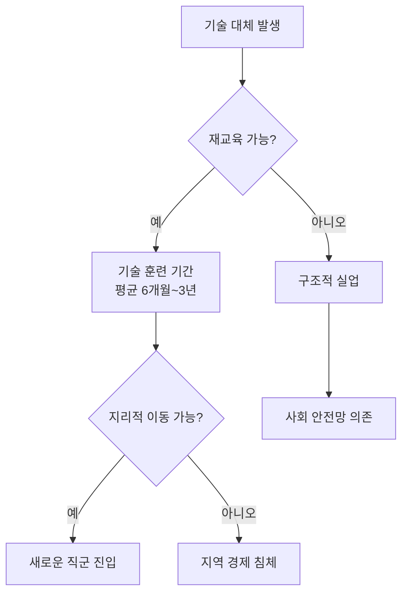
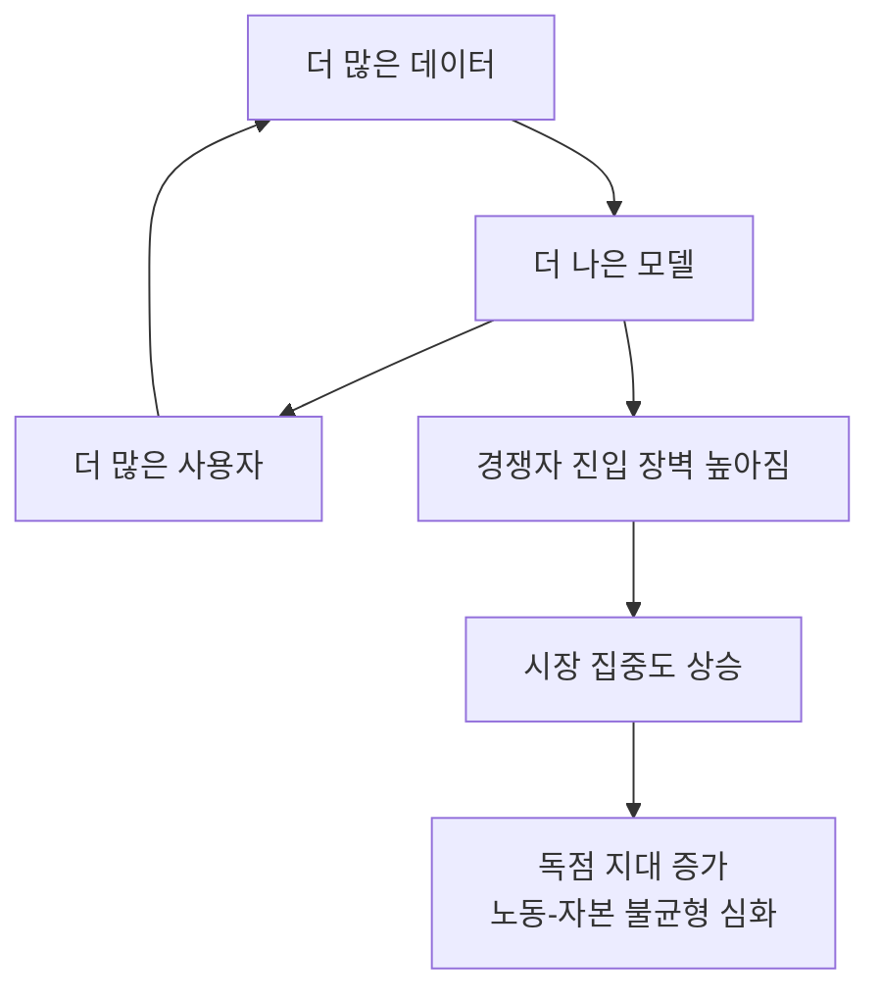

# AI 경제 영향 분석

## 정의와 본질

AI 경제 영향(AI Economic Impact)은 인공지능 기술의 확산이 거시경제 · 산업 구조 · 노동 시장 · 자본 배분에 미치는 총체적 효과를 분석하는 연구 분야다. 증기 기관, 전기, 인터넷 등 범용 기술(General Purpose Technology, GPT)과 비교하는 시각이 지배적이며, AI가 이전 기술 혁명과 유사하게 작동할 것인지, 아니면 질적으로 다른 파열을 일으킬 것인지가 핵심 논쟁이다.

분석 수준은 크게 세 층위로 나뉜다:
- **미시(Micro)**: 개별 기업 · 직무 · 근로자 수준의 생산성 · 임금 · 고용 변화
- **중간(Meso)**: 산업 · 지역 단위의 구조 변화 · 집중도 · 공급망 재편
- **거시(Macro)**: GDP 성장률, 총요소생산성(TFP), 불평등 지표, 국제 무역 패턴

---

## 핵심 아이디어

### 범용 기술로서의 AI

경제학자 Daron Acemoglu와 Simon Johnson의 분석에 따르면, AI가 범용 기술의 특성을 갖지만 이전 기술과 달리 '지식 작업(knowledge work)'에 집중적으로 영향을 미친다는 점이 역사적 선례와 다르다.

### 노동 시장 영향의 세 가지 시나리오

현재 주류 경제학은 이분화론(Polarization) 시나리오를 가장 유력하게 보고 있다. 이미 디지털화로 시작된 노동 시장 양극화가 AI로 심화될 가능성이 크다.

---

## 노동 시장 변화

### 직무 취약성 분석

Daron Acemoglu et al.(2022), McKinsey Global Institute(2023) 등의 연구는 직무를 AI 노출도에 따라 분류한다.

| 직무 유형 | AI 노출도 | 예시 | 전망 |
|-----------|-----------|------|------|
| 반복적 인지 작업 | 매우 높음 | 데이터 입력, 기초 분석, 표준 보고서 작성 | 단기 대체 위험 높음 |
| 전문적 지식 작업 | 높음 | 법률 문서 검토, 방사선 판독, 기본 코딩 | 부분 자동화 + 역할 변화 |
| 창의 · 전략 작업 | 중간 | 마케팅 전략, 제품 설계, 경영 의사결정 | AI 보조 도구로 증폭 |
| 물리적 작업 | 낮음 | 배관, 전기, 간호 보조 | 단기 내 대체 어려움 |
| 감성 · 관계 작업 | 낮음 | 상담, 코칭, 리더십 | 인간 고유 영역 유지 |

### 역사적 선례와의 비교

산업혁명 · 전기화 시대에도 기술 대체 공포가 있었다. 그러나:
- 증기 기관은 주로 **근육** 작업을 대체 → 새로운 제조업 일자리 대거 창출
- 컴퓨터화는 **반복적 인지** 작업 대체 → 분석 · 창의 직군 팽창
- AI는 **광범위한 인지** 작업 대체 → 새로운 직군이 무엇인지 아직 불분명

> "The history of technology and employment is one of creative destruction. But this time, the creative part may lag further behind." — Acemoglu & Restrepo(2022) 취지 요약

### 전환 마찰(Transition Friction)

기술 대체가 발생해도 신규 직군으로 즉각 이동하기 어려운 이유:

전환 마찰이 클수록 기술 변화의 경제적 이익이 소수에게 집중되고, 다수는 손해를 입는 불평등 구조가 강화된다.

---

## 생산성 역설 (Productivity Paradox)

### 솔로우 역설의 AI 버전

1987년 Robert Solow는 "컴퓨터를 어디서나 볼 수 있지만, 생산성 통계에서는 보이지 않는다"고 지적했다(Solow's Productivity Paradox). AI도 유사한 역설을 보이고 있다.

- 기업 수준에서는 AI 파일럿 성공 사례가 다수 보고됨
- 그러나 2020년대 초반까지 거시 TFP 통계에서 AI 효과가 명확히 관측되지 않음

**역설의 원인들**:

| 원인 | 설명 |
|------|------|
| 측정 오류 | GDP 통계가 디지털 서비스의 질적 향상을 포착 못함 |
| 도입 지연 | AI가 실제 생산성으로 이어지려면 조직 재설계 · 프로세스 혁신이 필요 |
| 집중 효과 | AI 효과가 소수 선도 기업에 집중돼 평균 통계에 희석됨 |
| 부작용 상쇄 | AI 도입에 따른 감독 비용 · 오류 검증 비용이 초기 효익을 상쇄 |

### Erik Brynjolfsson의 J-Curve 이론

MIT의 Erik Brynjolfsson은 범용 기술 도입 후 생산성이 일시적으로 하락했다가 이후 급등하는 J-Curve 패턴을 제시한다. AI의 경우 이 래그가 5~15년에 달할 수 있다고 주장한다.

---

## 자본 이동과 거시 경제 모델링

### AI와 자본-노동 분배

전통 경제학에서 장기적으로 자본과 노동의 소득 비율은 비교적 안정적이라고 봤다(Kaldor 사실). AI는 이 균형을 깰 수 있다:

- AI는 자본재(computing 인프라)로 분류
- AI가 노동을 대체할수록 자본 소득 비중 증가
- 이미 2000년대 이후 노동 소득 비중 하락 추세 — AI 가속화 가능

### 승자 독식 시장 (Winner-Take-Most)

AI는 규모의 경제와 데이터 네트워크 효과로 인해 산업 집중도를 심화시킨다:

이 선순환(혹은 악순환)은 AI 기반 플랫폼 기업의 시가총액 집중에서 이미 관찰된다.

### 거시 경제 모델: GPT-4 이후 예측 범위

주요 기관 · 연구자의 AI 성장 효과 추정치는 매우 편차가 크다:

| 기관/연구자 | 추정 내용 | 기간 |
|-------------|-----------|------|
| Goldman Sachs(2023) | 전 세계 GDP 7% 추가 성장 가능 | 10년 |
| McKinsey(2023) | 연간 2.6-4.4조 달러 경제 가치 창출 | 현재 |
| Acemoglu(2024) | 10년 내 GDP 효과 0.5-1.0% 수준 | 10년 |
| OpenAI 내부 추정 | AGI 달성 시 경제 성장 가속화 가능성 | 불특정 |

추정 범위의 극단적 차이는 AI 자율성 수준 · 보완 혁신 속도 · 제도적 적응력에 대한 가정 차이에서 비롯된다.

---

## 불평등과 분배 문제

### 계층별 AI 영향의 비대칭성

AI의 혜택과 비용이 동등하게 분배되지 않는다:

- **혜택 집중**: 고숙련 전문직 + AI = 생산성 폭발 → 임금 프리미엄
- **비용 집중**: 중간 숙련 반복 인지 직군 → 실직 위험 + 임금 하락 압력
- **자산 효과**: AI 기업 주식을 보유한 자본가 → 자산 가치 급등
- **소비자 잉여**: AI 도구 무료/저가 제공 → 저소득층도 일부 혜택

### 지리적 불균형

AI 경제 효과는 지역별로 불균등하게 분포한다:
- AI 기업 밀집 지역(실리콘밸리, 서울, 베이징, 런던) → 고소득 일자리 집중
- 중간 기술 제조업 중심 지역 → 자동화로 인한 침체 위험
- 개발도상국 → 콜센터 · 데이터 주석 작업 대체 vs. AI 도구로 역량 도약 가능성 공존

---

## 실제 사례와 응용

### 개별 기업 수준의 AI 도입 효과 연구

- **GitHub Copilot 연구(2023)**: Copilot 사용 개발자가 비사용자 대비 코딩 속도 55% 향상 (Microsoft/GitHub 내부 연구). 단, 코드 품질과 디버깅 시간 포함 시 실질 효과 논쟁 중.
- **콜센터 AI 연구(Brynjolfsson et al., 2023)**: AI 어시스턴트 도입 후 상담원 생산성 평균 14% 향상. 초보 상담원 효과(35%)가 베테랑(9%)보다 큼 → AI의 지식 평준화 효과.
- **법률 계약 검토**: 특정 계약 검토 작업에서 AI가 인간 변호사보다 정확도 높고 시간 1/10 수준 — 그러나 복잡한 협상·판단은 여전히 인간 영역.

### 정책 대응 사례

- **덴마크**: 플렉시큐리티(Flexicurity) 모델 — 유연한 해고 허용 + 강력한 재교육 지원 + 높은 실업 급여. AI 시대 참고 모델로 자주 인용됨.
- **싱가포르**: SkillsFuture 크레딧 제도 — 모든 성인에게 AI 역량 교육 바우처 제공.
- **EU AI Act + 디지털 전환 기금**: AI 전환에 따른 노동 시장 충격 완충 위해 구조 기금 확대.

---

## 한계와 비판

### 예측의 어려움

- AI 경제 영향 연구는 모델 가정에 극도로 민감하다. 특히 "AI가 어느 수준의 작업을 자율적으로 수행할 수 있는가"의 가정이 조금만 달라져도 결과가 수배 차이난다.
- [[transformative-ai-impact|변혁적 AI 영향]] 시나리오(AGI 수준)에 대한 경제 모델은 현재로선 SF에 가깝다는 비판이 있다.

### 방법론적 한계

- 대부분의 연구가 단기(3-5년) 단면 데이터에 의존 — 범용 기술 효과를 측정하기에 너무 짧은 기간
- 인과 관계 특정 어려움: AI 도입 기업이 성과가 좋은 건 AI 때문인가, 아니면 성과 좋은 기업이 AI를 더 잘 도입하는가(역인과)?
- 비시장 효과(교육, 의료 접근성 개선, 환경 비용) 측정 불충분

---

## 관련 문서

- [[economic-displacement-ai]] - AI로 인한 직업 대체 메커니즘 심층 분석 (조사 필요).
- [[transformative-ai-impact]] - 장기적 · 범사회적 AI 전환의 거시 시나리오.
- [[ai-fluency-literacy]] - AI 격차와 역량 불균형 — 노동 시장 영향의 인적 자본 차원.
- [[prompt-engineering]] - AI 활용 능력의 핵심 기술 — 고숙련 노동의 AI 보완 사례.
