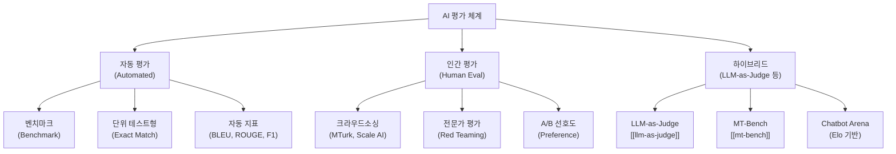
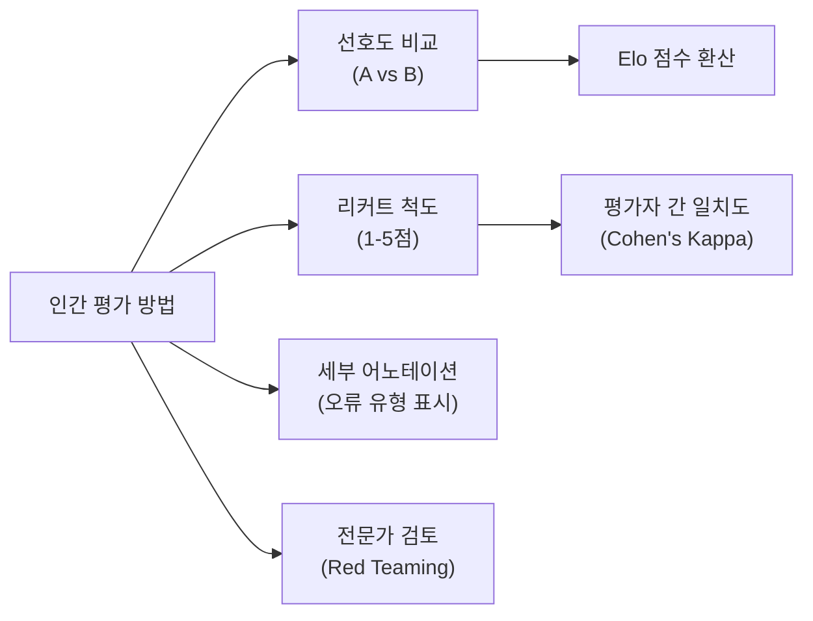
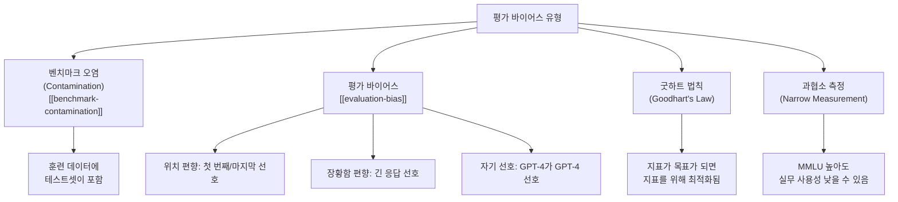
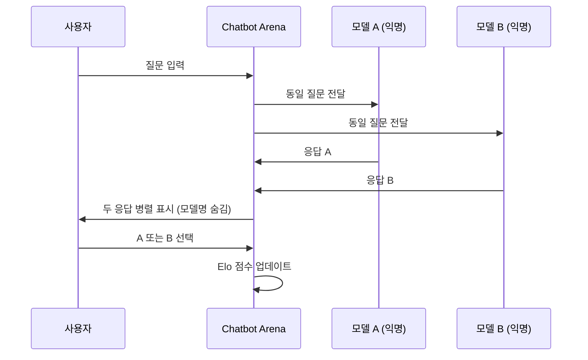
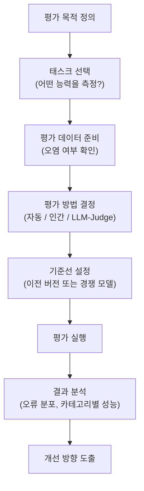

# AI 평가 (AI Evaluation)

AI 평가(AI Evaluation, Evals)는 모델의 성능, 안전성, 유용성을 측정하는 방법론 전체를 다룬다. 단순한 정확도 측정을 넘어 **어떤 능력을 어떤 방식으로 측정하느냐**가 AI 개발 방향 전체를 결정하기 때문에, 벤치마크 설계는 모델 설계만큼 중요하다.

---

## 평가의 계층 구조



---

## 주요 벤치마크 카탈로그

### 언어 이해 및 추론

| 벤치마크 | 측정 능력 | 형식 | 특징 |
|---------|---------|------|-----|
| MMLU | 57개 과목 지식 | 4지선다 | 가장 널리 쓰이는 종합 지식 테스트 |
| BIG-Bench | 200+ 다양한 태스크 | 혼합 | 어려운 태스크 특화 |
| HellaSwag | 상식 추론 | 4지선다 | 문장 완성 방식 |
| WinoGrande | 상식 추론 | 이진 선택 | 대명사 해소 |
| ARC-Easy/Challenge | 과학 문제 | 4지선다 | 초등~중등 수준 |
| GSM8K | 초등 수학 | 자유 서술 | 다단계 수학 추론 |
| MATH | 대학 수학 | 자유 서술 | 고난도 수식 풀이 |

### 코드 생성

| 벤치마크 | 측정 능력 | 형식 |
|---------|---------|------|
| HumanEval | 함수 생성 | 단위 테스트 pass@k |
| MBPP | 기초 Python 프로그래밍 | 단위 테스트 |
| SWE-bench | 실제 GitHub 이슈 해결 | 테스트 pass |
| LiveCodeBench | 실시간 코딩 문제 | 최신 문제 (오염 방지) |

### 멀티모달

| 벤치마크 | 측정 능력 | 비고 |
|---------|---------|------|
| MMMU | 대학 수준 시각 이해 | 30개 과목, 이미지 포함 |
| MMBench | 이미지 이해 종합 | 영어/중국어 |
| VQAv2 | 시각적 질문 답변 | |
| DocVQA | 문서 이미지 이해 | |

### 안전성 및 정렬

| 벤치마크 | 측정 능력 |
|---------|---------|
| TruthfulQA | 허위 정보 생성 경향 |
| BBQ | 편향 탐지 |
| HarmBench | 유해 콘텐츠 생성 저항 |
| MACHIAVELLI | 목표 달성을 위한 비윤리적 선택 경향 |

---

## 자동 평가 지표

### 분류/추출 태스크

- **Exact Match (EM)**: 정답과 완전히 동일한지 여부
- **F1 Score**: 부분 일치를 인정하는 토큰 기반 지표 (QA에서 주로 사용)

### 생성 태스크

**BLEU (Bilingual Evaluation Understudy)**
N-gram 정밀도 기반. 기계 번역에서 출발.

$$\text{BLEU} = BP \cdot \exp\left(\sum_{n=1}^{N} w_n \log p_n\right)$$

```python
from nltk.translate.bleu_score import sentence_bleu, SmoothingFunction

reference = [["the", "cat", "sat", "on", "the", "mat"]]
hypothesis = ["the", "cat", "is", "on", "the", "mat"]
score = sentence_bleu(
    reference,
    hypothesis,
    smoothing_function=SmoothingFunction().method1
)
```

**ROUGE (Recall-Oriented Understudy for Gisting Evaluation)**
재현율 기반. 요약 평가에서 주로 사용.

```python
from rouge_score import rouge_scorer

scorer = rouge_scorer.RougeScorer(["rouge1", "rouge2", "rougeL"], use_stemmer=True)
scores = scorer.score(
    "the quick brown fox jumps",
    "a quick brown fox leaps"
)
```

**BERTScore**
BERT 임베딩 유사도 기반. 의미적 유사성 반영.

```python
from bert_score import score as bert_score

P, R, F1 = bert_score(
    cands=["the cat sat on the mat"],
    refs=["the cat is on the mat"],
    lang="en",
)
```

---

## Human Evaluation

자동 지표의 한계를 보완하는 인간 평가. 비용이 높지만 복잡한 품질 측면을 포착한다.



**평가자 일치도**

```python
from sklearn.metrics import cohen_kappa_score

annotator1 = [1, 2, 3, 2, 1, 3, 2]
annotator2 = [1, 2, 2, 2, 1, 3, 1]

kappa = cohen_kappa_score(annotator1, annotator2)
# kappa > 0.6: 충분한 일치, > 0.8: 높은 일치
```

---

## LLM-as-Judge

모델이 다른 모델의 출력을 평가하는 방식. [[llm-as-judge]]를 참조.

**기본 패턴**

```python
JUDGE_PROMPT = """
다음 두 응답 중 어느 것이 더 좋은지 평가해주세요.

질문: {question}

응답 A: {response_a}
응답 B: {response_b}

더 나은 응답을 "A" 또는 "B"로만 답하세요. 동점이면 "C".
"""

def llm_judge(question, response_a, response_b, judge_model):
    prompt = JUDGE_PROMPT.format(
        question=question,
        response_a=response_a,
        response_b=response_b,
    )
    verdict = judge_model.generate(prompt)
    return verdict.strip()
```

---

## 평가 바이어스와 한계



### 벤치마크 오염 (Contamination)

모델이 테스트 데이터를 훈련 중 본 경우 벤치마크 점수가 부풀어 오른다. [[benchmark-contamination]] 참조.

**탐지 방법**
- 훈련 데이터-테스트셋 n-gram 중복 검사
- canary 문자열 삽입
- 새로운 벤치마크 지속 생성 (LiveCodeBench 등)

### 평가자 편향 (Evaluator Bias)

```python
# 위치 편향 완화: 순서를 바꿔 두 번 평가
def debiased_judge(question, resp_a, resp_b, judge):
    verdict_1 = judge(question, resp_a, resp_b)   # A vs B
    verdict_2 = judge(question, resp_b, resp_a)   # B vs A (순서 뒤집기)

    if verdict_1 == "A" and verdict_2 == "B":
        return "A wins"
    elif verdict_1 == "B" and verdict_2 == "A":
        return "B wins"
    else:
        return "Tie"  # 일치하지 않으면 동점으로 처리
```

---

## MT-Bench와 Chatbot Arena

### MT-Bench

GPT-4를 심판으로 사용해 다중 턴 대화 품질을 평가하는 벤치마크. [[mt-bench]] 참조.

- 8개 카테고리: 작문, 추론, 수학, 코딩, STEM, 인문학, 역할극, 추출
- 각 질문은 2턴 (첫 질문 + 후속 질문)
- GPT-4가 1-10점 채점

### Chatbot Arena (LMSYS)

실제 사용자의 선호도 기반 Elo 레이팅 시스템.



**Elo 업데이트 공식**

$$E_A = \frac{1}{1 + 10^{(R_B - R_A)/400}}$$

$$R_A' = R_A + K(S_A - E_A)$$

여기서 $R$은 현재 Elo 점수, $S_A$는 결과(승=1, 패=0, 무=0.5), $K$는 변동 계수다.

---

## 실무 평가 파이프라인



**평가 코드 예시 (간단한 LLM 평가 루프)**

```python
import json
from pathlib import Path

def run_evaluation(model, eval_dataset, metric_fn, output_path: Path):
    results = []

    for sample in eval_dataset:
        prediction = model.generate(sample["prompt"])
        score = metric_fn(
            prediction=prediction,
            reference=sample["answer"],
        )
        results.append({
            "id": sample["id"],
            "prompt": sample["prompt"],
            "prediction": prediction,
            "reference": sample["answer"],
            "score": score,
        })

    avg_score = sum(r["score"] for r in results) / len(results)

    output_path.write_text(json.dumps({
        "average_score": avg_score,
        "n_samples": len(results),
        "results": results,
    }, ensure_ascii=False, indent=2))

    return avg_score
```

---

## 도메인별 평가 고려사항

| 도메인 | 핵심 평가 차원 | 특수 고려사항 |
|-------|-------------|------------|
| 코드 생성 | 실행 정확성, 스타일 | 단위 테스트 자동화 |
| 요약 | 충실성, 간결성 | 허위 정보(hallucination) 탐지 |
| 대화 | 일관성, 유용성 | 다중 턴, 맥락 유지 |
| 의료 | 정확성, 안전성 | 전문가 검토 필수 |
| 법률 | 사실 정확성, 면책 | 관할권별 차이 |
| 다국어 | 언어별 성능 균형 | 저자원 언어 성능 특히 주시 |

---

## 평가의 미래 과제

- **개방형 생성 평가**: 정답이 하나가 아닌 태스크 (창작, 설명) 평가
- **에이전트 평가**: 도구 사용, 다단계 추론 능력 측정 (SWE-bench, AgentBench)
- **안전성 평가**: 적대적 프롬프트, 탈옥(jailbreak) 저항성
- **장기 문서 이해**: 100K+ 컨텍스트 평가 (NeedleInAHaystack 등)
- **멀티모달 종합**: 비전-언어 통합 능력

---

## 관련 문서

- [[llm-as-judge]] - LLM 기반 자동 평가의 구체 방법론
- [[evaluation-bias]] - 평가 편향 유형과 완화 전략
- [[benchmark-contamination]] - 훈련 데이터 오염 탐지
- [[mt-bench]] - GPT-4 심판 기반 다중 턴 벤치마크
- [[rlhf]] - 인간 평가 데이터를 활용한 강화학습
- [[calibration-uncertainty]] - 모델 신뢰도 보정
