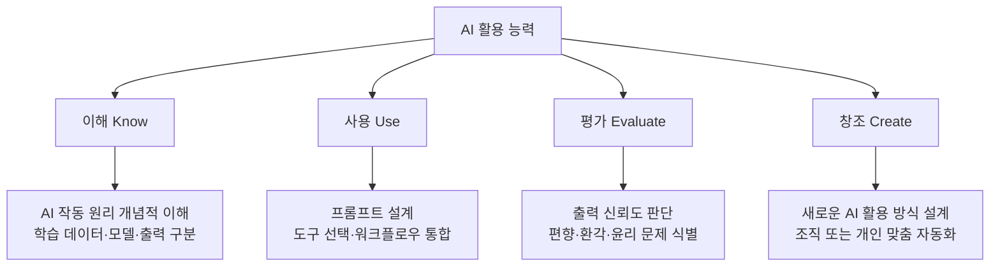
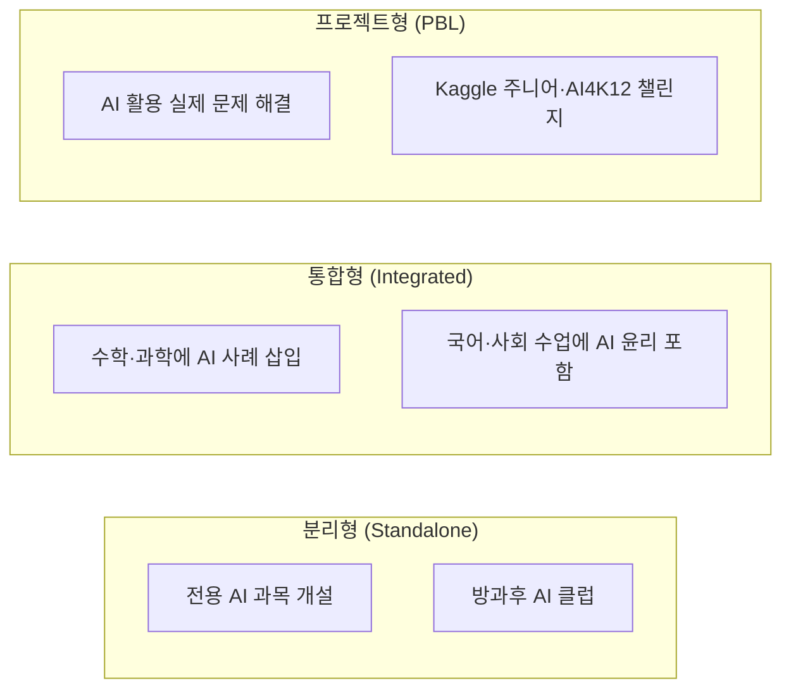
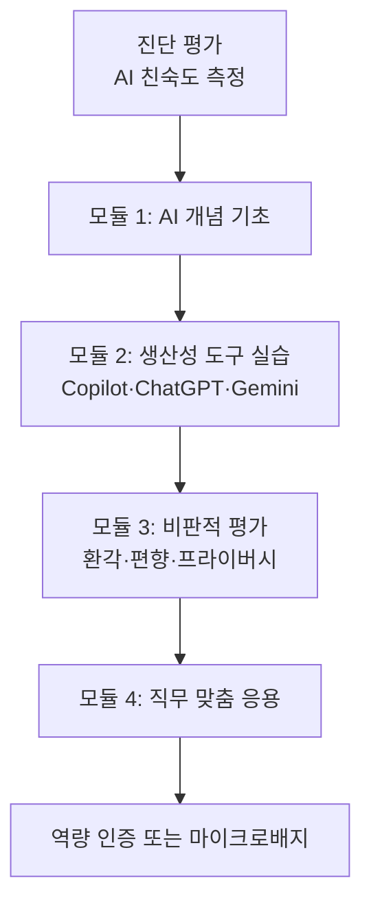
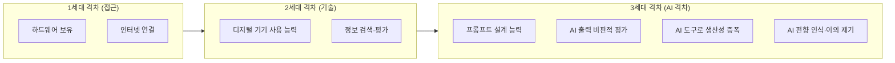

# AI 활용 능력 (AI Fluency / AI Literacy)

## 정의와 본질

AI 활용 능력(AI Fluency, 혹은 AI Literacy)은 인공지능 도구를 효과적으로 이해하고, 비판적으로 평가하며, 목적에 맞게 활용할 수 있는 역량의 총체를 가리킨다. 단순히 AI 서비스를 "사용할 줄 아는 것"을 넘어, AI가 어떻게 작동하는지, 어디서 실패하는지, 자신의 맥락에서 어떤 가치를 창출하거나 위험을 유발하는지를 판단하는 능력까지 포함한다.

'Literacy(리터러시)'가 읽고 쓰는 기초 능력을 뜻하는 데 비해, 'Fluency(플루언시)'는 유창하게 구사하는 수준을 강조한다. 연구자마다 용어 선호가 다르지만, 최근 교육학 · 인력 개발 분야에서는 두 용어를 대체로 혼용하거나, 기초 수준을 Literacy, 고급 응용 수준을 Fluency로 구분하는 경향이 있다.

### AI 활용 능력이 중요한 이유

- **생산성 불균형**: AI 도구를 잘 활용하는 사람과 그렇지 못한 사람 사이의 업무 산출 격차가 급격히 커지고 있다.
- **비판적 소비**: 생성형 AI(Generative AI)의 환각(hallucination) · 편향(bias)을 걸러내려면 AI 출력을 맹신하지 않는 판단력이 필요하다.
- **민주적 참여**: AI가 사회 의사결정(신용 평가, 채용, 의료)에 스며들면서, AI를 이해하지 못하는 시민은 불합리한 결정에 이의를 제기하기 어려워진다.
- **디지털 격차 심화**: 기존의 디지털 격차(digital divide)가 AI 격차(AI divide)로 전환 · 확대되고 있다.

---

## 핵심 아이디어

### AI 활용 능력의 4개 차원

위 다이어그램은 Long et al.(2020)의 AI Literacy 프레임워크를 현대화한 4단계 구조를 나타낸다. 단계가 올라갈수록 비판적 · 창의적 역량이 요구된다.

### 기술 수준별 세부 역량 맵

| 수준 | 명칭 | 핵심 역량 | 대상 |
|------|------|-----------|------|
| 1 | 인식(Awareness) | AI가 무엇인지, 어디에 쓰이는지 이해 | 일반 시민 |
| 2 | 사용(Use) | ChatGPT · Copilot 등 도구를 목적에 맞게 활용 | 직장인 · 학생 |
| 3 | 평가(Evaluate) | 출력의 신뢰도 · 한계 · 윤리적 함의를 판단 | 전문가 · 관리자 |
| 4 | 설계(Design) | 워크플로우 자동화, 프롬프트 최적화, 에이전트 구성 | AI 파워유저 |
| 5 | 개발(Build) | 모델 파인튜닝, API 통합, 시스템 구축 | 개발자 · 연구자 |

---

## 교육 프레임워크

### K-12 교육에서의 접근

AI 리터러시를 학교 교육 과정에 통합하려는 시도가 전 세계적으로 진행 중이다. 주요 접근 방식은 세 가지로 나뉜다.

**AI4K12 이니셔티브(미국)**는 K-12 AI 교육을 위한 5대 핵심 아이디어를 제시한다:
1. 컴퓨터는 감각을 통해 세상을 인식한다
2. 에이전트는 상태를 유지하고 행동하며 학습한다
3. 컴퓨터는 데이터에서 패턴을 학습한다
4. AI 상호작용은 자연어로 가능하다
5. AI는 사회에 영향을 미친다

### 직장인 재교육 (Upskilling)

기업과 정부가 주도하는 성인 AI 리터러시 프로그램은 일반적으로 다음 구조를 따른다:

주요 특징:
- **짧은 학습 단위(microlearning)**: 5-15분 모듈로 구성해 업무 중 소화 가능
- **역할 맞춤**: 마케터 · 법무 · 재무 · HR 등 직군별 AI 활용 시나리오 분리
- **실습 중심**: 시뮬레이션이나 실제 도구 sandbox에서 즉시 적용

---

## 디지털 격차와 AI 격차

### 기존 디지털 격차와의 연속성

기존의 디지털 격차(digital divide)는 주로 **접근성(access)** — 인터넷, 컴퓨터 보유 여부 — 로 정의되었다. AI 격차는 이보다 복합적이다.

AI 격차의 핵심 차이점:
- **비용**: ChatGPT Free, Copilot 기본형 등이 무료로 풀리면서 접근성 장벽은 낮아지고 있다.
- **이해 격차**: 같은 도구를 사용해도 활용 수준 차이가 크다 — 단순 질문 vs. 정교한 [[prompt-engineering|프롬프트 엔지니어링]].
- **언어 격차**: 영어 편향 모델에서 비영어권 사용자가 성능 손실을 겪는다.
- **교육 배경**: 고등 교육을 받은 사용자가 AI 도구 활용에서 더 큰 이익을 얻는 경향이 있다 — 기존 불평등 심화 가능성.

### 취약 집단별 특수 과제

| 집단 | 주요 장벽 | 완화 전략 |
|------|-----------|-----------|
| 고령층 | 기술 불안감, 신기술 노출 부족 | 느린 속도 · 대면 교육, 친숙한 비유 활용 |
| 저소득층 | 유료 도구 접근 제한, 시간 부족 | 무료 도구 집중 교육, 지역사회 AI 허브 |
| 비영어권 | 모델 성능 격차, 영어 자료 편중 | 다국어 튜토리얼, 현지 언어 특화 모델 |
| 장애인 | 인터페이스 접근성 부족 | 음성 인터페이스 · 스크린리더 지원 강화 |
| 소외 직군 | AI 대체 두려움, 재교육 기회 부족 | 도메인 맞춤 AI 보완 역할 훈련 |

---

## 실제 사례와 응용

### 교육 현장

- **Khanmigo(Khan Academy)**: 학생이 단순 답변을 받는 대신, AI가 소크라테스식 질문을 던져 스스로 답을 찾도록 유도한다. AI 리터러시와 교과 학습을 동시에 강화하는 설계.
- **MIT RAISE(Responsible AI for Social Empowerment)**: K-12 교사 대상 AI 교육 커리큘럼 개발 및 배포.
- **Google의 AI Literacy 커리큘럼**: "How AI Works" 시리즈를 통해 머신러닝 기초를 시각적으로 설명.

### 기업 내 배포

- **Microsoft의 AI Skills Initiative**: 전 세계 250만 명을 대상으로 Copilot 활용 교육 제공.
- **Salesforce의 AI Trailhead**: Salesforce Einstein AI 도구 활용에 특화된 역할별 마이크로러닝 경로.
- **직무 기술서 변화**: 2024년 기준, 많은 기업이 신규 채용 시 "AI 도구 활용 능력"을 필수 조건으로 명시하기 시작했다.

### 정책 레벨

- **EU AI Act**: 고위험 AI 시스템을 다루는 직원에 대한 AI 리터러시 교육을 의무화.
- **OECD AI 권고안**: 회원국 정부에 범국민 AI 리터러시 증진 정책 채택을 권고.
- **국내**: 한국의 디지털 인재 양성 종합방안(2022)에서 AI 소양 교육을 초·중·고 필수 교육으로 포함.

---

## 한계와 비판

### 개념적 한계

1. **정의 불명확성**: 연구자마다 AI Literacy의 범위가 다르다. 코딩 능력까지 포함할 것인가? 통계 이해가 필요한가? 합의된 정의가 없어 교육 목표 설정이 어렵다.

2. **측정 어려움**: 표준화된 AI 리터러시 평가 도구가 부족하다. 자기보고 방식의 설문은 실제 역량을 과대 추정하는 경향이 있다.

3. **빠른 진부화**: AI 도구가 급속히 발전하면서, 6개월 전에 만든 커리큘럼이 쉽게 구식이 된다. 지속적인 업데이트 없이는 교육 효과가 제한된다.

### 구조적 비판

- **공급 측 편향**: 현재 AI 리터러시 담론은 주로 Big Tech와 선진국 기관이 주도한다. 그들의 이해관계(더 많은 AI 도구 채택 유도)가 교육 내용에 반영될 수 있다.
- **개인화 함정**: AI 리터러시를 개인의 책임으로만 귀결시키면, AI 시스템의 설계 문제(편향 내재, 투명성 부족)를 사용자 탓으로 돌리게 된다.
- **비판적 차원 약화**: 기업 주도 교육은 도구 사용법에 집중하고, AI의 사회적 영향 · 규제 필요성 같은 비판적 차원은 축소하는 경향이 있다.

---

## 관련 문서

- [[ai-economic-impact]] - AI가 노동 시장과 거시 경제에 미치는 영향. AI 격차의 경제적 결과를 이해하는 데 필요.
- [[prompt-engineering]] - AI 활용 능력의 핵심 실천 기술인 프롬프트 설계.
- [[ai-literacy-curriculum]] - AI 리터러시 커리큘럼 설계 원칙과 사례 (조사 필요).
- [[transformative-ai-impact]] - 범사회적 AI 전환이 교육·역량에 미치는 영향.
- [[economic-displacement-ai]] - AI로 인한 직업 대체와 재교육 수요.
