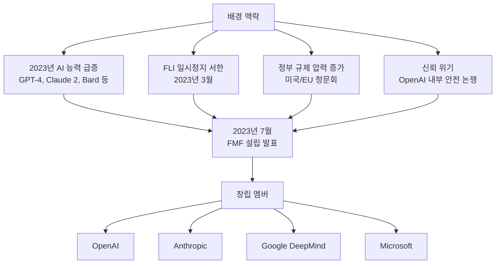
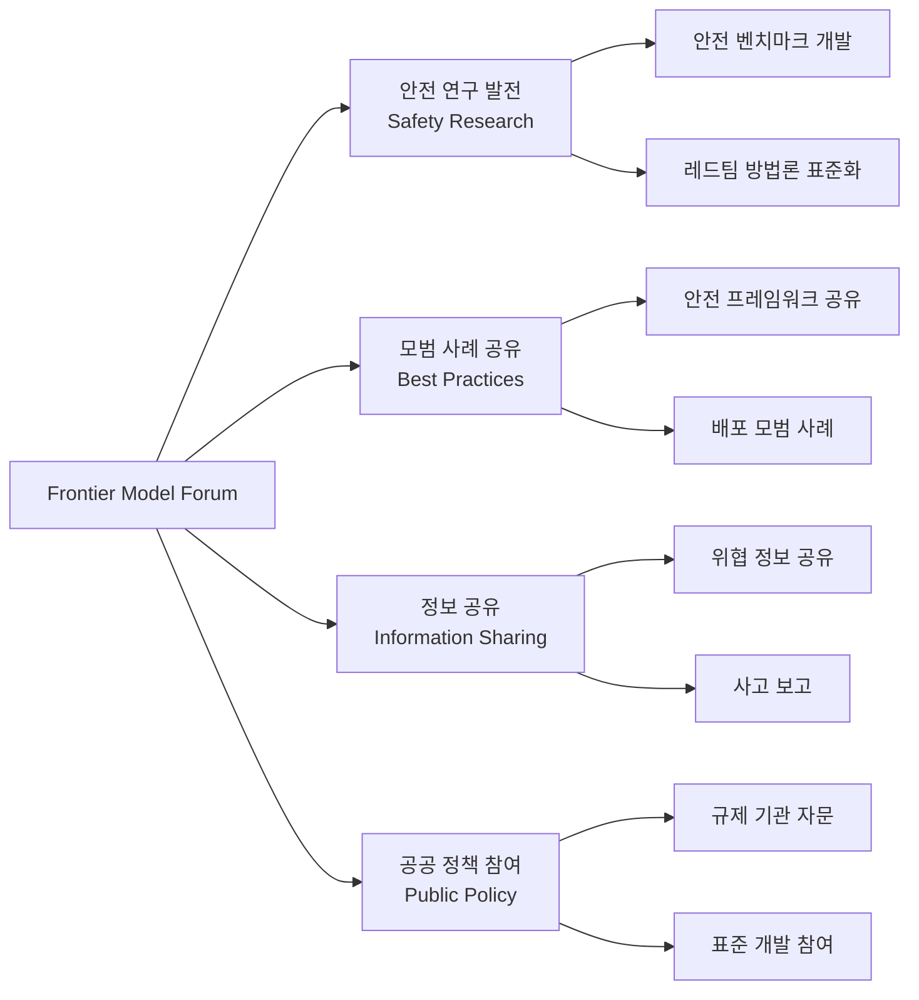
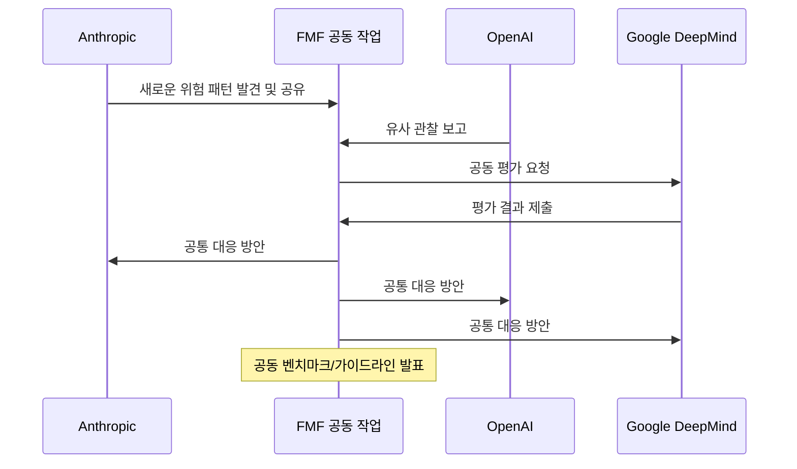

# Frontier Model Forum

## 정의 / 본질

Frontier Model Forum(FMF, 프론티어 모델 포럼)은 OpenAI, Anthropic, Google(DeepMind), Microsoft가 2023년 7월 공동 설립한 AI 안전 협의체다. "가장 강력한 AI 모델을 개발하는 기업들이 공동으로 안전 기준을 만들겠다"는 목적을 내건 최초의 주요 산업 자율 규제 기구다.

FMF는 경쟁 기업들이 핵심 비즈니스는 경쟁하면서도 안전이라는 공공재를 함께 구축하는 **경쟁적 협력(co-opetition)** 모델을 시도한다. AI 안전이 제로섬이 아닌 공공재라는 전제 위에 서 있다.

---

## 설립 배경

설립 시기가 FLI 일시정지 서한(2023년 3월) 이후 4개월 만이라는 점은 시사적이다. 서한이 제기한 "누가 AI 안전을 보장하는가?"라는 질문에 대한 산업계의 자체적 응답으로 볼 수 있다.

---

## 조직 구조와 회원사

### 창립 회원 (Founding Members)

| 회원사 | 역할 | 주요 AI 시스템 |
|--------|------|----------------|
| OpenAI | 공동 설립 | GPT-4, ChatGPT |
| Anthropic | 공동 설립 | Claude |
| Google DeepMind | 공동 설립 | Gemini, AlphaCode |
| Microsoft | 공동 설립 | Azure OpenAI, Copilot |

### 회원 확대

설립 이후 Amazon, Meta, Nvidia 등도 참여하거나 파트너십을 맺었다 [교차검증 필요: 최신 회원 구성 확인 권장]. 회원 자격은 "프론티어 AI 모델을 개발하는 기업"으로 제한되어, 스타트업보다는 대형 기업 중심의 구조다.

---

## 4대 핵심 목표

FMF가 공개한 설립 목적:

### 1. 안전 연구 발전

- AI 안전 연구 기금 조성 ($10M 이상 초기 공약 [교차검증 필요])
- 공동 안전 벤치마크 개발
- 취약점 공개(responsible disclosure) 체계 수립

### 2. 모범 사례 공유

각 기업의 안전 정책([[anthropic-rsp-evolution|Anthropic RSP]], OpenAI Preparedness Framework 등)을 공유하고 공통 기준을 수렴

### 3. 위협 정보 공유

악의적 사용 패턴, 새로운 취약점, 사고 정보를 회원사 간 공유. 사이버 보안 분야의 ISAC(Information Sharing and Analysis Center) 모델을 AI 안전에 적용

### 4. 공공 정책 참여

규제 기관에 기술적 자문 제공, AI 안전 표준 개발에 산업계 관점 반영

---

## 주요 활동과 결과물

FMF가 2023-2025년 기간에 공개한 주요 결과물 [교차검증 필요: 구체적 문서 확인 권장]:

- **AI 안전 벤치마크 프레임워크**: 다양한 위험 범주에 대한 평가 방법론
- **레드팀 가이드라인**: 프론티어 모델 레드팀 수행 모범 사례
- **배포 안전 가이드라인**: 고위험 시나리오에서의 배포 결정 기준

---

## 안전 협력의 구체적 메커니즘

FMF 내에서 실제 협력이 어떻게 이루어지는지는 다음과 같다:

단, 핵심 모델 아키텍처, 학습 데이터, 내부 평가 결과 등 **상업적으로 민감한 정보는 공유하지 않는다**. 이 제한이 협력의 실질적 깊이를 제한한다는 비판이 있다.

---

## 정부 및 국제 기구와의 관계

### 미국 정부

2023년 바이든 행정부가 AI 기업들로부터 받은 **자발적 안전 공약(Voluntary Commitments)**에 FMF 회원사들이 서명했다. 주요 공약 내용:
- 배포 전 안전 테스트
- 정보 공유
- 이중 사용 위험 연구 투자

FMF는 이후 미국 AI 안전 연구소(US AISI, AI Safety Institute)와 협력 관계를 구축했다.

### 블레츨리 파크 프로세스

2023년 11월 영국이 주도한 AI 안전 서밋에서 FMF 회원사들은 주요 참여자였다. 서밋의 결과물인 블레츨리 선언과 국제 AI 안전 연구소 네트워크 구축에 협력.

### G7 히로시마 AI 프로세스

G7 국가들의 AI 거버넌스 협력인 히로시마 AI 프로세스에서 FMF가 개발한 모범 사례가 참조됐다.

---

## FMF의 한계와 비판

### 구조적 비판

**1. 감호인에 의한 감호(Foxes guarding the henhouse)**: AI 개발로 가장 많은 이익을 얻는 기업들이 스스로 안전 기준을 만드는 이해충돌 구조.

**2. 진입 장벽으로서의 표준**: 소규모 기업이 따르기 어려운 안전 기준이 대기업의 시장 지위를 강화하는 효과. "안전"이 시장 독점의 수단이 된다.

**3. 오픈소스 AI 배제**: 메타의 Llama 시리즈 같은 오픈소스 프론티어 모델은 FMF 체계 밖에 있다. 오픈소스 모델에는 이 협력 체계가 전혀 적용되지 않는다.

**4. 중국/러시아 부재**: 글로벌 AI 개발의 일부를 담당하는 중국 기업들이 FMF에 없다. AI 안전의 전 세계적 공백이 있다.

### 실질적 효과 의문

- 공개된 결과물이 기존 각 기업의 정책과 얼마나 차이가 있는지 불명확
- 회원사가 FMF 권고를 실제로 따르지 않아도 강제 메커니즘이 없음
- 안전 투자 규모가 전체 AI 개발 투자에 비해 극히 작다는 비판

### AI 커뮤니티 내 비판

학계와 시민사회에서는 FMF가 진정한 안전보다는 **규제 대응 PR**에 가깝다는 시각이 있다:
- 자발적 공약이므로 실질적 강제력 없음
- 민주적 거버넌스 없이 소수 기업이 공공 정책 방향 결정
- 사고 발생 시 책임 소재 불명확

---

## FMF vs 다른 거버넌스 메커니즘

| 메커니즘 | 유형 | 강제력 | 범위 | 강점 |
|---------|------|--------|------|------|
| FMF | 산업 자율 | 없음 | 대형 기업 중심 | 기술 전문성, 속도 |
| EU AI Act | 법적 규제 | 강함 | EU 내 모든 AI | 체계적, 집행 가능 |
| NIST AI RMF | 자발적 프레임워크 | 없음 | 미국 중심 | 체계적 위험 관리 |
| 블레츨리 프로세스 | 정부 간 협력 | 약함 | 국제 | 다자 합의 |
| [[anthropic-rsp-evolution|Anthropic RSP]] | 단일 기업 정책 | 자발적 | Anthropic | 상세하고 투명 |

이상적으로는 FMF의 기술 전문성과 정부 규제의 강제력이 결합된 형태가 효과적이다.

---

## 미래 발전 방향

FMF의 지속 가능성과 발전에 대한 전망:

1. **제도화**: 자발적 협력에서 더 공식화된 기구로 발전 가능성
2. **확장**: 더 많은 AI 개발 국가/기업 포함 시도
3. **독립성 강화**: 외부 전문가 참여, 독립적 감사 도입
4. **규제 기관과의 통합**: 정부 AI 안전 기관의 기술 파트너로 역할 정착

---

## 관련 문서

- [[anthropic-rsp-evolution]] - FMF의 핵심 멤버 Anthropic의 단독 안전 정책
- [[ai-pause-letter-impact]] - FMF 설립을 촉발한 사회적 맥락
- [[ai-existential-risk]] - FMF가 대응하려는 프론티어 AI 위험
- [[ai-governance-regulation]] - FMF가 위치하는 더 넓은 AI 거버넌스 생태계
- [[ai-agent-security]] - 프론티어 모델의 에이전트 보안 과제
