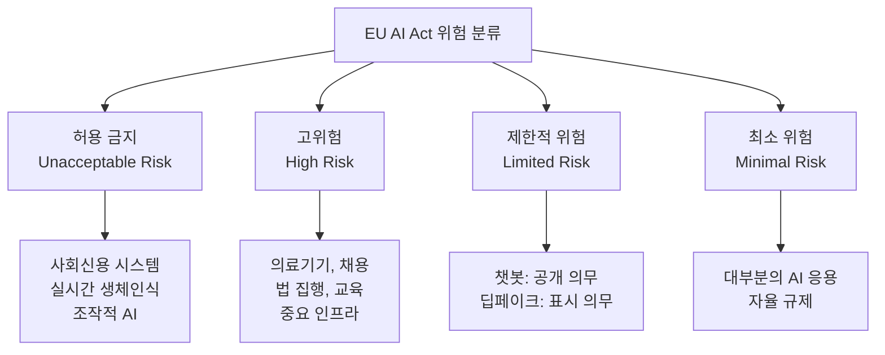

# AI 거버넌스와 규제 현황

## 개요

전 세계 주요 국가와 기관들이 AI 시스템의 위험을 관리하기 위한 법적/제도적 프레임워크를 경쟁적으로 구축하고 있다. 각 지역의 접근 방식은 규제 강도, 위험 분류 방식, 집행 기관 구성 면에서 서로 다른 철학을 반영한다.

## 주요 규제 프레임워크

### EU AI Act (유럽 AI 법)

2024년 발효된 EU AI Act는 세계 최초의 포괄적 AI 규제법이다. 위험 기반 계층(risk-based tier) 구조를 채택한다:

**고위험 AI 의무사항**:
- 적합성 평가(conformity assessment) 의무
- 투명성 문서화 및 기술 문서 작성
- 인간 감독(human oversight) 메커니즘 구축
- 강건성, 정확성, 사이버보안 요건 충족
- EU 시장에 출시 전 적합성 선언(Declaration of Conformity)

**범용 AI(GPAI) 모델 규정**: 대규모 파운데이션 모델에 대한 별도 조항이 포함되어 있다. 10^25 FLOP 이상으로 훈련된 모델은 "시스템적 위험" 모델로 분류되어 추가 의무(적대적 테스트, 사고 보고 등)가 부과된다.

### 미국 행정명령 14110 (2023)

바이든 행정부가 2023년 발령한 AI 관련 행정명령이다. 법적 구속력이 있는 EU AI Act와 달리 소프트한 성격을 갖는다:

- 프론티어 AI 개발사에 안전 테스트 결과 정부 공유 의무화
- NIST AI 안전 기준 개발 지시
- AI 콘텐츠 표시(watermarking) 기준 개발
- 바이든 이후 행정부에서 일부 수정/철회됨

### 중국 생성AI 관리법

중국은 2023년 생성AI 서비스 관리 임시 규정을 발효했다:
- 생성 콘텐츠의 허위 정보 금지
- 정치적 민감 콘텐츠 통제 의무
- 사용자 정보 보안 및 개인정보 보호
- 알고리즘 추천에 관한 별도 규정과 연계

## AI 안전 기관

| 기관 | 국가/지역 | 주요 역할 |
|------|----------|----------|
| UK AISI | 영국 | 프론티어 모델 안전 평가, 레드팀 |
| US AISI | 미국 | NIST 산하, AI 안전 표준 개발 |
| NIST AI RMF | 미국 | AI 리스크 관리 프레임워크 |
| EU AI Office | EU | AI Act 집행 기관 |

NIST AI RMF(Risk Management Framework)는 법적 구속력이 없지만 산업 표준으로 광범위하게 참조된다. 거버넌스(Govern), 매핑(Map), 측정(Measure), 관리(Manage)의 4개 코어 함수로 구성된다.

## 오픈소스 예외 조항 논쟁

EU AI Act는 오픈소스 AI 모델에 대한 예외 조항을 두고 있으나, 그 범위와 조건에 대해 논쟁이 지속된다:

**찬성 (오픈소스 면제)**: 혁신 저해 우려, 소규모 개발자 부담, 오픈 생태계 위축
**반대 (동등 규제)**: 오픈소스 고위험 AI도 동일한 피해 발생 가능, 규제 차익(regulatory arbitrage) 우려

현재 EU AI Act는 연구 목적과 비상업적 오픈소스에 대한 일부 면제를 제공하지만, 고위험 카테고리에 해당하면 오픈소스도 일부 의무가 적용된다.

## 기업 자율 규제

정부 규제 이전에 주요 AI 기업들이 자체 안전 프레임워크를 발표했다:

**Anthropic RSP (Responsible Scaling Policy)**: AI 능력 평가와 위험 임계치에 따라 개발/배포를 단계적으로 제한. ASL(AI Safety Level) 등급 체계 사용.

**OpenAI 준비 프레임워크 (Preparedness Framework)**: 사이버 보안, 화학/생물 무기, 설득 및 자율성 등 5개 위험 범주에 대한 평가 매트릭스.

**Frontier Model Forum**: Anthropic, Google, Microsoft, OpenAI가 공동 설립한 업계 안전 협력체.

## 한국 AI 기본법

한국은 AI 기본법 제정을 추진 중이다. 주요 내용:
- AI 윤리 원칙 법제화
- 고위험 AI 시스템 사전 등록 및 적합성 평가
- 개인정보보호법과의 연계
- AI 안전 전담 기관 설치

2024-2025년에 걸쳐 입법 논의가 진행되고 있으며, EU AI Act를 상당 부분 참고하면서도 산업 육성과의 균형을 모색하고 있다.

## 규제 조화와 파편화 우려

각국이 독립적으로 규제를 만들면서 다국적 AI 기업들은 지역별로 다른 요건을 준수해야 하는 상황이 되었다. ISO/IEC 42001(AI 관리 시스템 표준)과 같은 국제 표준이 이를 조화시키는 역할을 할 것으로 기대된다.

## 관련 문서

- [[nist-ai-rmf]] - NIST AI 리스크 관리 프레임워크 상세
- [[responsible-scaling-policy-v3]] - Anthropic RSP 분석
- [[eu-ai-act-enforcement]] - EU AI Act 집행 실무
- [[iso-42001]] - AI 관리 시스템 국제 표준
- [[compute-governance]] - 컴퓨팅 자원을 통한 AI 거버넌스
- [[ai-safety-alignment-2026]] - AI 안전 현황 2026
