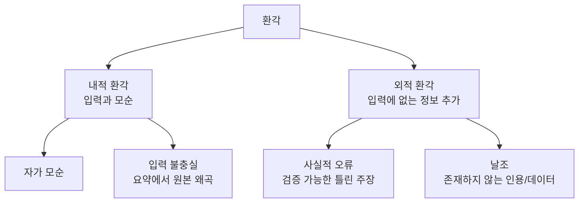

# AI 환각 분류학

[[hallucination|환각(hallucination)]]을 **유형, 원인, 탐지, 완화** 관점에서 체계적으로 분류한 프레임워크. LLM의 환각은 단일 현상이 아니라 여러 원인과 양상을 가진 복합 문제다.

## 환각 유형

## 원인 분류

| 원인 | 설명 | 완화 |
|------|------|------|
| **학습 데이터 노이즈** | 틀린 정보 학습 | [[pretraining-data-curation\|데이터 큐레이션]] |
| **지식 한계** | 학습 후 변경된 사실 | [[rag-pipeline\|RAG]] 결합 |
| **디코딩 편향** | 유창성 > 정확성 | 제약 디코딩, 온도 조절 |
| **위치 편향** | 긴 컨텍스트 중간 정보 무시 | 컨텍스트 최적화 |
| **과도한 일반화** | 패턴 과적합 | [[grounding-attribution\|그라운딩]] |

## 환각 탐지 기법

1. **NLI 기반**: 생성 텍스트와 소스의 논리적 함의 관계 검증
2. **자기 일관성**: 같은 질문에 여러 번 답하고 불일치 탐지
3. **외부 검증**: 검색 엔진/KB로 사실 확인
4. **불확실성 추정**: 토큰 확률의 엔트로피로 불확실 구간 탐지

## 관련 문서

- [[hallucination]] -- 환각 기초
- [[grounding-attribution]] -- 그라운딩과 출처 귀속
- [[rag-hallucination-reduction]] -- RAG 환각 감소
- [[cot-monitorability]] -- CoT 모니터링 가능성
