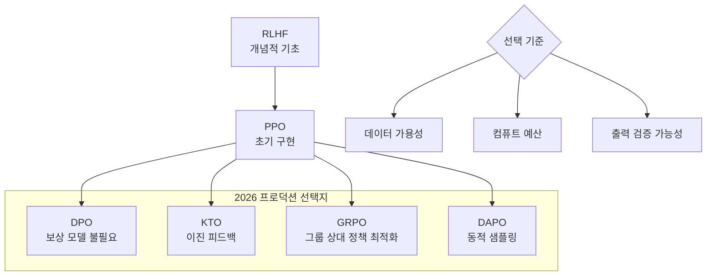

# AI 데이터 라벨링 산업

RLHF(Reinforcement Learning from Human Feedback)/정렬(alignment) 수요 폭증으로 급성장한 AI 데이터 라벨링 시장. Surge AI가 부트스트랩으로 연매출 $1B+를 달성하며 업계 성장을 상징한다.

## 왜 중요한가

- **RLHF의 기초 인프라**: LLM 정렬의 모든 파이프라인은 인간 선호도 데이터에서 시작한다
- **$1B+ 시장**: Surge AI 단일 기업이 부트스트랩으로 $1B+ 연매출을 달성할 만큼 수요가 폭발적
- **자동화와 인간의 공존**: RLAIF/합성 데이터로 비용을 절감하면서도 고위험 도메인에서는 인간 피드백이 여전히 필수

## 시장 구도 (2026)

| 기업 | 특징 |
|------|------|
| Scale AI | 최대 규모. 정부/군사 계약, RLHF 특화 |
| Surge AI | 부트스트랩 성공. $1B+ 연매출, 높은 품질 |
| Labelbox | 플랫폼 기반. MLOps 통합 |
| Appen | 글로벌 크라우드소싱(crowd sourcing) |
| Invisible AI | 인간 앵커(anchor) + 합성 데이터 하이브리드 |

## RLHF 진화 (2026)

이 다이어그램은 RLHF에서 파생된 정렬 알고리즘의 진화를 보여준다. PPO가 원조이나, 2026년 프로덕션에서는 DPO/KTO/GRPO/DAPO가 대체 선택지로 활용된다.

RLHF는 여전히 정렬의 개념적 기초이지만, 프로덕션에서는 PPO 대신 보상 모델 없이 직접 선호도를 학습하는 **DPO**, 이진 피드백만으로 학습하는 **KTO**, 그룹 상대 정책 최적화 **GRPO**, 동적 샘플링의 **DAPO** 등으로 대체되고 있다. 선택 기준은 데이터 가용성, 컴퓨트 예산, 출력 검증 가능성이다.

## 자동화 트렌드

| 접근 | 설명 | 적합 도메인 |
|------|------|------------|
| RLAIF | AI가 AI를 평가하는 자동화 | 저위험 범용 태스크 |
| 합성 선호도 데이터 | 비용 절감, 대량 생성 | 다양성 확보 |
| 확장 가능 감독(Scalable Oversight) | 전문가/도구가 평가자를 보조 | 복잡한 전문 영역 |
| 인간 피드백 | 전문가 직접 평가 | 고위험(의료, 법률) |

## 품질 관리(QC)

- **통계적 필터링**: 이상치, 낮은 합의(low agreement) 사례 자동 제거
- **팀 기반 접근**: 2명에서 20명까지 확장 가능한 QC 파이프라인
- **전문가 참여**: 도메인 전문 지식이 필요한 라벨링에 전문가 투입

## 관련 문서

- [[rlhf-and-alignment]] -- RLHF와 정렬 기법 상세
- [[dpo-paper|dpo]] -- Direct Preference Optimization
- [[on-policy-distillation]] -- 온폴리시 증류
- [[open-post-training-recipes]] -- 오픈 포스트 트레이닝 레시피
