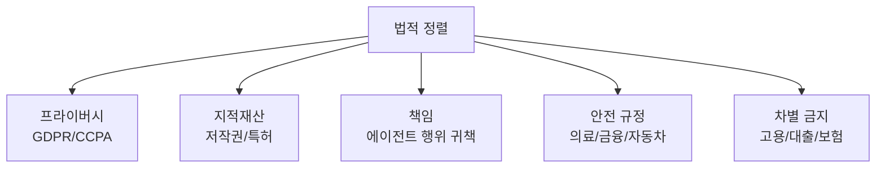

# AI와 법적 정렬

에이전틱 AI가 다양한 도메인에서 **관련 법률을 준수하는 정도**를 평가하고 보장하는 연구 영역. AI 안전성(기술적 정렬)과 구별되는 **법적/규제적 정렬** 관점.

## 핵심 쟁점

| 쟁점 | 문제 | 현황 |
|------|------|------|
| **에이전트 책임** | AI가 잘못된 행동을 했을 때 누구 책임? | 운영자/개발자 책임론 |
| **학습 데이터 저작권** | 학습 데이터 사용이 공정 이용인가? | NYT vs OpenAI 등 소송 진행 |
| **알고리즘 차별** | AI 결정의 공정성 입증 | [[eu-ai-act-enforcement\|EU AI Act]] 고위험 의무 |
| **프라이버시** | 개인정보 학습/생성/저장 | GDPR Right to Erasure vs [[machine-unlearning\|머신 언러닝]] |

## 에이전트 시대의 새 과제

자율 에이전트가 계약 체결, 금융 거래, 의료 조언을 수행하면 **법적 행위 능력**과 **전자 대리인** 개념이 필요해진다. [[agent-safety-alignment|에이전트 안전성]]의 법적 차원.

## 관련 문서

- [[eu-ai-act-enforcement]] -- EU AI Act
- [[ai-regulation-global]] -- 글로벌 AI 규제
- [[agent-safety-alignment]] -- 에이전트 안전성
- [[ai-copyright-litigation]] -- AI 저작권 소송
