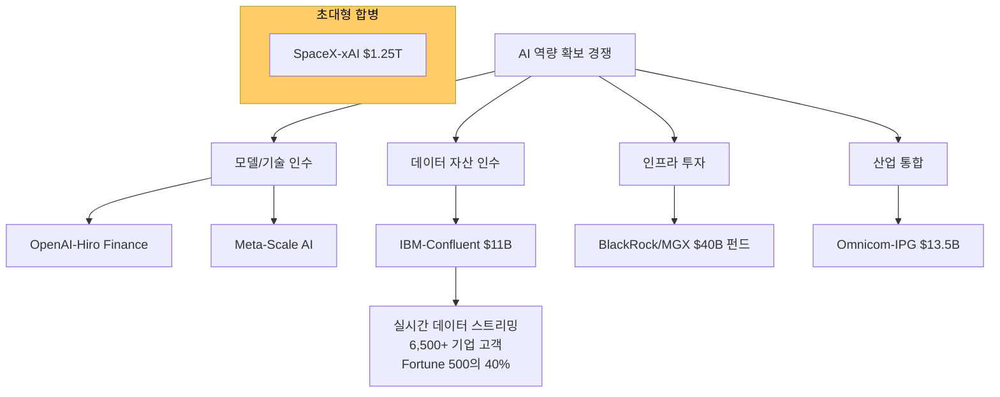

# AI M&A 메가딜과 산업 통합

AI 역량 확보를 위한 초대형 인수합병과 전 산업에 걸친 M&A 가속화 현상.

## 개요

2026년 AI가 글로벌 M&A 시장의 핵심 동인으로 부상했다. SpaceX-xAI는 $1.25T(1.25조 달러) 기업가치로 합병을 추진하고, BlackRock/MGX는 $40B AI 인프라 펀드를 조성했으며, IBM은 Confluent를 $11B에 인수 완료했다. 2025년 전체 M&A 규모는 $4.3T로 전년 대비 39% 증가했으며, AI 역량 확보가 거래의 핵심 동기다. Luma Partners CEO는 "모두가 결론 내렸다: 이 추세는 실제"라고 평가한다.

## 핵심 개념

### 주요 메가딜

| 거래 | 규모 | 유형 | 시기 |
|------|------|------|------|
| SpaceX-xAI 합병 | $1.25T (기업가치) | 합병 | 2026 진행 중 |
| BlackRock/MGX AI 인프라 펀드 | $40B | 펀드 | 2026 |
| IBM-Confluent | $11B (주당 $31) | 인수 완료 | 2026.03.17 |
| Omnicom-IPG | $13.5B | 인수 | 2025 |
| HPE-Juniper Networks | $14B | 인수 | 2025 |
| Meta-Scale AI 지분 투자 | $14.3B | 전략 투자 | 2025 |
| Disney-OpenAI 라이선싱/투자 | $1B | 전략 투자 | 2025.12 |
| OpenAI-Hiro Finance | 비공개 | 인수 | 2026.04 |

### M&A 가속화 동인

AI M&A 붐의 구조적 동인은 세 가지다:

1. **AI 역량 확보 경쟁**: 자체 개발보다 인수가 빠르고 확실한 AI 역량 확보 경로
2. **데이터 자산 가치 상승**: 실시간 데이터 스트리밍(Confluent), 금융 데이터(Hiro) 등 AI 학습/추론에 필요한 데이터 자산의 전략적 가치 급등
3. **산업 통합 압력**: AI 도입으로 규모의 경제가 강화되면서 소규모 플레이어의 독자 생존이 어려워짐

### IBM-Confluent 사례 분석

IBM의 Confluent 인수($11B)는 AI M&A의 전형적 패턴을 보여준다. IBM 부회장 Rob Thomas는 "거래는 밀리초 단위로 발생하며, AI 의사결정도 같은 속도로 이루어져야 한다"고 인수 이유를 설명했다. Confluent는 Fortune 500의 40% 포함 6,500개+ 기업이 사용하는 Apache Kafka 기반 실시간 데이터 스트리밍 플랫폼이다. watsonx.data, IBM MQ, IBM Z 등과의 즉시 통합을 통해 엔터프라이즈 AI 에이전트의 실시간 데이터 파이프라인을 확보한다.

## 기술 상세

### AI M&A 생태계 구조

### 2026년 M&A 5대 트렌드

1. **AI 중심 거래 확대**: AI 역량이 모든 M&A의 핵심 평가 기준으로 자리잡음
2. **비전통 플레이어 진입**: T-Mobile의 Vistar Media($600M), Blis($175M) 인수 등 비기술 기업의 AI/애드테크 진출
3. **공개기업 비상장화**: AdTheorent($324M), Innovid, Integral Ad Science 등 팬데믹 고평가 조정으로 비상장 전환
4. **커머스 미디어 통합**: Walmart, Target 등 대형 유통사 광고 플랫폼 인수 경쟁
5. **홀딩스 재편**: Dentsu 구조조정, WPP 경영진 교체, Havas-Horizon 합작 등

### SpaceX-xAI 합병의 의미

SpaceX와 xAI의 합병은 $1.25T 기업가치로, AI와 우주/인프라 산업의 수렴을 상징한다. Elon Musk의 기업 생태계(Tesla, SpaceX, xAI, Neuralink) 통합의 일환으로, AI 모델과 위성 통신 인프라의 시너지를 추구한다.

### M&A 시장 전망

PwC는 2026년 기술 M&A가 AI 주도로 계속 가속화될 것으로 전망한다. 핵심 변수는 금리 환경, 규제 승인 속도, AI 투자 ROI 실현 여부다. AI 벤처 버블 우려에도 불구하고, 전략적 AI 역량 확보를 위한 M&A는 ROI와 무관하게 당분간 지속될 가능성이 높다.

## 관련 문서

- [[ai-venture-bubble-2026|AI 벤처 버블 (2026 Q1 $300B)]]
- [[sovereign-ai|주권 AI / 국가 AI 전략]]
- [[ai-workforce-impact|AI 인력 영향과 스킬 프리미엄]]
- [[ai-copyright-litigation|AI 저작권 및 IP 소송]]
