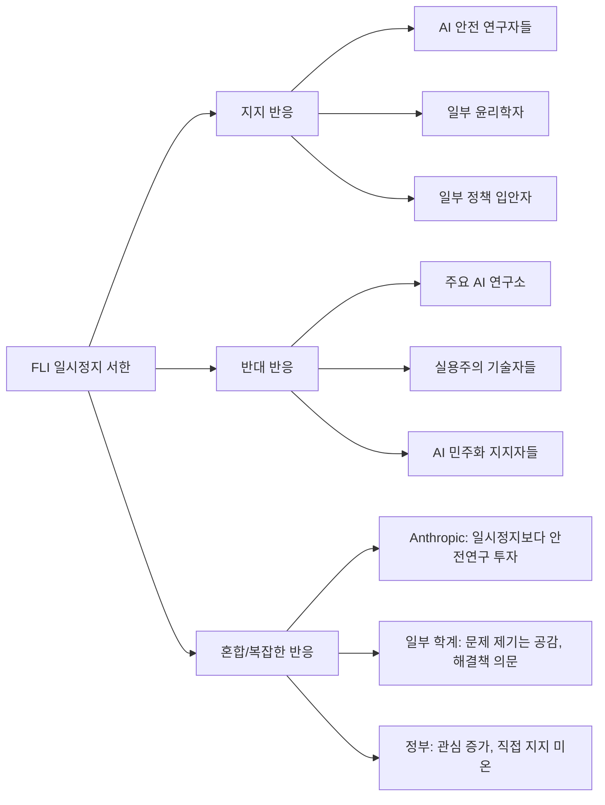

# AI 일시정지 운동의 영향 (AI Pause Letter Impact)

## 정의 / 본질

AI 일시정지 운동(AI Pause Movement)은 프론티어 AI 시스템의 개발 속도를 의도적으로 늦추거나 일시적으로 중단해야 한다는 주장을 중심으로 형성된 흐름이다. 2023년 3월 FLI(Future of Life Institute, 미래생명연구소)가 발표한 "GPT-4 이상 AI 시스템 개발 6개월 일시정지"를 촉구하는 공개서한이 이 운동의 촉매가 됐다.

이 서한은 단순한 청원을 넘어 AI 거버넌스 논의를 공론장으로 끌어냈다는 점에서 중요하다. 기술 개발자들 스스로 "더 빠르게"가 아닌 "더 안전하게"를 공개적으로 요청한 전례 없는 사건이었다.

---

## FLI 6개월 일시정지 서한

### 서한 내용 요약

2023년 3월 22일 공개된 서한의 핵심 내용:

- **대상**: GPT-4보다 강력한 모든 AI 시스템의 학습
- **기간**: 최소 6개월
- **이유**: AI의 잠재적 위험이 이익을 초과하는지 사회가 판단할 시간 필요
- **요청 사항**: AI 안전 연구 공동 추진, AI 거버넌스 시스템 구축

### 서명자 프로필

초기 서명자에는 일론 머스크, 애플 공동창업자 스티브 워즈니악, AI 연구자 요슈아 벤지오(Yoshua Bengio), 수천 명의 AI 연구자와 기술 전문가가 포함됐다. 서명자는 수일 내에 1,000명을 넘어 결국 수만 명에 달했다.

주목할 점은 OpenAI, Google DeepMind, Anthropic 등 **주요 프론티어 AI 개발사의 핵심 인물들은 서명하지 않았다**는 것이다. 일론 머스크도 서명 후 얼마 지나지 않아 자신의 AI 회사 xAI를 설립해 일관성 문제가 제기됐다.

---

## 엇갈린 반응



### 지지 입장

- **안전 최우선론자**: AI 능력이 인류의 이해와 통제 능력을 앞지르고 있다
- **민주적 결정 지지자**: 이처럼 중요한 기술 결정이 소수 기업에 의해 이루어져서는 안 된다
- **구체적 거버넌스 공백 지적**: 프론티어 AI에 대한 국제 안전 기준이 없다

### 반대 입장

**기술 실용주의자들의 비판**:
- AI 발전을 멈추는 것은 현실적으로 불가능하다 - 중국, 러시아 등은 멈추지 않는다
- "6개월"이라는 기간 자체가 임의적이며 의미 없다
- 일시정지보다 실질적 안전 연구 투자가 효과적이다

**AI 민주화 관점의 비판 (Timnit Gebru, Emily Bender 등)**:
- 서한이 정작 현재 AI 시스템이 이미 야기하는 편향, 허위정보, 착취적 데이터 수집 문제를 무시
- X-Risk에 집중하면서 현실적 AI 해악 논의를 주변화
- 서한 서명자 대부분이 AI 산업의 기득권층이라는 이해충돌 문제

**OpenAI의 입장**:
- GPT-4는 이미 출시됐으며, 안전하게 출시된 것이다
- 일시정지보다 안전 연구와 함께 진행하는 것이 더 책임 있는 방법

---

## 정책 변화에 미친 영향

서한이 직접적인 AI 개발 중단을 이끌어내지는 못했지만, 정책 차원에서 여러 가시적 효과를 낳았다:

```mermaid
flowchart TD
    LETTER[FLI 서한 발표] --> POLICY[정책 영역 반응]
    POLICY --> US[미국]
    POLICY --> EU[유럽연합]
    POLICY --> UK[영국]
    POLICY --> INT[국제]

    US --> US1[2023년 10월 바이든 행정명령]
    US --> US2[의회 AI 청문회 증가]
    US --> US3[NIST AI RMF 가이드라인]

    EU --> EU1[EU AI Act 심의 가속]
    EU --> EU2[프론티어 모델 특별 조항 논의]

    UK --> UK1[2023년 AI 안전 서밋 (블레츨리 파크)]
    UK --> UK2[AI 안전 연구소 설립]

    INT --> INT1[G7 히로시마 AI 프로세스]
    INT --> INT2[블레츨리 선언 29개국 서명]
```

### 주요 정책 이정표

**2023년 10월 미국 바이든 AI 행정명령**: 이중 사용 잠재력이 있는 AI 시스템에 대한 안전 테스트 및 결과 정부 공유 의무화 요구 포함 [교차검증 필요: 세부 내용 확인 권장]

**2023년 11월 블레츨리 파크 AI 안전 서밋**: 영국 주도로 AI 안전을 주제로 한 첫 국제 정상회의. 한국, 중국, 미국 포함 29개국이 "프론티어 AI의 잠재적 위험"을 인정하는 블레츨리 선언 서명.

**EU AI Act (2024년 통과)**: 프론티어 모델(GPAI - General Purpose AI)에 대한 별도 규제 체계 포함. 서한 이후 논의가 가속됐다는 평가.

---

## 거버넌스 모멘텀 (Governance Momentum)

### "일시정지 불가"에서 "어떻게 안전하게"로

서한의 가장 큰 영향은 담론 전환이다. "AI 개발을 멈춰야 하는가?"라는 질문이 공론화되면서, 이에 대한 반응으로 "멈출 수 없다면 어떻게 안전하게 개발할 것인가?"라는 실용적 거버넌스 논의가 촉진됐다.

이 논의의 산물이 [[anthropic-rsp-evolution|Anthropic의 RSP(책임 있는 스케일링 정책)]]와 [[ai-frontier-model-forum|Frontier Model Forum]]이다.

### 산업 자율 규제의 한계 노출

서한은 동시에 자발적 일시정지가 현실적으로 불가능하다는 것을 드러냈다. 어떤 기업도 실제로 개발을 멈추지 않았다. 이는 **강제력 있는 국제 거버넌스**의 필요성 논증에 활용됐다.

---

## AI 일시정지 이후의 운동

FLI 서한 이후 AI 일시정지 요구는 여러 형태로 발전했다:

1. **"AI 모라토리엄" 캠페인 (PauseAI 등)**: 더 강력하고 영구적인 중단 요구
2. **군사 AI 특화 캠페인**: 치명적 자율 무기 시스템(LAWS) 금지 별도 추진
3. **생물안전 AI 특화 캠페인**: AI를 이용한 생물무기 설계 방지

2024년 이후에도 AI 능력이 빠르게 성장하면서 일시정지 요구가 주기적으로 재등장하고 있다.

---

## 비판 / 한계

### 서한 자체의 한계

1. **실행 메커니즘 부재**: "6개월 일시정지"를 어떻게 집행할 것인지 제시하지 못함
2. **동기 불투명**: 일론 머스크 등 서명자의 동기가 순수 안전 우려인지 경쟁 억제인지 불명확
3. **선택적 문제 제기**: GPT-4 이상만 문제 삼고 현재 시스템의 피해는 무시
4. **기간 임의성**: "6개월"에 대한 근거가 불분명

### 영향력의 한계

1. **실제 개발 중단 없음**: 서한 발표 이후 GPT-4, Claude 2, Gemini 등 더 강력한 모델들이 연속 출시
2. **정책 전환 지연**: 서한에서 요청한 안전 기준들이 실제 의무 규제로 전환되는 데 수년 소요
3. **국제 조율 부재**: 단일 국가/기업이 멈춰도 다른 주체가 계속 개발

---

## 관련 문서

- [[ai-existential-risk]] - 서한의 이론적 기반: AI 실존적 위험
- [[anthropic-rsp-evolution]] - 일시정지 운동에 대한 산업 내 대안적 대응
- [[ai-frontier-model-forum]] - 주요 기업들의 자율 안전 협력 체계
- [[ai-governance-regulation]] - 서한이 촉진한 더 넓은 AI 거버넌스 발전
- [[instrumental-convergence]] - 서한이 우려한 AI 위험의 기술적 메커니즘
