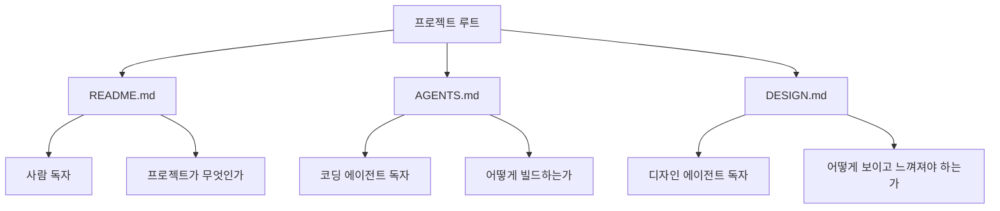

# AI 친화적 디자인 시스템 문서화

AI 에이전트가 UI를 생성하는 시대에, 디자인 시스템은 **사람뿐 아니라 에이전트도 읽을 수 있는** 형태여야 한다는 관점. Google Stitch가 [[DESIGN.md 포맷]]을 제안하면서 구체화된 개념이지만, 원리 자체는 source-agnostic하다.

## 왜 이 개념이 필요한가

전통적인 디자인 시스템 저장소를 생각해보자:

- **Figma 파일** — 시각 편집은 강력하지만 AI 에이전트가 읽기 어렵다
- **브랜드 PDF** — 바이너리 이미지 + 자유 서술. 파싱 불가에 가까움
- **Notion 페이지** — 마크다운이긴 하지만 비공개·인증 필요
- **디자이너의 머릿속** — 문서화 자체가 안 되어 있음

AI 에이전트가 UI를 생성하는 시대에는 이 형태들이 모두 **읽을 수 없는 격리된 소스오브트루스**가 된다. 에이전트는 매 화면마다 스타일을 재발명하고, 결과물 간 일관성이 무너진다.

> "Every project has a visual identity: colors, fonts, spacing, component styles. Traditionally, this lives in a Figma file, a brand PDF, or a designer's head. **None of these are readable by an AI agent.**" — Google Stitch 문서

## 세 파일 체계 (Three-file convention)

AI 에이전트 시대의 프로젝트는 **세 개의 마크다운 파일**로 모든 축을 커버할 수 있다는 주장:

### 각 파일의 책임

| 파일 | 독자 | 정의 | 관례 |
|------|------|------|------|
| **README.md** | 사람 | 프로젝트의 목적·기능·설치 방법 | GitHub 1995년부터 보편화 |
| **AGENTS.md** | 코딩 에이전트 | 빌드·테스트·실행 방법, 프로젝트별 규약, 주의사항 | OpenAI·Claude Code 생태계 2025~ 채택, [[Claude Code]]는 CLAUDE.md도 사용 |
| **DESIGN.md** | 디자인 에이전트 | 색상, 타이포, 컴포넌트, do/don'ts | Google Stitch 2026 제안, [[DESIGN.md 포맷]] 참조 |

### 세 파일의 공통 원칙

1. **평문 마크다운** — 특수 schema 없이 표준 마크다운
2. **리포지토리 루트에 위치** — 누구나 쉽게 찾음
3. **사람도 읽을 수 있음** — 에이전트 전용이 아니라 human-readable 공존
4. **git diff 친화적** — 버전 관리, 코드 리뷰, 협업 가능
5. **소스오브트루스** — 분산된 지식을 한 곳에 모음

## "Living artifact" 원칙

> "DESIGN.md is a **living artifact**, not a static config file. It evolves as your design evolves. The agent generates it, you refine it, and it's re-applied to screens as you iterate."

이 세 파일은 모두 **살아있는 문서**여야 한다. 한 번 만들고 잊는 설정 파일이 아니라 프로젝트와 함께 진화한다:

- 에이전트가 초안 생성 → 사람이 다듬음 → 에이전트가 다시 읽어 반영 → 반복

AGENTS.md도 CLAUDE.md도 같은 원칙을 따른다. 프로젝트 규약이 바뀌면 문서도 바뀌고, 그 결과가 다음 에이전트 세션에 즉시 반영된다.

## 기계 가독성의 기술적 요건

AI 에이전트가 디자인 시스템 문서를 "읽을 수 있다"는 것의 구체적 요건:

1. **구조화된 헤딩** — 섹션 이름이 일관되면 에이전트가 신뢰성 있게 파싱 가능
2. **표 형식보다 리스트** — 간단한 값은 `- **Primary** (#2665fd): ...` 같은 형태가 LLM에 더 잘 파싱됨
3. **구체적 값 명시** — "warm colors" 대신 `#2665fd` (둘 다 허용하지만 정확 값이 충돌 시 우선)
4. **역할(role) 태그** — 단순 색상값이 아니라 "이 색을 *어디에* 쓰는지" 명시
5. **Do/Don't 규칙** — 생성 시 가드레일로 직접 사용 가능한 명령형 규칙

## AGENTS.md / CLAUDE.md와의 연결

[[agentic engineering]] 생태계에는 이미 에이전트용 지침 파일 관례가 있다:

- **AGENTS.md**: OpenAI/Cursor/Claude Code 등 다수 도구가 채택한 "에이전트에게 전하는 프로젝트 규약" 파일
- **CLAUDE.md**: Claude Code 고유 버전 (역사적 유래로 존재, 최근에는 AGENTS.md로 수렴 추세)

DESIGN.md는 이 흐름의 자연스러운 확장이다. 코딩 규약이 문서화되었듯 디자인 규약도 문서화되어야 한다는 논리.

## 도입 장벽과 비판

- **디자이너 저항** — Figma의 시각 편집 대신 마크다운을 쓰는 것에 대한 거부감
- **정확도 한계** — 마크다운 텍스트만으로는 복잡한 애니메이션·인터랙션 표현이 어려움
- **에이전트 파싱 일관성** — 같은 DESIGN.md를 서로 다른 에이전트가 다르게 해석할 수 있음 (현재는 비공식 표준)
- **Structured tokens와의 이중화** — 마크다운 원본과 토큰 스냅샷을 동기화하는 복잡성 (Stitch의 경우 자동 reconcile하지만 다른 도구는 그렇지 않을 수 있음)

## 실무 적용

1. **기존 Figma 파일이 있는 팀**: Stitch의 "derive from branding" 경로 또는 수동 추출로 DESIGN.md 초안 생성 → git에 커밋
2. **새 프로젝트**: 분위기 프롬프트로 에이전트에게 생성 맡기기 → 팀이 리뷰 → DESIGN.md를 AGENTS.md와 함께 루트에 배치
3. **기존 AGENTS.md + Claude Code 사용자**: DESIGN.md를 추가로 작성. Claude Code는 [[DESIGN.md 포맷]]을 읽고 UI 작성 시 참조

## 관련 문서

- [[DESIGN.md 포맷]]
- [[stitch design-md guide]]
- [[Google Stitch]]
- [[design tokens]]
- [[Claude Code]]
- [[agentic engineering]]
- [[better code with agents]]
