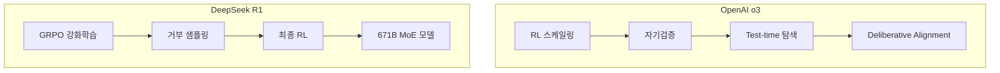

## 개요

AI 추론 모델(Reasoning Models)은 단순한 패턴 매칭 기반 다음 토큰 예측에서 벗어나, 명시적인 단계별 논리적 사고를 수행하는 새로운 AI 시스템 패러다임이다. OpenAI의 o1/o3 시리즈와 [[deepseek-v3-2|DeepSeek V3.2/R1]]이 대표적이며, 추론 시간(test-time)에 계산량을 확장하여 성능을 끌어올리는 [[test-time-compute-scaling|추론 시간 스케일링]]이 핵심 원리다. o3는 ARC-AGI 벤치마크에서 88%를 달성하며, AI가 "대화 상대"에서 "목표 수행 시스템"으로 진화하는 전환점을 보여주었다.

## 핵심 개념

### 추론 모델 vs 전통 LLM

| 구분 | 전통 LLM | 추론 모델 |
|------|---------|---------|
| 방식 | 확률 기반 다음 토큰 예측 | 논리적 단계별 추론 |
| 다단계 작업 | 약함 | 강함 |
| 환각 위험 | 높음 | 낮음 (자기 검증) |
| 투명성 | 낮음 | 높음 (CoT 추적 가능) |
| 비용 | 상대적 저비용 | CoT로 토큰 3-5x 증가 |

### 세 가지 핵심 기술

1. **[[chain-of-thought|Chain-of-Thought (CoT)]]**: 복잡한 문제를 중간 추론 단계로 분해하여 순차적으로 해결
2. **Test-time Search**: 여러 추론 경로를 동시에 탐색하고, 검증 모델로 최적 경로 선택 (o3의 핵심)
3. **Mixture-of-Experts (MoE)**: 전문화된 서브네트워크를 게이팅 메커니즘으로 선택적 활성화 (DeepSeek R1)

## 기술 상세

### 훈련 방식 비교

**OpenAI o3**: 고밀도 트랜스포머 + RL 기반 추론 능력 학습. 수백-수천 개의 후보 추론 경로를 동시에 생성하고, 검증 모델이 계산 오류와 논리적 오류를 검토한 뒤 올바른 경로만 추가 RL 학습의 타겟으로 활용한다. "숙고적 정렬([[deliberative-alignment|deliberative alignment]])"을 통해 안전 정책에 대한 추론을 최종 답변 전에 수행한다.

**DeepSeek R1**: 671B MoE 모델에 4단계 학습 파이프라인을 적용한다:
1. 검증된 1,000개 샘플로 지도학습 미세조정
2. 수학/코딩/논리 태스크에 대한 GRPO(Group Relative Policy Optimization) 강화학습
3. 600K개 생성 샘플의 거부 샘플링(정확성 기준 필터링)
4. 100개 이상 태스크 카테고리에 대한 다양한 RL 적용

### 벤치마크 성과

| 벤치마크 | GPT-4o | DeepSeek R1 | o3-high |
|---------|--------|------------|---------|
| ARC-AGI | 5% | - | 88% |
| AIME 2024 (수학) | - | 79.8% | 96.7% |
| GPQA Diamond (과학) | - | - | 87.7% |
| Codeforces (코딩) | - | - | ELO 2727 |

### 아키텍처 및 비용 비교

| 측면 | OpenAI o3 | DeepSeek R1 | o4-mini |
|------|----------|------------|---------|
| 아키텍처 | 고밀도 트랜스포머 | MoE (671B/37B 활성) | 경량 추론 모델 |
| CoT 가시성 | 숨김 (내부 숙고) | 공개 (추론 과정 노출) | 숨김 |
| 접근 방식 | 클로즈드소스, API만 | 오픈소스 | 클로즈드소스, API만 |
| 입력 비용 | ~$2/1M 토큰 | ~$0.55/1M 토큰 | ~$2/1M 토큰 |
| 출력 비용 | 높음 | ~$2.19/1M 토큰 | o3의 ~1/5 |
| 학습 에너지 | 1.2M A100 GPU 시간 | 공개되지 않음 | - |

o4-mini는 o3 추론 능력의 85-90%를 유지하면서 비용을 약 1/5로 낮춘 모델이다. AIME에서 R1을 12.9점, GPQA에서 6.3점, Codeforces 레이팅에서 270점 앞선다. o3의 비용은 R1의 18배, Gemini 3 Flash의 100배에 달한다.

### 실제 적용의 트레이드오프

- **비용 오버헤드**: CoT 생성으로 토큰 사용량 3-5배 증가. o3 high-reasoning 모드에서 100K 토큰 출력에 7.7초 소요
- **단순 쿼리 비효율**: 단위 변환 같은 간단한 작업도 복잡한 추론 과정을 거침 -- 두 패러다임 모두 동일한 문제
- **안전성 트레이드오프**: R1에서 안전 학습 적용 시 추론 성능이 최대 12% 감소한 사례 보고
- **증류(Distillation)**: 대형 추론 모델의 능력을 소형 모델로 전이하는 기법이 활발히 연구 중. 성능 손실 없는 추론 능력 전이가 핵심 과제

### 스케일링 패러다임 전환

기존의 "훈련 시간 스케일링"(더 큰 모델, 더 많은 데이터)에서 "추론 시간 스케일링"(동일 모델로 더 많은 계산)으로 효율적 성능 향상 경로가 열렸다. 비용을 증가시킬수록 o3의 정확도가 비례적으로 상승하는 패턴이 관찰된다. 강화학습은 이 방향의 핵심 기술로 유지되며, 확장된 CoT 스케일링과 향상된 증류 기법이 2026년의 주요 연구 방향이다.

## 관련 문서
- [[fluid-intelligence]] -- Fluid Intelligence (유동 지능)

- [[test-time-compute-scaling]] - 추론 시 계산 확장의 이론적 기반
- [[deepseek-mhc]] - DeepSeek의 아키텍처 혁신
- [[multi-head-latent-attention]] - DeepSeek의 MLA 어텐션 메커니즘
- [[grpo]] - Group Relative Policy Optimization
- [[rlvr]] - 검증 가능한 보상 기반 RL
