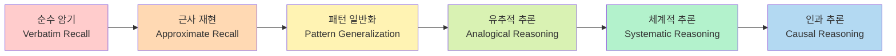
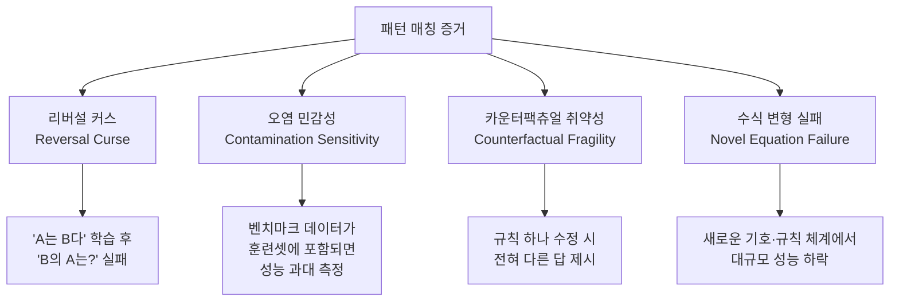
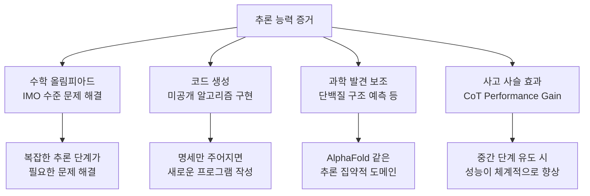
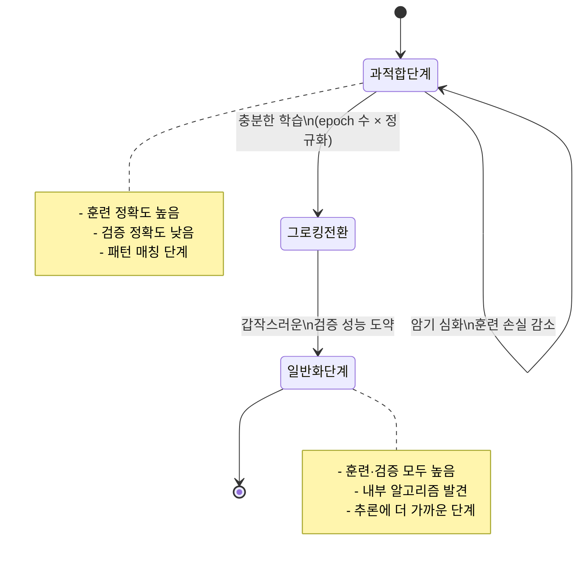

# 추론 vs 암기 구분 (Reasoning vs Memorization in LLMs)

## 정의와 본질

LLM(대형 언어 모델, Large Language Model)이 문제를 맞히는 것이 **진짜 추론(genuine reasoning)**인지, **정교한 패턴 매칭(sophisticated pattern matching)**인지는 AI 연구의 핵심 논쟁 중 하나다.

- **암기(Memorization)**: 훈련 데이터에 등장한 입출력 쌍을 내부적으로 저장했다가 유사 쿼리에 재활용하는 것. 보간(interpolation) 이상을 하지 않는다.
- **패턴 매칭(Pattern Matching)**: 암기와 유사하지만 더 넓은 범주. 훈련 데이터의 통계적 패턴을 추출해 보지 않은 입력에도 적용. 외삽(extrapolation)의 일종이지만 진짜 이해 없이도 가능하다.
- **추론(Reasoning)**: 알려진 원리 · 개념으로부터 새로운 결론을 논리적으로 도출하는 능력. 분포 밖(out-of-distribution) 입력에서도 원리에 기반한 정답 생성이 가능해야 한다.

이 구분이 중요한 이유는 모델의 신뢰성 · 안전성 · 한계 예측과 직결되기 때문이다. 패턴 매칭으로 작동하는 모델은 분포 이동(distribution shift)에 취약하고, 핵심 원리를 변형한 변이 문제에서 급격히 성능이 떨어진다.

---

## 핵심 아이디어

### 연속 스펙트럼으로서의 추론

추론과 암기는 이분법이 아니라 연속적 스펙트럼으로 보는 것이 더 정확하다.

LLM은 현재 C-D 구간에서 주로 작동하며, E-F 구간에서 일관된 능력을 보이는지는 논쟁 중이다.

### 핵심 검증 질문

"이 모델이 추론하는가, 암기하는가?"를 판별하는 표준 질문들:

1. **신기성(Novelty)**: 훈련 데이터에 없는 새로운 조합이나 구조로 물어봤을 때 성능이 어떻게 변하는가?
2. **원리 변형(Principle Modification)**: 수학 규칙이나 논리 규칙을 미세하게 수정하면 모델이 그 변화에 적응하는가?
3. **역방향(Reversal)**: "A의 수도는 B"를 학습한 모델이 "B는 어느 나라의 수도인가?"에 답하는가? (리버설 커스(Reversal Curse) 문제)
4. **최소 수정(Minimal Edit)**: 문제에서 핵심 조건 하나만 바꿨을 때 답이 올바르게 변화하는가?

---

## LLM이 패턴 매칭인가 추론인가 — 주요 증거

### 패턴 매칭 가설을 지지하는 증거

**리버설 커스(Reversal Curse)** (Berglund et al., 2023): GPT-4 등 최신 모델도 "A is B"를 학습하면 "A is B"를 잘 답하지만, "B's A is?"에는 실패하는 비율이 높다. 진정한 추론이라면 방향에 무관해야 한다.

**카운터팩츄얼 테스트**: 수학 문제에서 연산 규칙을 바꾸면(예: 덧셈이 2를 추가로 더하는 새로운 체계) 모델은 이를 학습하지 못하고 기존 덧셈으로 답한다.

### 추론 능력을 지지하는 증거

특히 [[chain-of-thought|사고 사슬(Chain-of-Thought, CoT)]] 프롬프팅이 복잡한 추론 문제에서 성능을 크게 향상시킨다는 사실은, 모델이 단순 암기 이상의 내부 계산 능력을 갖고 있음을 시사한다.

---

## 조작 실험 방법론

### 오염 없는 평가 (Contamination-Free Evaluation)

훈련 데이터 오염은 "성능이 좋다 = 추론 능력이 있다"는 해석을 위협한다. 주요 대응 방법:

| 방법 | 설명 | 한계 |
|------|------|------|
| 시간 컷오프 테스트 | 훈련 데이터 이후에 생성된 문제만 사용 | 데이터 수집 완료 시점 불명확 |
| 합성 벤치마크 | 무작위 생성 문제 (GSM-Symbolic 등) | 자연어 품질 낮을 수 있음 |
| 동적 평가 | 평가 시점마다 문제를 새로 생성 | 평가 비용 높음 |
| 역엔지니어링 탐지 | 모델 출력에서 암기 흔적 검색 | 완전한 탐지 불가능 |

### 대표적 조작 실험 설계

**원리 변형 실험**:
- 기존: "2 + 3 = ?"
- 변형: "새로운 연산 ⊕ 정의: a ⊕ b = a + b + 1. 2 ⊕ 3 = ?"
- 추론 모델이라면 정의를 따라 6을 답해야 한다. 패턴 매칭 모델은 5라고 답하는 경향이 있다.

**상징 대체 실험**:
- 기존 수학 문제의 숫자와 기호를 비표준 기호로 치환 (예: △ → +, ○ → ×)
- 진짜 추론 능력이 있다면 기호 정의만 주어지면 풀 수 있어야 한다.

**체계적 일반화 테스트 (SCAN 등)**:
- "jump"와 "right"가 무엇인지 학습한 모델에 "jump right"을 처리하게 함
- 개별 원소를 조합하는 체계적 능력이 있는가를 검증

---

## Grokking과 관계

[[grokking|그로킹(Grokking)]]은 모델이 훈련 중에 처음에는 훈련 데이터를 암기하다가, 충분한 훈련 후 갑자기 일반화된 알고리즘을 발견하는 현상이다.

Grokking 연구는 "모델이 충분히 학습하면 암기에서 추론으로 전환될 수 있는가"라는 질문에 긍정적 증거를 제공한다. 단, 자연어 LLM에서 Grokking이 같은 방식으로 작동하는지는 추가 연구 필요.

---

## 창발적 능력(Emergent Abilities)과의 관계

[[emergent-abilities|창발적 능력(Emergent Abilities)]]은 작은 모델에서는 나타나지 않다가 특정 규모를 넘어 갑자기 나타나는 능력을 가리킨다. 이를 추론 능력으로 해석할 수 있는지는 논쟁 중이다:

**창발 = 추론 임계점 도달 주장**:
- 모델이 충분히 커지면 패턴 매칭을 넘어 진짜 일반화 알고리즘을 내부에 형성
- 이것이 "추론"의 출현으로 관찰된다

**창발 = 측정 아티팩트 주장**:
- Wei et al.(2022)가 지적한 창발 현상의 상당수가 비선형 평가 지표(정확도)의 문제
- 연속적 지표(로그 가능도 등)로 재측정하면 창발은 사라지고 점진적 개선으로 나타남

---

## 비교 요약

| 차원 | 순수 암기 | 패턴 매칭 | 진짜 추론 |
|------|-----------|-----------|-----------|
| 훈련 데이터 의존도 | 100% | 높음 | 낮음 (원리 추출) |
| 분포 이동 강건성 | 없음 | 약함 | 강함 |
| 원리 변형 적응 | 없음 | 제한적 | 가능 |
| 리버설 처리 | 실패 | 부분적 | 성공 |
| 현재 LLM 수준 | 일부 포함 | 주된 작동 방식 | 부분적 · 불일관 |

---

## 실무적 함의

이 구분은 LLM 배포 시 다음 의사결정에 영향을 준다:

1. **고위험 도메인 배포**: 의료 진단 · 법률 판단 등에서 LLM이 패턴 매칭으로 작동한다면, 분포 이탈 사례에서 심각한 오류가 발생할 수 있다.
2. **벤치마크 해석**: 높은 벤치마크 점수가 실제 추론 능력을 반영하지 않을 수 있다. [[agentic-benchmarks-overview|에이전트 벤치마크]] 오염 문제와 직결된다.
3. **[[chain-of-thought]] 활용**: CoT를 강제하면 모델이 중간 단계를 생성하도록 유도하여, 단순 패턴 매칭보다 추론에 가까운 경로를 취하게 된다.
4. **파인튜닝 전략**: 특정 도메인의 추론 능력이 필요하다면, 단순 Q&A 페어 파인튜닝보다 추론 과정을 포함한 데이터가 더 효과적일 수 있다.

---

## 한계와 비판

- **"추론"의 정의 미합의**: 철학적 · 인지과학적 추론 개념과 AI에서의 추론 개념이 일치하지 않는다. 정의 자체가 논쟁이다.
- **관찰 불가능한 내부 메커니즘**: 외부 행동만으로 추론인지 암기인지 판별하기 어렵다. 해석 가능성(interpretability) 연구가 보완적 증거를 제공하려 하지만 아직 초기 단계.
- **인간도 패턴 매칭을 한다**: 인간의 인지도 상당 부분 패턴 인식으로 작동한다. "LLM은 패턴 매칭이라 추론이 아니다"는 논리가 인간에도 적용될 수 있다는 역비판이 있다.

---

## 관련 문서

- [[chain-of-thought]] - 중간 추론 단계를 명시적으로 유도해 추론 성능을 높이는 프롬프팅 기법.
- [[grokking]] - 훈련 중 암기에서 일반화로 전환되는 현상 — 추론 발현의 메커니즘적 증거.
- [[emergent-abilities]] - 규모 증가에 따른 갑작스러운 능력 출현 — 추론 임계점과의 관계.
- [[agentic-benchmarks-overview]] - LLM 능력 평가 방법론 — 오염 문제와 측정 신뢰성.
- [[activation-patching]] - 모델 내부 메커니즘을 추적해 추론 회로를 찾는 기법.
