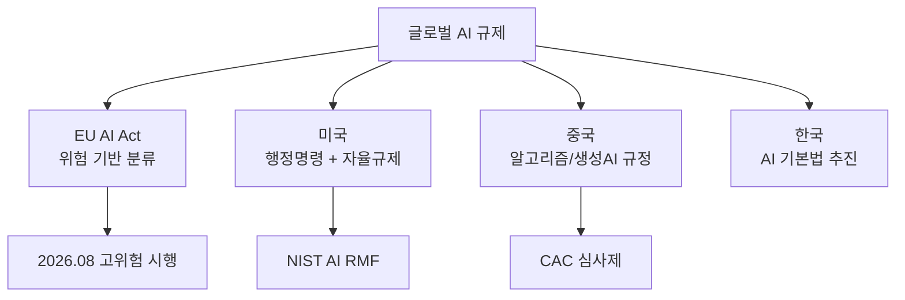

# 글로벌 AI 규제 현황

EU, 미국, 중국, 한국 등 주요국의 AI 규제 프레임워크 비교. 2026년 기준 EU AI Act가 본격 시행되면서 글로벌 AI 거버넌스가 구체화되고 있다.

## 주요국 비교

| 국가 | 접근 | 핵심 법규 | 특징 |
|------|------|----------|------|
| EU | 위험 기반 법적 규제 | [[eu-ai-act-enforcement\|AI Act]] | 금지/고위험/제한/최소 4등급 |
| 미국 | 행정명령 + 산업 자율 | EO 14110, [[nist-ai-rmf\|NIST RMF]] | 혁신 우선, 자발적 지침 |
| 중국 | 분야별 개별 규정 | 알고리즘 추천/딥페이크/생성AI | 사전 심사제, 콘텐츠 규제 |
| 한국 | AI 기본법 추진 중 | 고위험 AI 규제 | EU식 접근 참조 |

## [[compute-governance|컴퓨트 거버넌스]]와의 관계

모델 규제 외에 **학습 컴퓨트 자체를 규제**하는 접근(FLOP 임계값, 칩 수출 통제)이 부상하고 있다.

## 관련 문서

- [[eu-ai-act-enforcement]] -- EU AI Act 시행
- [[nist-ai-rmf]] -- NIST AI 리스크 관리
- [[compute-governance]] -- 컴퓨트 거버넌스
- [[ai-legal-alignment]] -- AI 법적 정렬
