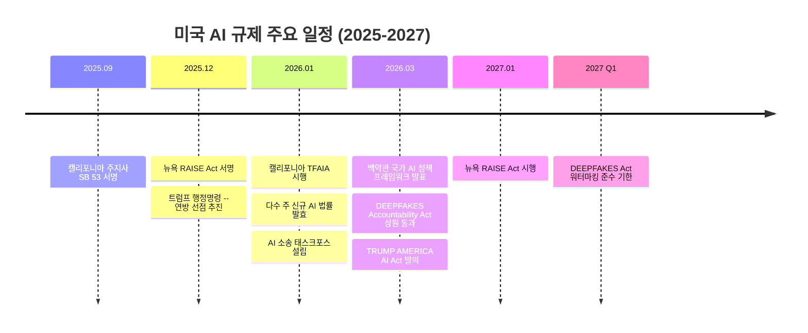

## 개요

2026년 미국 AI 규제는 연방과 주 정부 차원에서 동시에 빠르게 진행되고 있다. 백악관이 2026년 3월 국가 AI 정책 프레임워크를 발표하고, 캘리포니아 투명성법이 2026년 1월 시행되었으며, 뉴욕주의 RAISE Act가 캘리포니아 모델과 정렬하여 2027년 1월 시행 예정이다. 연방 차원에서는 신규 독립 규제 기관 설립 대신 기존 기관의 역할 확대를 선호하는 방향이 뚜렷하며, 2025년 12월 트럼프 대통령의 행정명령이 주 AI법의 연방 선점을 추진하여 주-연방 간 긴장이 심화되고 있다.

## 핵심 개념

**국가 AI 정책 프레임워크(National Policy Framework for AI)**: 2026.03.20 백악관이 발표한 비구속적(nonbinding) 정책 문서로, 의회에 대한 입법 권고 사항을 담고 있다. 기존 기관 활용, 규제 샌드박스 도입, 혁신 촉진을 기조로 한다.

**연방 선점(Federal Preemption)**: 파편화된 주 AI 법률을 연방 법률로 선점하되, 주 정부의 경찰권, 도시 계획, 주 정부 자체 AI 사용 규칙은 보존하는 접근 방식. 2025.12.11 트럼프 행정명령이 주 AI법과 "불일치하는" 법률을 연방 정책으로 선점하는 통일된 연방 정책 프레임워크 수립을 제안했다.

**규제 샌드박스(Regulatory Sandbox)**: 혁신적 AI 기술에 대해 한시적으로 규제 면제를 적용하여 실험을 허용하는 프레임워크.

**AI 소송 태스크포스(AI Litigation Task Force)**: 2025.12 행정명령에 따라 2026.01.09 법무부가 설립한 집행 기구로, 주 AI법과 연방 정책 간 충돌을 법적으로 다룬다.

## 현황 (2026)

**연방 차원**:
- 트럼프 행정명령 (2025.12.11): 주 AI법과 불일치하는 법률의 연방 선점을 위한 통일 정책 프레임워크 수립 제안
- AI 소송 태스크포스 (2026.01.09): 법무부 산하 설립, 주-연방 AI법 충돌 관할
- 백악관 국가 AI 정책 프레임워크 (2026.03.20): 비구속적 입법 권고
  - 아동 보호: 프라이버시, 화면 시간, 콘텐츠 필터링 도구
  - 지적 재산: 학습 데이터 자발적 라이선싱, 음성/초상권 연방 보호
  - 표현의 자유: 연방 기관의 플랫폼 콘텐츠 억압 금지
  - 혁신: 규제 샌드박스, 연방 데이터셋 접근 개선
  - 인력: 기존 교육 프로그램에 AI 훈련 통합
  - 연방 선점: 주 AI법 선점하되 주 고유 권한 보존
- TRUMP AMERICA AI Act (상원 Marsha Blackburn, 2026.03.18): 291페이지 분량의 보다 규범적 법안
- DEEPFAKES Accountability Act: 2026.03 상원 통과, AI 생성 콘텐츠 워터마킹 표준 의무화

**주 정부 차원**:

| 법률 | 시행일 | 핵심 요건 | 집행 |
|------|-------|----------|------|
| 캘리포니아 TFAIA (SB 53) | 2026.01.01 | 프론티어 AI 프레임워크 공개, 재앙적 위험 식별/완화 | 검찰총장, 위반당 최대 $1M |
| 뉴욕 RAISE Act | 2027.01.01 | CA와 유사, 프론티어 모델 위험 프레임워크 + 안전 사고 보고 | 주지사 서명 완료 |
| 다수 주 신규 AI 법률 | 2026.01.01 | 주별 상이 | 주별 상이 |

캘리포니아 TFAIA는 대규모 프론티어 AI 모델 개발자에게 "재앙적 위험(catastrophic risks)"을 식별하고 완화하는 접근법을 기술한 "프론티어 AI 프레임워크"를 작성, 구현, 공개하도록 의무화한다. 뉴욕 RAISE Act는 2025.12.19 Hochul 주지사가 서명하고, 2026년 1월 입법 세션에서 캘리포니아 TFAIA와 더 밀접하게 정렬하는 수정안을 통과시켰다. 두 법률 모두 투명성 요건을 핵심 의무로 설정하여, 개발자가 프론티어 AI 위험 프레임워크를 공개하고 안전 사고를 주 당국에 보고하도록 요구한다.

## 전망/과제

**연방-주 갈등 심화**: 트럼프 행정명령이 연방 선점을 명시적으로 추진하고 AI 소송 태스크포스까지 설립했지만, 캘리포니아와 뉴욕은 이미 독자적 법률을 시행/서명 완료했다. Carnegie Endowment은 뉴욕 RAISE Act가 캘리포니아와 정렬하면서 "주 차원 프론티어 AI 규제의 사실상 표준"이 형성되고 있다고 분석한다. 기업은 연방법 제정 전까지 복수의 주 법률에 동시 준수해야 하는 부담에 직면한다.

**혁신 vs. 규제 균형**: 규제 샌드박스 등 혁신 촉진 메커니즘과 소비자/시민 보호 간의 균형점을 찾는 것이 과제이다. 특히 오픈소스 AI 모델에 대한 규제 적용 범위가 논쟁적이다.

**글로벌 조율**: [[eu-ai-act-enforcement]]와의 규제 접근 방식 차이(EU의 위험 기반 사전 규제 vs. 미국의 부문별 사후 규제)가 글로벌 기업에 이중 부담을 야기한다. 캘리포니아/뉴욕의 프론티어 모델 규제는 [[eu-ai-act-enforcement|EU AI Act]]의 범용 AI 모델(GPAI) 규제와 유사한 방향이지만, 구체적 요건과 집행 체계에서 차이가 있다.

## 관련 문서

- [[eu-ai-act-enforcement]] - EU AI Act 시행과 비교
- [[deepfake-detection-c2pa]] - DEEPFAKES Accountability Act 관련
- [[enterprise-ai-adoption]] - 규제가 기업 AI 도입에 미치는 영향
