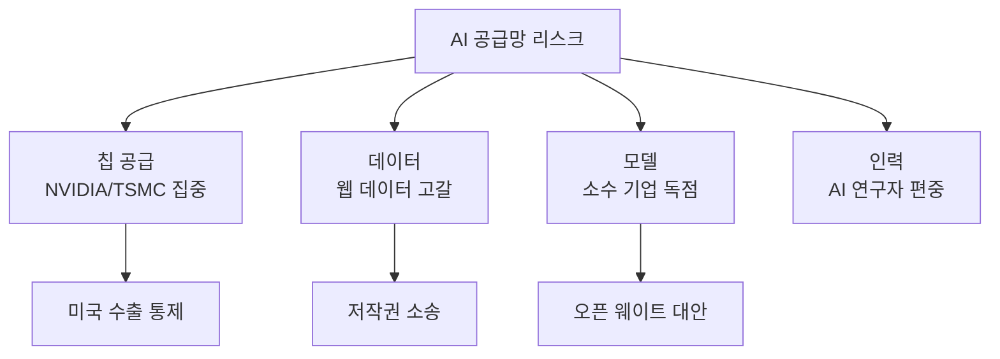

# AI 공급망 리스크

AI 시스템 구축에 필요한 **칩, 데이터, 모델, 인력**의 공급망 의존성과 지정학적 취약점.

## 주요 리스크 영역

| 영역 | 리스크 | 완화 전략 |
|------|--------|----------|
| **GPU 칩** | NVIDIA 90%+ 점유, TSMC 제조 집중 | AMD/Intel 대안, 자체 칩(Google TPU) |
| **학습 데이터** | 웹 데이터 고갈, 합성 데이터 의존 | [[synthetic-data-generation-pipeline\|합성 데이터]], 데이터 라이선싱 |
| **모델 접근** | API 의존, 가격 변동 | [[open-weights-movement\|오픈 웨이트]], 로컬 추론 |
| **인력** | 소수 기업/국가 집중 | 글로벌 AI 교육 확대 |

## [[compute-governance|컴퓨트 거버넌스]]와의 교차

칩 수출 통제가 공급망의 가장 강력한 제어 수단이 되면서, AI 거버넌스가 반도체 지정학과 직결되고 있다.

## 관련 문서

- [[compute-governance]] -- 컴퓨트 거버넌스
- [[open-weights-movement]] -- 오픈 웨이트 운동
- [[open-source-vs-proprietary-ai]] -- 오픈소스 vs 독점
- [[china-ai-ecosystem]] -- 중국 AI 생태계
