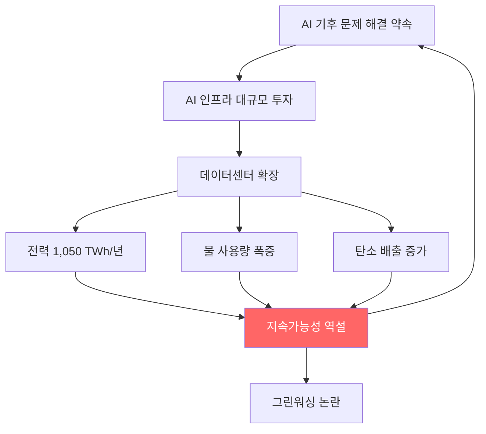

# AI 지속가능성 역설

AI가 기후 문제 해결을 약속하면서도, AI 자체의 [[ai-data-center-power|에너지]]/물 소비가 환경 부담을 가중시키는 구조적 모순.

## 개요

2026년 AI 데이터센터의 글로벌 전력 소비는 약 1,050 TWh에 달할 것으로 추정된다. GPT-4o 단일 모델의 물 사용량은 1,200만 명 이상의 생활용수에 해당한다. AI 기업들은 "AI로 기후 문제를 해결한다"고 주장하지만, 독립적으로 검증된 탄소 감소 사례는 사실상 없다. UNEP(유엔환경계획)는 이를 "AI의 환경 문제"로 공식 지목했으며, AI 산업의 지속가능성 주장과 실제 환경 영향 사이의 괴리가 심화되고 있다.

## 핵심 개념

### 역설의 구조

AI 지속가능성 역설은 세 가지 축으로 구성된다.

| 차원 | AI의 약속 | 현실 |
|------|-----------|------|
| 에너지 | 에너지 효율 최적화 | 데이터센터 전력 소비 1,050 TWh |
| 물 | 물 관리 최적화 | GPT-4o 물 사용 > 1,200만 명 생활용수 |
| 탄소 | 탄소 배출 감소 지원 | 검증된 감소 사례 0건 |

### 에너지 소비 폭발

AI 데이터센터 전력 수요는 지수적으로 증가하고 있다. IEA에 따르면 글로벌 데이터센터 전력 소비는 2024년 415 TWh에서 2030년 945 TWh로 증가할 전망이며, AI 워크로드가 이 성장의 핵심 동인이다. 2026년 기준 1,050 TWh는 일본 전체 전력 소비량을 초과하는 규모다.

### 물 소비 문제

데이터센터 냉각에 사용되는 물은 AI의 "숨겨진 비용"이다. 대규모 언어 모델의 학습과 추론에는 막대한 냉각수가 필요하며, 물 부족 지역에 데이터센터가 건설되는 경우 지역 사회와의 갈등이 발생한다.

### 그린워싱 우려

AI 기업들은 재생에너지 사용, 탄소 상쇄, 효율 개선 등을 통해 지속가능성을 주장하지만, 독립적으로 검증된 순(net) 탄소 감소 사례는 아직 보고되지 않았다. 이는 에너지 효율 개선 속도보다 AI 수요 증가 속도가 빠르기 때문이다.

## 기술 상세

### 역설의 순환 구조

### 재생에너지의 한계

2024년 신규 발전 용량의 90% 이상이 재생에너지로 충당되었으나, AI 수요 증가 속도를 따라가지 못하고 있다. WEF는 "지속가능한 AI 설계"를 촉구하면서도, 현재 AI 데이터센터의 재생에너지 비율은 27%에 불과하다고 지적한다. 재생에너지 발전이 연 22% 성장하더라도 2030년까지 데이터센터 전력 수요 증가분의 절반 수준만 충족할 수 있다.

### 효율 개선의 제본스 역설

AI 모델의 추론 효율이 개선되면 비용이 낮아져 사용량이 급증하고, 결과적으로 총 에너지 소비가 증가하는 제본스 역설(Jevons Paradox)이 AI 산업에서도 관찰된다. 일부 전문가는 "장기 에너지 수요 예측이 과장될 수 있다"고 보는 반면, 현재까지의 추세는 수요가 예측을 초과하는 방향이다.

### 해결 방향

- **모델 효율화**: 양자화, 추측적 디코딩, 지식 증류 등으로 와트당 처리량 향상
- **냉각 혁신**: 액침 냉각, 직접 칩 냉각 등 차세대 기술로 물/에너지 사용 절감
- **입지 전략**: 한랭 기후, 재생에너지 풍부 지역에 데이터센터 배치
- **투명성 의무화**: 에너지/물/탄소 소비 데이터의 독립적 검증과 공개 의무화

## 관련 문서

- [[ai-data-center-power|AI 데이터센터 전력 위기]]
- [[ai-workforce-impact|AI 인력 영향과 스킬 프리미엄]]
- [[ai-venture-bubble-2026|AI 벤처 버블 (2026 Q1 $300B)]]
