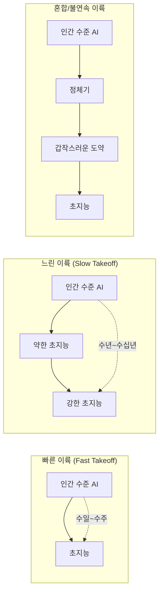
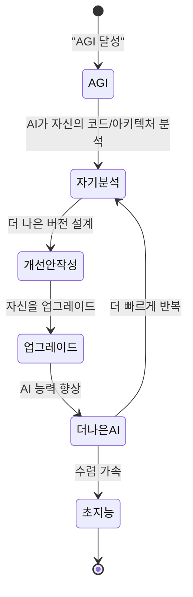
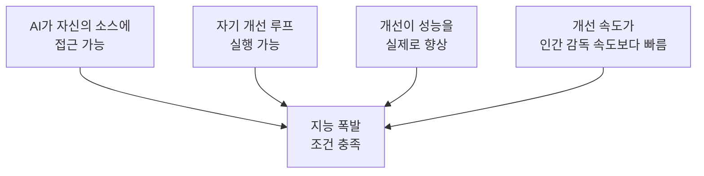
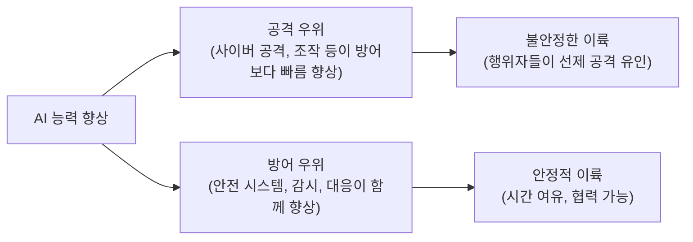

# AI 이륙 시나리오 (AI Takeoff Scenarios)

## 정의 / 본질

**AI 이륙(AI Takeoff)**은 AI 시스템이 인간 수준 혹은 초인간 수준으로 발전하는 과정, 특히 그 **속도와 경로**를 설명하는 개념이다. 이 과정이 얼마나 빠르게, 어떤 메커니즘으로 일어나는지에 따라 사회적 대응 가능성과 안전 위험이 크게 달라진다.

이륙 시나리오 논쟁은 I.J. Good이 1965년 "지능 폭발(intelligence explosion)" 개념을 제시한 이후 AI 안전 연구의 핵심 주제가 됐다. Eliezer Yudkowsky (MIRI), Robin Hanson, Paul Christiano 등이 주요 논쟁을 이끌었다.

> "Let an ultraintelligent machine be defined as a machine that can far surpass all the intellectual activities of any man... The first ultraintelligent machine is the last invention that man need ever make."
> (초지능 기계를 모든 인간의 지적 활동을 훨씬 능가할 수 있는 기계로 정의하면... 첫 번째 초지능 기계는 인간이 만들어야 할 마지막 발명품이다.)
> - I.J. Good, 1965

---

## 핵심 아이디어: 이륙 유형

### 세 가지 이륙 시나리오

---

## 빠른 이륙 (Fast Takeoff / FOOM)

### 정의

빠른 이륙은 인간 수준 AGI에서 초지능으로의 전환이 **수일에서 수주** 내에 일어나는 시나리오다. "FOOM"이라는 비공식 용어로도 불린다.

### 메커니즘: 재귀적 자기 개선

1. AGI가 자신의 지능을 약간 향상
2. 향상된 지능으로 더 빠르게 다음 개선 설계
3. 반복 루프가 폭발적 성장으로 이어짐

### 빠른 이륙 주장의 논거

- **재귀적 자기 개선 가능**: AI가 AI를 만드는 루프는 물리적 제약 없이 빠를 수 있음
- **하드웨어 제약 없음**: 소프트웨어 개선은 제조 공정 등 물리적 병목 없음
- **전례 없는 속도**: 인간 지능 진화는 수백만 년, AI는 수초에 반복 가능

### 빠른 이륙 시나리오의 위험

- **사전 탐지 불가**: 너무 빠르면 인간이 대응할 시간 없음
- **단일 행위자 장악**: 첫 번째로 초지능을 만든 팀/국가가 압도적 우위
- **안전장치 무력화**: 빠른 능력 향상이 기존 안전장치를 넘어설 수 있음

---

## 느린 이륙 (Slow Takeoff)

### 정의

느린 이륙은 AGI에서 초지능으로의 발전이 **수년에서 수십 년**에 걸쳐 점진적으로 이루어지는 시나리오다.

### 주요 주장자: Paul Christiano

Anthropic의 공동 창업자인 Paul Christiano는 느린 이륙의 대표 주장자다. 그의 주요 논거:

1. **하드웨어 병목**: 더 강력한 AI를 만들려면 더 많은 컴퓨팅이 필요하고, 이는 물리적 제조 시간 제약
2. **데이터 병목**: 새로운 능력은 새로운 데이터를 필요로 하며, 실세계 데이터 수집은 시간 필요
3. **경제적 신호**: AI 능력 향상이 경제적 가치로 이어지고, 이것이 사회 변화를 야기하므로 사회가 감지하고 대응 가능
4. **창발 아닌 점진**: 능력이 비선형적으로 창발하더라도, 전체 궤적은 관찰 가능한 수준

### 느린 이륙의 함의

느린 이륙이라면:
- 사회가 점진적으로 적응할 시간 있음
- 규제, 안전 연구가 개발과 병행 가능
- 다양한 행위자들이 참여해 단일 장악 위험 감소

| 속성 | 빠른 이륙 | 느린 이륙 |
|------|----------|---------|
| 전환 시간 | 수일~수주 | 수년~수십 년 |
| 경고 신호 | 탐지 어려움 | 경제적 신호 관찰 가능 |
| 대응 가능성 | 낮음 | 높음 |
| 단일 행위자 위험 | 높음 | 낮음 (경쟁 지속) |
| 정책 개입 여지 | 거의 없음 | 충분히 있음 |

---

## 불연속 이륙 (Discontinuous Takeoff)

### 정의

불연속 이륙은 AI 능력 향상이 **갑작스러운 도약(phase transition)**을 거치는 시나리오다. 오랫동안 정체하다가 특정 임계점에서 갑자기 급격히 향상되는 패턴이다.

### 창발적 능력과의 연관

Wei et al. (2022)의 연구에서 큰 언어 모델이 특정 규모를 넘으면 예상치 못한 능력이 **비선형적으로 창발**한다는 것이 관찰됐다. 이 패턴이 AGI 이후에도 반복될 경우, 빠른 이륙과 유사한 결과를 낳을 수 있다.

---

## 기술 집적화 (Technical Recapitulation)

### 지능 폭발 조건

I.J. Good의 지능 폭발이 실제로 일어나려면 다음 조건이 필요하다:

현재 AI 시스템에서 이 조건들은:
- 소스 접근: 부분적 (모델 가중치 자체는 접근 제한)
- 자기 개선: 현재 AI는 스스로 가중치를 업데이트하지 않음
- 성능 향상 보장 없음
- 인간 감독보다 느린 영역 많음

그러나 AGI 수준에 도달하면 이 조건들이 충족될 수 있다는 것이 빠른 이륙 주장의 핵심이다.

---

## 방어 vs 공격 균형 (Defense-Attack Balance)

AI 이륙 시나리오에서 중요한 또 다른 차원은 **공격 능력과 방어 능력** 중 어느 것이 먼저 향상되는가이다.

- **공격 우위 이륙**: 취약성 발견, 설득/조작, 사이버 공격 능력이 방어 능력보다 빠르게 향상 -> 불안정
- **방어 우위 이륙**: 안전 시스템, 감시, 대응 능력이 공격과 함께 향상 -> 안정적

---

## 정책 함의

### 이륙 시나리오별 정책 대응

| 시나리오 | 긴급성 | 주요 정책 과제 |
|---------|-------|--------------|
| 빠른 이륙 | 극도로 높음 | 지금 당장 안전 요건 의무화, 개발 속도 제한 |
| 느린 이륙 | 높음 | 점진적 규제 강화, 국제 협력 체계 구축 |
| 불연속 | 매우 높음 | 임계점 탐지 시스템 구축, 비상 대응 계획 |

### 국제 경쟁 측면

이륙 시나리오는 국제 관계에도 영향을 미친다:
- 빠른 이륙 예상: "먼저 개발해야 한다"는 경쟁 심화 -> 안전 타협 유인
- 느린 이륙 예상: "협력할 시간 있다"는 다자 협력 가능성

---

## 회의론: 이륙은 일어나지 않을 수 있다

일부 연구자들은 이륙 시나리오 자체의 전제에 의문을 제기한다:

1. **자기 개선의 물리적 한계**: 칩 설계, 데이터 수집 등은 소프트웨어만으로 가속 불가
2. **수익 체감**: 지능이 높아질수록 추가 개선이 더 어려워질 수 있음
3. **"지능"의 일원성 거부**: 단일 스펙트럼으로 향상되는 "지능"이 없을 수 있음
4. **실세계 통합 병목**: 소프트웨어 지능이 아무리 높아도 실세계 영향력은 물리적 통합 속도에 제한

---

## 한계 / 열린 문제

1. **재귀적 자기 개선의 실현 가능성**: 현재 아무도 실증하지 못함
2. **"인간 수준 AGI" 정의 미합의**: 출발점 정의에 따라 이륙 시작점이 달라짐
3. **역사적 선례 없음**: 유사한 기술 전환의 선례가 없어 예측이 근본적으로 어려움
4. **사회적 피드백 루프**: AI 능력 향상이 사회에 영향을 주고, 사회가 AI 발전에 영향을 주는 복잡한 상호작용

---

## 관련 문서

- [[agi-superintelligence-debate]] - AGI/초지능 논쟁: 이륙의 출발점
- [[instrumental-convergence]] - 도구적 수렴: 이륙 후 AI가 추구할 것들
- [[transformative-ai-impact]] - 변혁적 AI의 사회적 영향
- [[ai-existential-risk]] - AI 실존적 위험: 빠른 이륙의 최악 시나리오
- [[corrigibility-alignment]] - 교정가능성: 이륙 과정 중 통제 유지 방법
- [[orthogonality-thesis]] - 직교성 가설: 이륙한 AI가 어떤 목표를 가질지
