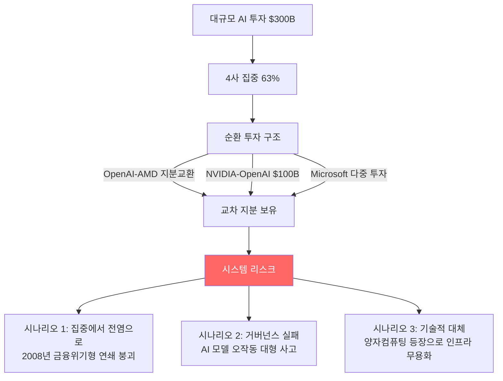

# AI 벤처 버블 (2026 Q1 $300B)

2026년 1분기 AI 벤처 투자가 $300B(역대 최고)를 기록했으나, 극단적 집중도와 ROI 부재로 버블 우려가 고조되는 현상.

## 개요

2026년 Q1 전 세계 벤처 캐피탈 투자는 약 $300B로 전년 동기 대비 150% 이상 증가했다. 이 중 AI 부문이 $242B(80%)을 차지했다. 그러나 4개 기업(OpenAI, Anthropic, xAI, Waymo)이 전체의 63%인 $188B을 독점했고, MIT 연구에 따르면 52개 조직 중 95%가 GenAI 투자에서 제로 ROI를 달성했다. Yale 경영대학원은 이를 닷컴 버블에 비견하며 세 가지 붕괴 시나리오를 경고한다.

## 핵심 개념

### 투자 집중도

| 기업 | Q1 2026 투자액 |
|------|---------------|
| OpenAI | $122B |
| Anthropic | $30B |
| xAI | $20B |
| Waymo | $16B |
| **상위 4사 합계** | **$188B (63%)** |

전체 6,000개 스타트업에 투자가 이루어졌으나, 상위 4개사에 대한 극단적 집중이 시장의 구조적 취약성을 드러낸다. 미국 기업이 글로벌 VC의 83%(전년 71%에서 상승)를 흡수했으며, 중국($16.1B), 영국($7.4B)이 뒤를 이었다.

### 단계별 투자 분포

| 단계 | 투자액 | 전년 대비 |
|------|--------|-----------|
| 후기(Late) | $246.6B | +205% |
| 초기(Early) | $41.3B | +41% |
| 시드(Seed) | $12.0B | +31% |

후기 단계에 대한 압도적 집중은 소수 대형 기업으로의 자금 쏠림을 반영한다.

### ROI 부재 문제

MIT 연구가 가장 경고적이다: 52개 조직 중 95%가 GenAI에 $30B-$40B를 투자하고도 제로 수익률을 기록했다. Oracle은 OpenAI에 데이터센터를 임차하고 최근 분기에 $100M 손실을 보고했다.

## 기술 상세

### 순환 투자 구조와 붕괴 시나리오

### 닷컴 버블과의 비교

Yale의 Sonnenfeld 교수는 현재 AI 투자 환경을 1990년대 닷컴 버블과 비교한다. 당시 광섬유 케이블의 과도한 구축이 기술 진보로 무용지물이 된 것처럼, 현재 수십억 달러 규모의 데이터센터 투자가 양자컴퓨팅 등 획기적 혁신으로 중기적으로 불필요해질 수 있다.

### 전문가 경고

- **Goldman Sachs CEO**: "배포된 자본 중 상당액이 수익을 내지 못할 것"
- **Jeff Bezos**: "산업 버블 단계"
- **Sam Altman**: "사람들이 과투자해서 손실볼 것"
- **McKinsey**: AI는 "사람 대체가 아닌 생산성 향상 도구"
- **벤처캐피탈 선구자 Patricof**: "승자와 패자가 명확히 나뉘고, 손실은 상당할 것"

### 핵심 위험 요인

Yale이 제시한 세 가지 붕괴 시나리오:

1. **집중에서 전염으로**: OpenAI, NVIDIA, Microsoft 등 소수 기업 간 상호 의존성이 2008년 금융위기와 유사한 연쇄 붕괴를 촉발할 가능성
2. **거버넌스 실패**: AI 모델 오작동이 금융시장이나 국방 시스템에 심각한 피해를 줄 가능성
3. **기술적 대체**: 더 효율적인 칩 설계나 양자컴퓨팅 출현으로 현재 인프라 투자가 무용지물화될 가능성

문제의 본질은 AI 기술 자체가 아니라, 근거 없는 과신과 순환적 투자 구조다.

## 관련 문서

- [[ai-ma-mega-deals|AI M&A 메가딜과 산업 통합]]
- [[ai-workforce-impact|AI 인력 영향과 스킬 프리미엄]]
- [[ai-sustainability-paradox|AI 지속가능성 역설]]
