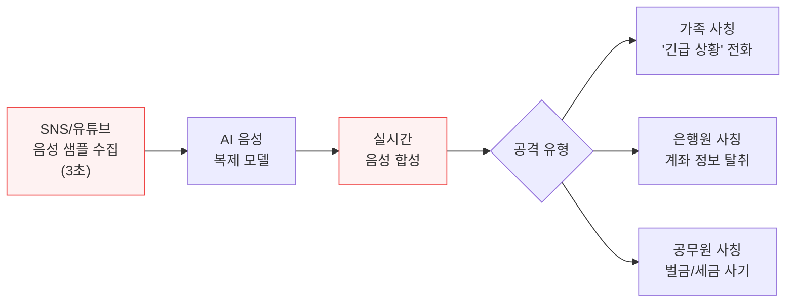

# AI 음성 복제 사기 및 사칭 범죄

AI 음성 복제(voice cloning) 기술을 악용한 사칭 사기가 2026년 폭발적으로 증가하고 있다. 3초 분량의 오디오만으로 85% 정확도의 음성 복제가 가능해졌으며, 미국에서만 $23억 이상의 피해가 보고되었다. UN은 이를 "조직 범죄의 규모적 무기화"로 경고했다.

## 개요

AI 음성 복제 사기는 딥러닝 기반 음성 합성 기술로 특정인의 목소리를 복제하여 전화, 음성 메시지, 화상 회의에서 사칭하는 범죄다. 2024년까지는 기술적 한계로 인해 탐지가 가능했으나, 2025-2026년 음성 합성 모델의 급격한 발전으로 **"구별 불가 임계점(indistinguishable threshold)"을 돌파**했다(Fortune). 인간 청자가 합성 음성과 실제 음성을 신뢰성 있게 구별할 수 없게 된 것이다.

이 위협은 개인 대상 사기를 넘어 기업 CEO/CFO 사칭, 금융 기관 공격, 정치적 허위정보 유포까지 확대되고 있다.

## 핵심 통계 (2026)

### 피해 규모

| 지표 | 수치 | 출처 |
|------|------|------|
| 미국 고령자 피해액 | $23억+ | FBI |
| FTC 신고 건수 (Q1 2026) | 250,000건 | FTC |
| AI 사기 전년 대비 증가율 | 1,210% | Vectra AI |
| BEC(비즈니스 이메일 침해) 피해 | $27.7억 (21,442건) | FBI IC3 |
| 2027년 예상 손실 | $400억 | 산업 추정 |
| 단일 최대 피해 사례 | $2,560만 (Arup) | 보도 자료 |
| 실제 신고 비율 | 15% | 연구 추정 |

### 기술 지표

| 지표 | 수치 |
|------|------|
| 음성 복제 최소 필요 오디오 | 3초 |
| 복제 정확도 | 85% (McAfee) |
| 음성 피싱 공격 증가율 (2025) | 442% |
| 딥페이크 사기 고유 사례 (Q4 2025) | 159,378건 |
| 사기 성공률 변화 | 12% (2024) -> 34% (2026) |
| 미국인 딥페이크 음성 경험률 | 4명 중 1명 |
| 주간 온라인 음성 공유 비율 | 53%+ |
| 소매업체 일평균 AI 사기 전화 | 1,000건+ |

## 공격 방식

### 개인 대상

가장 흔한 패턴은 "긴급 사칭(urgency impersonation)"이다. 자녀나 손주의 목소리를 복제하여 "사고가 났다", "체포되었다" 등 긴급 상황을 연출하고 즉각적인 송금을 유도한다. 고령자가 주요 타겟이며, FBI에 따르면 2026년 미국 고령자 피해액만 $23억을 초과했다. 실제 신고율이 15%에 불과하므로 실제 피해는 이보다 훨씬 클 것으로 추정된다.

### 기업 대상

기업 대상 공격은 더욱 정교하다:

- **CEO/CFO 사칭 화상 회의**: Arup 엔지니어링 사례에서 딥페이크 화상 회의로 $2,560만 탈취
- **딥페이크 채용 후보**: 위협 행위자가 AI로 가짜 면접 후보를 생성하여 내부 시스템 접근 확보
- **재무 고문 사칭 영상**: 투자 사기에 신뢰 구축용으로 활용

2025년 기준 73%의 조직이 사이버 기반 사기를 경험했으며, CEO들의 최우선 보안 우려가 랜섬웨어에서 AI 사기로 전환되었다.

## UN 경보 및 국제 대응

2026년 3월 UN은 AI 기반 딥페이크와 음성 복제의 무기화에 대한 공식 경보를 발령했다. UN 보고서의 핵심 내용:

- 동남아시아 기반 사기 조직이 **"전체 범죄 생태계"**를 구축 -- 사기, 자금 세탁, 악성코드, 인신매매, 부패를 포괄
- 미국만 2024년 동남아 사기 조직에 $100억 손실
- 60개국이 방콕 회의에 참여하여 공동 대응 논의
- 개인 사례로 Sawyer 부부가 $250만 이상 피해

UN 권고사항:
- 국경 간 합동 수사 및 공동 기소
- 실시간 정보 공유 체계 구축
- 디지털 증거 처리 역량 강화
- 지하 은행 시스템 및 카지노 자금 흐름 차단
- 피해자 중심 대응 절차 수립

## 방어 및 탐지

### 개인 방어

- **가족 간 비밀 인증 구호(safe word)** 설정 -- 전화로 신원 확인
- **콜백 검증**: 긴급 요청을 받으면 알려진 번호로 직접 재전화
- **즉각 송금 거부**: 진짜 긴급 상황이라도 전화로 금전 요구하는 경우 의심
- **온라인 음성 노출 최소화**: SNS 음성/영상 게시 시 복제 위험 인식

### 기업 방어

Vectra AI 등 보안 기업이 제시하는 다계층 방어:

1. **NDR(네트워크 탐지/대응)**: 인프라 이상 징후 감지
2. **ITDR(ID 위협 탐지/대응)**: 행동 편차 기반 사칭 탐지
3. **이중 승인 재무 통제**: 고액 거래 시 별도 채널로 이중 확인
4. **대역 외(out-of-band) 검증**: 고가치 요청에 대해 다른 통신 채널로 확인
5. **피싱 방지 MFA**: FIDO2, 하드웨어 토큰 기반 인증
6. **행동 기반 이메일 분석**: 서명 기반 필터링을 대체

## 기술적 배경

음성 복제 기술의 급속한 발전은 다음 요인에 기인한다:

- **소량 데이터 학습**: 과거 수 시간의 녹음이 필요했던 것이 3초로 단축
- **실시간 합성**: 지연 없이 대화 중 실시간 음성 변환 가능
- **오픈소스 확산**: 음성 합성 모델의 오픈소스화로 진입 장벽 급감
- **다국어 지원**: 영어 외 한국어, 중국어 등 다양한 언어의 음성 복제 지원

Fortune은 2026년을 음성 복제가 "구별 불가 임계점"을 넘은 해로 규정했다. 이는 전통적인 "귀로 듣고 판별하는" 방어 전략이 더 이상 유효하지 않음을 의미한다.

## 관련 문서

- [[deepfake-detection-c2pa|Deepfake Detection & C2PA]]
- [[ai-cybersecurity-defensive|AI Cybersecurity (Defensive AI)]]
- [[llm-security-owasp|LLM Security OWASP]]
- [[agent-prompt-injection-defense|Agent Prompt Injection Defense]]
- [[ai-regulation-us|AI Regulation (US)]]
