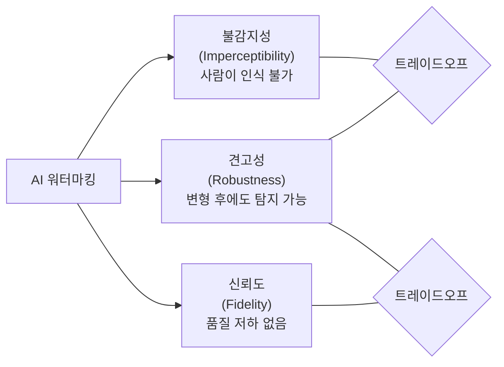
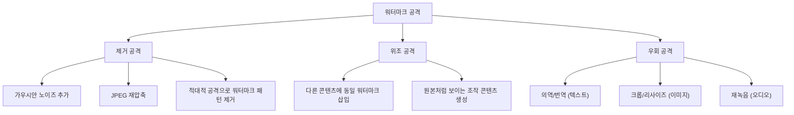

# AI 워터마킹 (AI Watermarking)

## 개요

AI 워터마킹(AI Watermarking)은 AI 시스템이 생성한 콘텐츠(텍스트, 이미지, 오디오, 비디오)에 사람이 인식할 수 없지만 기계로 탐지 가능한 신호를 삽입하여, 해당 콘텐츠가 AI에 의해 생성되었음을 사후에 검증할 수 있게 하는 기술이다.

딥페이크, AI 생성 허위 정보, 저작권 분쟁이 증가하면서 워터마킹은 단순한 연구 주제에서 EU AI Act, 미국 행정명령 등 규제 요건으로 격상되었다. 2023년 7월 바이든 행정부는 주요 AI 기업들로부터 AI 생성 콘텐츠에 워터마킹을 적용하겠다는 자발적 약속을 받아냈다.

## 워터마킹의 핵심 속성

이상적인 AI 워터마킹은 다음 세 가지 속성을 동시에 만족해야 한다:



세 속성은 서로 트레이드오프 관계에 있다. 강한 워터마크는 탐지가 쉽지만 품질을 저하시키거나 인지될 수 있고, 품질 저하 없는 미묘한 워터마크는 공격에 취약하다.

추가로 다음 속성도 중요하다:
- **위조 불가능성(Unforgeability)**: 공격자가 다른 콘텐츠에 동일한 워터마크를 삽입하거나 워터마크를 제거할 수 없어야 함
- **키 보안(Key Security)**: 워터마크 삽입/검출 키가 노출되지 않아야 함
- **확장성(Scalability)**: 대규모 서비스 환경에서 추가 지연 없이 동작해야 함

---

## 텍스트 워터마킹

### 어휘 기반 워터마킹 (Token-level Watermarking)

Kirchenbauer et al. (2023, "A Watermark for Large Language Models")의 방법론이 가장 널리 알려진 LLM 텍스트 워터마킹이다.

**작동 원리**:
1. 비밀 키와 앞선 토큰들을 해시하여 각 생성 단계에서 어휘를 "그린 리스트(green list)"와 "레드 리스트(red list)"로 분할
2. 샘플링 시 그린 리스트 토큰에 편향(bias)을 주어 높은 확률로 선택
3. 탐지 시 동일 키로 그린/레드 분할을 재현하고, 텍스트 내 그린 토큰 비율을 통계 검정

```python
# 개념 설명용 의사코드 (실제 구현 아님)
def watermark_logits(logits, prev_tokens, secret_key):
    seed = hash(secret_key + str(prev_tokens))
    rng = Random(seed)
    green_list = rng.sample(vocab, k=vocab_size // 2)
    
    for token_id in green_list:
        logits[token_id] += delta  # 그린 토큰에 편향 추가
    
    return logits

def detect_watermark(text, secret_key):
    tokens = tokenize(text)
    green_count = 0
    for i, token in enumerate(tokens):
        seed = hash(secret_key + str(tokens[:i]))
        rng = Random(seed)
        green_list = rng.sample(vocab, k=vocab_size // 2)
        if token in green_list:
            green_count += 1
    
    # 이항 검정: 우연이라면 그린 비율 ≈ 0.5
    z_score = (green_count - len(tokens) * 0.5) / sqrt(len(tokens) * 0.25)
    return z_score > threshold  # z > 4 이면 99.99% 이상 신뢰로 워터마크 탐지
```

**장점**: 추가 연산 비용 최소, 어떤 LLM에도 샘플링 단계에서 적용 가능  
**한계**: 의역(paraphrase)이나 번역 공격에 취약, 저엔트로피 텍스트(코드, 수식)에서 품질 저하 발생

### 의미 기반 워터마킹 (Semantic Watermarking)

텍스트의 표면적 형태가 아닌 의미(임베딩 공간)에 워터마크를 삽입하는 방법. 의역 공격에 더 견고하지만, 탐지를 위해 원본 모델 접근이 필요한 경우가 많다.

### 스테가노그래피 기반

텍스트의 특정 언어적 패턴(문장 길이, 동의어 선택, 구두점 위치)을 조절하여 비트 정보를 인코딩. 탐지 가능성은 높지만 텍스트 품질에 영향을 줄 수 있다.

---

## 이미지 워터마킹

### SynthID (Google DeepMind)

Google DeepMind가 2023년에 Imagen 생성 이미지에 적용한 워터마킹 시스템. 이후 Gemini 생성 이미지와 텍스트까지 확장되었다.

**핵심 아이디어**: 이미지 생성의 확산 과정(diffusion process) 자체에 워터마크를 삽입. 픽셀 수준이 아닌 생성 과정에 개입하므로 후처리 공격에 강하다.

**탐지 방식**: 이미지를 인식 불가능한 워터마크 패턴으로 변환한 신경망(워터마크 식별자)이 직접 탐지. 이진 결과(탐지됨/안됨)가 아닌 신뢰도 점수를 제공.

**견고성 평가**: 자르기(crop), 회전, 색상 조정, JPEG 압축, 스크린샷 후 재촬영에도 탐지 성능 유지.

2024년 SynthID는 텍스트 워터마킹으로 확장(토큰 레벨 토너먼트 샘플링)되어 Gemini 앱에 적용.

### 비가시 워터마킹 (Invisible Watermarking)

인간이 인식하기 어려운 픽셀 수준 변화로 워터마크를 삽입:

- **DCT/DWT 기반**: 주파수 도메인에서 워터마크 삽입. JPEG 압축에 상대적으로 견고
- **LSB 스테가노그래피**: 최하위 비트(LSB) 조작. 탐지 쉽고 공격에 취약
- **Deep Watermarking**: HiDDeN, RivaGAN 등 신경망으로 학습된 인코더-디코더 쌍. 다양한 공격에 견고

### C2PA (Coalition for Content Provenance and Authenticity)

Adobe, Microsoft, Google, Intel 등이 참여하는 업계 표준. 콘텐츠 자체에 워터마크를 삽입하는 것이 아니라, 서명된 메타데이터(출처 정보)를 파일에 첨부한다. EXIF 수준을 넘어 암호화 서명으로 위변조를 방지한다.

---

## 오디오 워터마킹

AI 생성 오디오(TTS, 음악 생성, 음성 복제)에 워터마크를 삽입하는 기술. 주요 접근:

- **주파수 도메인 삽입**: 사람이 인지하기 어려운 초음파 또는 서브소닉 주파수 대역에 패턴 삽입
- **스펙트로그램 기반**: 오디오를 스펙트로그램으로 변환 후 이미지 워터마킹 기법 적용, 재변환
- **신경 워터마킹**: WavMark, AudioSeal (Meta) 등 end-to-end 신경망 워터마크

**AudioSeal (Meta, 2024)**: 오디오 생성기와 결합하거나 사후에 적용 가능한 오디오 워터마크. 국소화(localization) 기능이 있어 오디오의 어느 구간이 AI 생성인지 식별 가능.

---

## 비디오 워터마킹

비디오는 프레임 수준 이미지 워터마킹 + 시간 도메인 정보의 조합으로 접근:

- **프레임 일관성**: 모든 프레임에 일관된 워터마크를 삽입하되, 프레임 추출·재인코딩에도 탐지 가능해야 함
- **시간 도메인 패턴**: 특정 프레임 간격으로 패턴을 배치하여 편집 후에도 추적 가능
- **SynthID 비디오**: Google의 Veo 비디오 생성 모델에 적용된 프레임 레벨 워터마크 확장

---

## 공격 유형과 방어



각 공격에 대한 방어 전략:
- **제거 공격 대응**: 주파수 도메인 또는 생성 과정 삽입으로 견고성 향상
- **위조 공격 대응**: 비대칭 키 구조 (삽입 키 != 탐지 키)
- **우회 공격 대응**: 의미 수준 워터마크, 출처 메타데이터(C2PA) 병행

---

## 규제 환경

| 규제/표준 | 내용 |
|---------|------|
| EU AI Act (2024) | 고위험 AI가 생성한 콘텐츠는 AI 생성임을 표시 의무화 |
| 미국 행정명령 (2023) | 주요 AI 기업이 자발적 워터마킹 약속 |
| NIST AI RMF | 콘텐츠 출처 투명성을 위험 관리 프레임워크에 포함 |
| C2PA 표준 | 업계 자율 메타데이터 기반 출처 증명 |

---

## 한계와 미해결 문제

1. **조율 문제**: 여러 공급자가 서로 다른 워터마킹 표준을 사용하면 상호운용이 불가
2. **적대적 제거**: 워터마크 탐지기 접근 시 적대적 공격으로 무력화 가능
3. **오탐(False Positive)**: 워터마크 없는 인간 콘텐츠를 AI 생성으로 오분류하는 위험
4. **오픈소스 우회**: 워터마킹이 없는 오픈소스 모델로 생성하면 규제 우회 가능
5. **긴 시간 견고성**: 압축, 재생성, 스타일 변환이 반복되면 워터마크 신호가 희석

---

## 관련 문서

- [[ai-content-detection]] - AI 생성 콘텐츠 탐지 전반 (GPT-Zero, 통계적 방법)
- [[ai-content-moderation]] - 유해 콘텐츠 필터링과 생성 콘텐츠 정책
- [[deepfake-detection]] - 딥페이크 영상/음성 탐지 기법
- [[differential-privacy]] - 출처 보호의 다른 접근법

---

## 참고 자료

- Kirchenbauer, J. et al. (2023). "A Watermark for Large Language Models." ICML 2023.
- Fernandez, P. et al. (2024). "SynthID: Watermarking AI-Generated Content." Google DeepMind Technical Report.
- San Roman, R. et al. (2024). "AudioSeal: Proactive Detection of Voice Cloning with Localized Watermarking." Meta AI Research.
- C2PA Specification v2.0. Coalition for Content Provenance and Authenticity. (https://c2pa.org)
