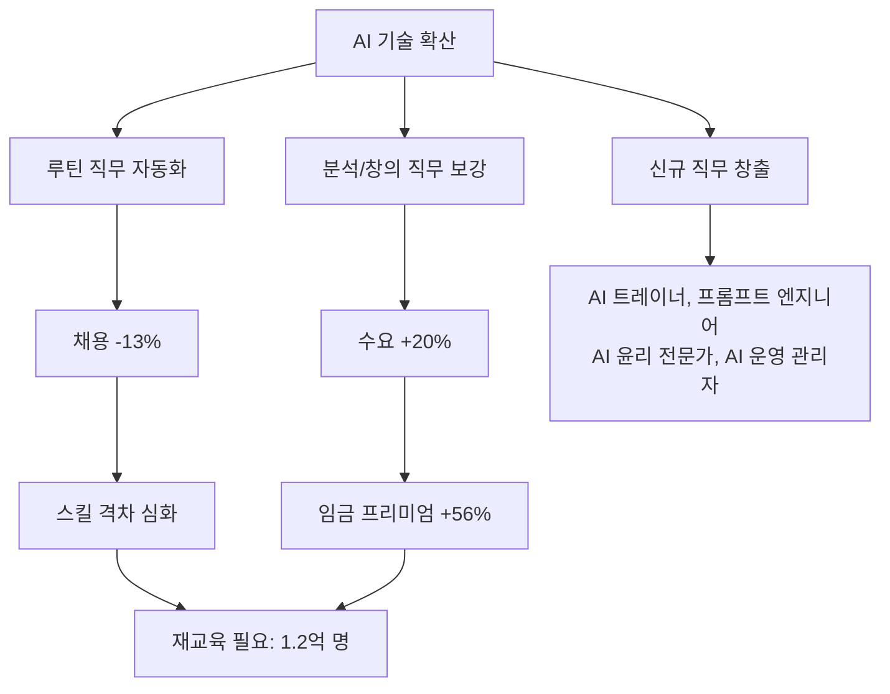

# AI 인력 영향과 스킬 프리미엄

AI 기술 보유 여부에 따른 임금 격차 심화와 노동시장 구조 재편 현상.

## 개요

2026년 현재 AI가 노동시장에 미치는 영향은 "대체"보다 "재편"에 가깝다. HBR 연구에 따르면 ChatGPT 출시 이후 반복적/구조화된 업무의 채용공고는 13% 감소한 반면, 분석적/창의적 업무 수요는 20% 증가했다. AI 기술을 보유한 근로자는 동일 직무의 동료보다 56% 높은 임금을 받으며, 이 격차는 더 벌어지고 있다. WEF(세계경제포럼)는 2030년까지 1억 7천만 개의 새로운 직무가 생성되고 9,200만 개가 사라져 순 7,800만 개 일자리가 순증가할 것으로 전망한다.

## 핵심 개념

### 스킬 프리미엄의 구조

AI 스킬 프리미엄은 단순히 "AI를 다룰 줄 아는가"에 그치지 않는다. 프롬프트 작성, AI 도구 활용, AI 출력물 검증, AI-인간 워크플로 설계 등 복합적 역량이 시장 가치를 결정한다.

| 지표 | 수치 |
|------|------|
| AI 스킬 임금 프리미엄 | +56% |
| 루틴 직무 채용 감소 | -13% |
| 분석/창의 직무 수요 증가 | +20% |
| 2030년까지 영향받는 일자리 비율 | 22% |
| 재교육 필요 엔지니어링 인력 | 80% (2027년까지) |
| 중기 실업 위험 근로자 수 | 1억 2천만 명 |

### 직무 양극화

AI 도입은 직무 스펙트럼의 양 끝을 강화한다. 고숙련 분석/창의 직무는 AI 보강으로 생산성이 높아져 수요와 임금이 동시에 상승한다. 반면 중간 숙련의 루틴 직무(데이터 입력, 기초 분석, 정형 보고서 작성 등)는 자동화 압력을 받아 축소된다. 금융과 기술 분야에서 감소가 가장 두드러진다.

### 기업의 대응

고용주의 85%가 2030년까지 인력 재교육을 최우선 과제로 설정할 계획이다. BCG는 "AI가 대체하는 것보다 재편하는 일자리가 훨씬 많다"고 분석하며, AI를 비용 절감이 아닌 업무 보강 도구로 접근해야 한다고 권고한다.

## 기술 상세

### 노동시장 재편 구조

### 산업별 영향 차이

HBR 연구(2019-2025년 미국 채용공고 거의 전수, 19,000개 이상 업무, 900개 이상 직종 분석)는 산업별 영향이 균등하지 않음을 보여준다. 자동화 취약 직무의 필요 기술은 7% 감소한 반면, AI 보강 직무에서는 프롬프트 작성, AI 도구 활용 등 새로운 기술 요구가 급증했다.

### 재교육의 규모와 긴급성

WEF 추산 약 1억 2천만 명의 근로자가 중기적 실업 위험에 처해 있으나, 필요한 재교육을 받을 가능성은 낮다. 이는 단순한 기술 교육이 아니라 직무 설계, 조직 구조, 교육 시스템 전반의 전환을 요구하는 문제다.

### 인간-AI 협업 모델

핵심 연구 결론은 AI가 단순히 일자리를 없애기보다 인간-AI 협업이 노동시장 변화의 핵심 동인이라는 점이다. AI는 루틴 업무를 자동화하되, 인간은 판단, 맥락 이해, 창의적 문제 해결, 이해관계자 소통 등 고차원 역량에 집중하는 분업 구조가 형성되고 있다.

## 관련 문서

- [[ai-sustainability-paradox|AI 지속가능성 역설]]
- [[ai-venture-bubble-2026|AI 벤처 버블 (2026 Q1 $300B)]]
- [[ai-data-center-power|AI 데이터센터 전력 위기]]
