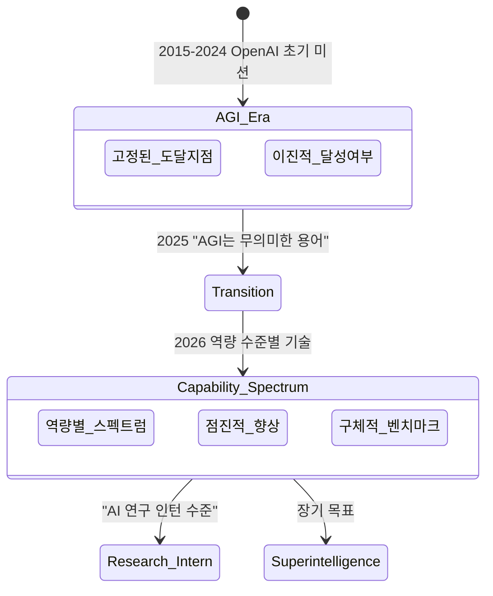

# Sam Altman의 AGI 정의 전환

## 개요

"AGI(Artificial General Intelligence, 인공일반지능)는 더 이상 유용한 용어가 아니다"라는 Sam Altman의 2025-2026년 발언은 AGI 담론의 전환점이다. 고정된 도달 지점으로서의 AGI 개념에서 점진적 역량 수준(capability spectrum) 논의로 이동하는 이 전환은 단순한 수사가 아니라 OpenAI의 전략적 포지셔닝 변화를 반영한다.

## 전환의 계기: 무엇이 바뀌었나

### 이전 프레임: AGI 달성 선언

OpenAI는 초기부터 "AGI 안전하게 달성"을 미션으로 명시했다. 이 때 AGI는 암묵적으로 "인간 수준의 모든 인지 작업을 수행하는 시스템"을 의미했다. 이 정의는 다음 문제를 내포했다:

- **달성 기준 모호성**: "인간 수준"이 어느 인간인지, 어느 작업인지 불명확
- **마케팅 과장 위험**: AGI 달성 주장이 규제, 경쟁사, 투자자 관계에 복잡한 함의
- **실제 역량 괴리**: 현행 LLM이 특정 영역에서는 인간을 초월하고 다른 영역에서는 초등 수준에 머무는 불균형

### 2025-2026년 전환: "AI 연구 인턴의 해"

Altman은 AGI를 명명하기보다 달성하고자 하는 구체적 역량을 기술하는 방식으로 이동했다.

> "2026년은 AI 연구 인턴의 해(the year of the AI research intern)"

이 표현이 암시하는 역량 수준:

- 특정 복잡한 연구 작업을 자율적으로 수행
- 지속적 감독 없이 멀티스텝 작업 완료
- 새로운 도메인 적응 능력

위 다이어그램은 Altman의 AGI 프레임이 고정 목표에서 연속 스펙트럼으로 전환되는 과정을 보여준다.

## 세 가지 전환 방향

### 1. 이진(binary) -> 스펙트럼(spectrum)

| 이전 관점 | 새 관점 |
|-----------|---------|
| AGI 달성/미달성 | 역량 수준 A, B, C... |
| 인간 수준 = 임계점 | 특정 작업별 초과/미달 |
| 달성 후 "무엇을 해야 하나" 불명확 | 각 수준에서 구체적 활용 |

### 2. 추상 개념 -> 구체적 벤치마크

AGI 대신 측정 가능한 역량으로 대화를 전환:

- Terminal-Bench 2.0 (에이전틱 코딩)
- MRCR v2 (장문 컨텍스트 추론)
- OSWorld (컴퓨터 사용)
- "AI 연구 인턴 수준" (자율 연구 작업)

### 3. 기술 담론 -> 경제적 영향 담론

Altman은 "AGI가 모든 인간 작업을 수행한다"는 기술적 주장보다 "AI가 경제 성장을 이끄는 방식"에 초점을 맞추기 시작했다. [[transformative-ai-impact]] 문서에서 다루는 AI의 GDP 기여 논의와 연계된다.

## AGI 재정의를 둘러싼 긴장

### OpenAI 내부 계약 문제

OpenAI의 투자자 계약 일부에 "AGI 달성 시 특정 조항 발동" 내용이 있는 것으로 알려져 있다. AGI의 정의를 흐리는 것이 법적/재무적 동기와 연결된다는 시각도 존재한다.

### 경쟁사들의 다른 접근

| 기업/인물 | AGI 정의/입장 |
|-----------|--------------|
| Sam Altman (OpenAI) | "무의미한 용어", 스펙트럼 접근 |
| Demis Hassabis (DeepMind) | AGI를 구체적 마일스톤으로 정의 유지 |
| Elon Musk (xAI) | "AGI 달성 확률 10%" 계량화 주장 |
| Yann LeCun (Meta) | LLM 방식으로는 AGI 불가능 주장 |

[[agi-superintelligence-debate]] 에서 이 논쟁의 전반적 맥락을 다룬다.

### "GPT-5.5 발언"의 상징성

2026년 4월 Altman은 X(구 트위터)에 "GPT-5.5가 너무 좋아서 다상 수면(polyphasic sleep)으로 전환할 것"이라는 글을 올렸다. 이는 모델 역량에 대한 개인적 경이(awe)를 공개적으로 표현한 것으로, AGI 선언은 피하면서도 전환점 인식을 암시하는 이중적 커뮤니케이션이다.

## 왜 이 전환이 중요한가

### 규제 함의

- AGI를 명시적으로 선언하면 EU AI Act, 미국 행정명령 등의 "고위험 AI" 분류 기준에 걸릴 수 있음
- 점진적 역량 서술 방식은 규제 경계 획정을 어렵게 만듦

### 경쟁 전략

- "우리는 AGI를 달성했다"고 선언하면 경쟁사들에게 구체적 타깃 제공
- 모호한 역량 스펙트럼 논의는 마케팅 유연성 유지

### 안전 연구 방향

- [[transformative-ai-impact]] 관점에서 "언제 임계점인가"를 논의하기 어려워짐
- 역설적으로 "지금도 이미 중요한 안전 투자가 필요하다"는 논거 강화

## 실무적 관점

AI 개발자와 연구자 입장에서 이 전환이 의미하는 것:

1. **벤치마크 중심 평가**: AGI 여부가 아닌 특정 작업 역량으로 모델을 평가하는 문화 강화
2. **에이전틱 시스템 부상**: "AI 연구 인턴" 비유가 가리키는 것은 결국 자율 에이전트 시스템
3. **인프라 투자 정당화**: 명확한 AGI 달성 없이도 [[openai-titan-custom-chip]] 같은 대규모 인프라 투자를 정당화하는 내러티브 필요

## 관련 문서

- [[agi-superintelligence-debate]] - AGI와 초지능 논쟁 전반
- [[transformative-ai-impact]] - AI의 경제적/사회적 변환 영향
- [[openai-titan-custom-chip]] - OpenAI의 커스텀 실리콘 전략
