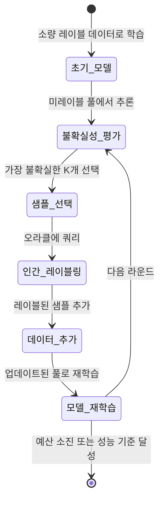
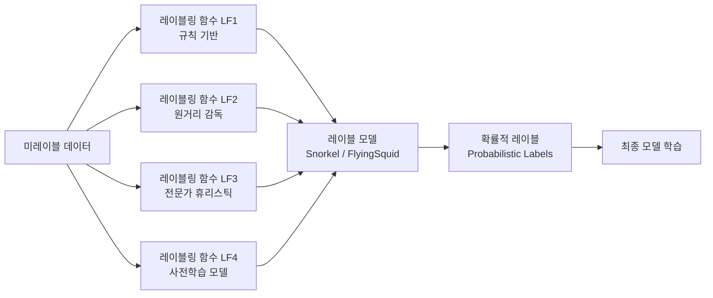
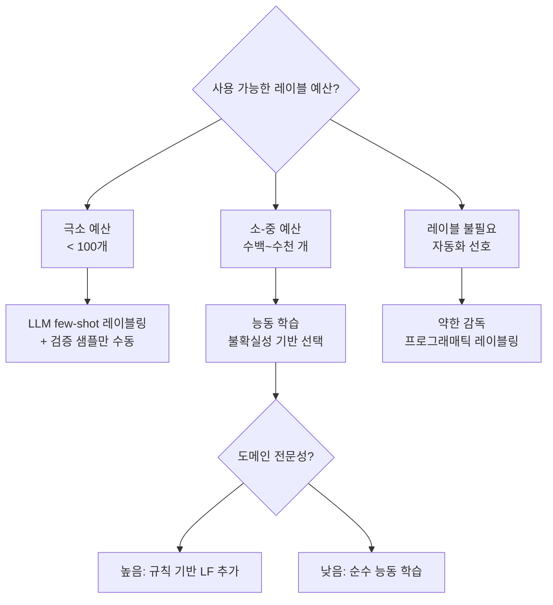

# 어노테이션 효율화

## 개요

어노테이션 효율화(Annotation Efficiency)는 모델 학습에 필요한 레이블 데이터를 최소한의 인간 노력으로 획득하는 방법론 전반을 다룬다. 고품질 어노테이션은 지도 학습의 품질을 결정하는 핵심 요소이지만, 전문가 레이블러가 필요한 경우 비용이 매우 높다. 이 문제를 해결하기 위해 능동 학습(active learning), 약한 감독(weak supervision), 프로그래매틱 레이블링(programmatic labeling) 등 다양한 접근이 발전했다.

[[data-annotation]] 작업의 실제 구현을 위한 핵심 기술 집합이며, [[active-learning]]은 그 중에서도 가장 활발히 연구되는 분야이다.

## 핵심 접근법

### 1. 능동 학습 (Active Learning)

모델이 스스로 "어떤 샘플에 레이블을 붙이면 가장 유익한가"를 판단하여 인간 레이블러에게 선택적으로 쿼리하는 방식이다.

**불확실성 측정 방법:**

| 방법 | 기준 | 특징 |
|------|------|------|
| Least Confidence | $1 - \max_c P(y=c|x)$ | 가장 단순, 널리 사용 |
| Margin Sampling | $P(y_1|x) - P(y_2|x)$ | 상위 2개 클래스 차이 |
| Entropy | $-\sum_c P \log P$ | 정보 이론적 불확실성 |
| BALD | 정보 획득량(mutual information) | 베이지안 관점, 앙상블 필요 |

**배치 능동 학습:** 쿼리마다 1개가 아닌 K개 샘플을 선택해 레이블러 효율을 높임. 단, 선택된 샘플들 간 다양성(diversity)도 고려해야 중복 선택 방지 가능.

### 2. 약한 감독 (Weak Supervision)

완벽한 레이블 대신 노이즈가 있거나 불완전한 레이블 소스를 여러 개 결합하여 레이블을 생성하는 패러다임이다.

**Snorkel 프레임워크**가 이 접근의 대표적 구현체다. 레이블링 함수들의 합의와 충돌을 분석하여 각 샘플에 대한 확률적 레이블을 생성하고, 이를 학습 신호로 활용한다.

**원거리 감독(Distant Supervision):** 지식 베이스(Knowledge Base)와 텍스트 간 관계 매핑을 이용해 자동으로 레이블 생성. 관계 추출(relation extraction) 분야에서 특히 많이 사용됨.

### 3. 프로그래매틱 레이블링

규칙, 패턴, 모델을 코드로 작성하여 대량의 데이터에 레이블을 자동으로 부여하는 방식이다. 약한 감독의 한 형태이나, 도메인 전문가가 자신의 지식을 함수 형태로 코드화한다는 점이 강조된다.

**레이블링 함수 유형:**
- **키워드 규칙**: "이 단어가 포함되면 긍정"
- **정규 표현식**: 패턴 매칭 기반 분류
- **외부 자원 활용**: 사전, 온톨로지, 기존 분류기 출력 활용
- **LLM 기반**: GPT-4나 Claude를 레이블링 함수로 사용 (최근 급증)

### 4. LLM 기반 데이터 생성 및 레이블링

최근 가장 빠르게 성장하는 영역으로, 대형 언어 모델을 활용해 레이블 데이터를 완전히 합성하거나 기존 데이터에 레이블을 부여한다.

- **합성 데이터 생성**: LLM에 프롬프트를 주어 레이블이 포함된 학습 데이터를 직접 생성
- **In-Context 레이블링**: few-shot 예시와 함께 레이블 판단을 요청
- **Chain-of-Thought 레이블링**: 추론 과정을 명시하게 하여 레이블 품질 향상

**주의사항:** LLM 생성 데이터는 LLM의 편향(bias)을 그대로 계승하며, 특히 LLM을 이용해 같은 LLM 계열 모델을 학습시키는 "모델 붕괴(model collapse)" 문제에 주의가 필요하다.

## 어노테이션 품질 관리

레이블 효율만큼 중요한 것이 레이블 품질이다.

### 레이블러 간 일치도 (Inter-Annotator Agreement)

- **Cohen's Kappa**: 우연에 의한 일치를 보정한 레이블러 간 동의율
- **Krippendorff's Alpha**: 여러 레이블러, 여러 척도 유형에 적용 가능한 범용 지표

### 크라우드소싱 품질 제어

Amazon Mechanical Turk, Scale AI 등 크라우드소싱 플랫폼에서는:
- **골든 태스크(Golden Tasks)**: 정답이 알려진 샘플을 혼합하여 레이블러 품질 모니터링
- **다수결 집계(Majority Vote)**: 같은 샘플에 여러 레이블러 배정, 다수결로 최종 레이블 결정
- **EM 알고리즘 기반 품질 추정**: DAWID-SKENE 모델 등으로 레이블러 신뢰도와 실제 레이블을 동시에 추정

## 방법 선택 가이드

## 관련 문서

- [[data-annotation]] - 어노테이션 작업의 전반적인 개념과 워크플로우
- [[active-learning]] - 능동 학습의 이론적 배경과 다양한 쿼리 전략
- [[data-selection-optimal]] - 레이블 할당 이전 단계인 데이터 선택
- [[trak-attribution]] - 기존 레이블 데이터의 영향력 측정으로 노이즈 레이블 탐지
