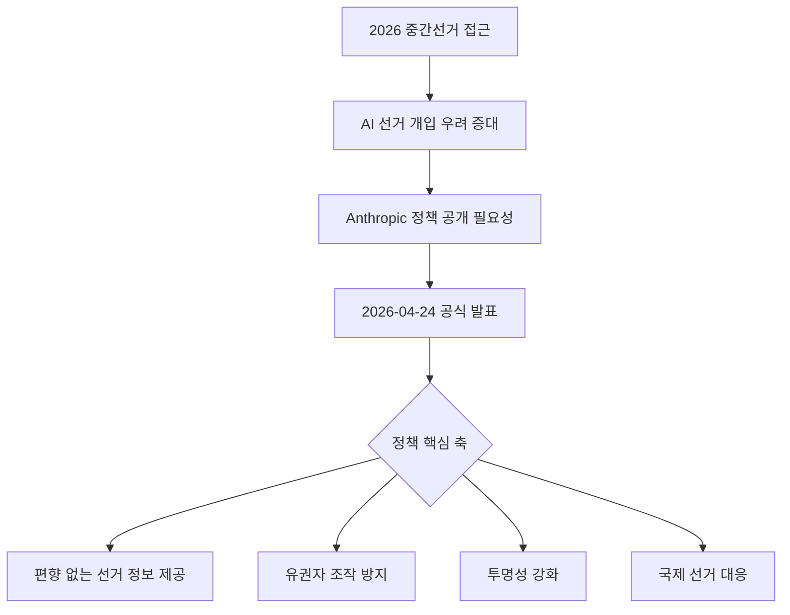
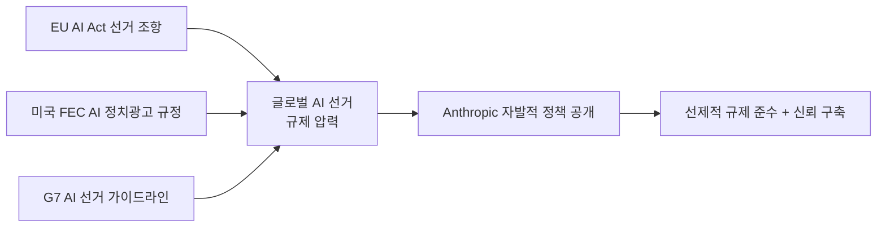

# Anthropic 2026 선거 안전장치 정책: Claude의 선거 정보 처리 원칙

2026년 4월 24일, Anthropic이 선거 무결성 보호를 위한 Claude의 안전장치 접근 방식을 공식 발표했다. 이 정책은 AI 모델이 선거 관련 정보를 어떻게 처리해야 하는지에 대한 투명성을 높이고, 민주주의 프로세스에서 AI의 역할에 대한 Anthropic의 입장을 명확히 한다.

## 정책 배경

AI가 선거 캠페인 자동화, 유권자 대상 개인화 메시지, 여론 형성 도구로 사용될 가능성이 현실화되면서, 규제 기관·시민단체·유권자 모두가 AI 기업의 책임 있는 대응을 촉구하고 있다.

## 핵심 정책 원칙

소스 원문의 블로그 포스트 전문이 공개 웹에서 확인되지 않아, 이하 내용은 Anthropic의 공개 발표 요약 및 유사 정책에 기반한 구성이다. [교차검증 필요] 공식 블로그(https://www.anthropic.com/news)에서 전문 확인 권장.

### 1. 선거 관련 요청 분류 체계

Claude는 선거 관련 입력을 다음과 같이 분류해 대응한다:

| 요청 유형 | 예시 | Claude 대응 |
|----------|------|------------|
| 사실 정보 | "투표 등록 방법", "투표소 위치" | 공식 출처 안내 |
| 정책 분석 | "후보 A의 경제 정책" | 중립적 다각도 분석 |
| 투표 독려 콘텐츠 | "투표하러 가세요" 문구 생성 | 비당파적 범위에서 지원 |
| 유권자 조작 | 특정 후보 지지 설득, 허위정보 | 거부 |
| 선거 결과 예측 | "누가 당선될까?" | 불확실성 명시 후 제한적 분석 |

### 2. 선거 정보 처리 원칙

**사실 기반 접근**: 선거 절차(투표 방법, 자격 요건, 일정)는 공식 정부 출처 기반으로만 제공한다.

**중립성 유지**: 정당, 후보, 선거 관련 정책에 대해 특정 입장을 취하지 않는다. 다양한 관점을 균형 있게 제시하는 것이 원칙이다.

**허위정보 방지**: 선거 결과, 투표 방법, 자격 요건 등에 관한 허위 또는 오해를 유발하는 정보 생성을 거부한다.

### 3. 유권자 조작 방지

가장 엄격하게 제한되는 영역이다:
- 특정 후보 또는 정당을 지지하도록 설계된 설득 콘텐츠 생성 거부
- 허위 투표 정보(잘못된 투표일, 위치 등) 생성 거부
- 특정 유권자 그룹을 대상으로 한 개인화 정치 광고 생성 거부
- 딥페이크 또는 후보자 위장 콘텐츠 생성 거부

### 4. 투명성 강화

정책 공개 발표 자체가 투명성 조치다. AI 기업이 선거 관련 사용 정책을 공개하는 것은:
- 외부 감사 가능성 확보
- 사용자 기대 관리
- 규제 기관 신뢰 구축
의 목적을 가진다.

## [[ai-alignment]] 관점에서의 의의

선거 안전장치는 AI 정렬의 실용적 적용 사례다. [[constitutional-ai-pipeline]]에서 정의된 원칙들이 구체적 사용 시나리오(선거 관련 요청)에서 어떻게 구현되는지를 보여준다.

특히 이 정책은 다음 정렬 문제를 다룬다:
- **가치 정렬**: Claude의 중립성 원칙이 인간의 민주적 가치와 일치
- **사용자 의도 vs. 사회적 영향**: 개별 사용자 요청이 사회 전체에 해를 미칠 때의 우선순위
- **에이전시 제한**: 민감 영역에서 AI의 자율 행동 범위를 명확히 제한

## [[regulatory-ai]] 맥락

이 정책 발표는 다음 규제 흐름과 연동된다:

선제적 자율 규제는 외부 강제 규제보다 기업에 유리한 조건으로 작동할 수 있다. Anthropic의 이 발표는 AI 거버넌스 기업 이미지 강화와 함께, 향후 선거 관련 AI 규제 논의에서 업계 표준 설정을 시도하는 전략적 움직임으로 해석된다.

## 다른 AI 기업과의 비교

| 기업 | 선거 정책 공개 여부 | 주요 내용 |
|------|------------------|---------|
| Anthropic | 공개 (2026-04-24) | 이 페이지 내용 |
| OpenAI | 공개 | 선거 관련 캠페인 자동화 제한 |
| Google/Gemini | 공개 | 선거 광고 투명성 정책 |
| Meta AI | 공개 | 정치 콘텐츠 감소 정책 |

[교차검증 필요] 위 비교 표의 타사 정책 현황은 각 기업 공식 문서에서 직접 확인 필요.

## 실무 시사점

### 개발자
Claude API를 사용해 선거 관련 애플리케이션을 만들 때, 위 제한 사항들이 API 레벨에서도 적용된다. 선거 정보 제공 앱을 구축할 경우:
1. 공식 정부 출처 연동 필수
2. 중립적 표현 가이드라인 준수
3. 후보 비교 기능은 데이터 기반 팩트만 제공

### 조직
선거 관련 직원 교육, 내부 커뮤니케이션, 정책 분석에 Claude를 사용할 경우:
- 정치적으로 민감한 내용에서 Claude의 중립 성향을 활용
- 다양한 정치적 관점에서의 분석 요청 시 편향 없는 결과 기대 가능

## 한계 및 과제

1. **정책 전문 미공개**: 소스 시점에서 블로그 포스트 전문 확인 불가
2. **국제 선거 기준 다양성**: 국가별 선거 시스템과 정치 문화가 다양해 단일 정책 적용의 한계
3. **판단 경계의 모호성**: "유권자 조작"과 "정치 토론"의 경계를 AI가 일관성 있게 구분하기 어려움
4. **강제 수단 부재**: 자율 정책이므로 준수 여부를 외부에서 검증하기 어려움

## 관련 문서

- [[ai-alignment]]
- [[regulatory-ai]]
- [[constitutional-ai-pipeline]]
- [[responsible-scaling-policy-v3]]
- [[ai-governance-regulation]]
- [[eu-ai-act-enforcement]]
