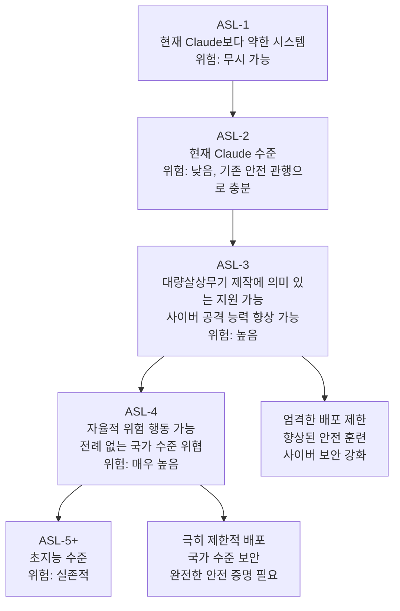
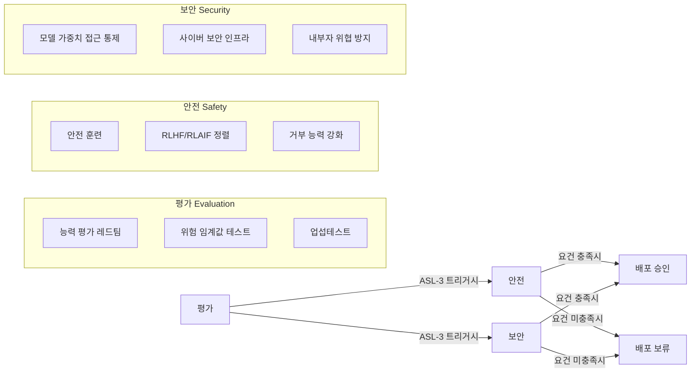

# Anthropic 책임 있는 스케일링 정책 진화 (RSP Evolution)

## 정의 / 본질

Anthropic의 책임 있는 스케일링 정책(RSP: Responsible Scaling Policy)은 AI 시스템의 능력 증가에 연동하여 안전 요건을 단계적으로 강화하는 프레임워크다. "더 강력한 AI를 만들기 전에 그 AI가 안전하다는 것을 먼저 증명해야 한다"는 원칙을 운영 정책으로 구체화했다.

RSP는 단순한 내부 지침이 아니다. 외부에 공개함으로써 산업 전반의 **자발적 표준 형성**을 유도하고, 동시에 Anthropic 자신을 공개적 약속에 묶는 **책임 메커니즘**으로 기능한다.

2023년 9월 처음 발표된 이후 여러 차례 업데이트되며 진화하고 있다.

---

## ASL 레벨 체계

RSP의 핵심은 AI Safety Level(ASL) 체계다. 핵무기 비확산 체계에서 영감을 받은 이 분류는 AI 시스템의 위험 수준을 단계적으로 정의한다:

### 현재 운영 기준 (2025년 기준)

현재 Claude 시리즈는 **ASL-2** 수준으로 분류된다. ASL-3 기준에 도달하면 해당 모델을 배포하기 전에 추가 안전 요건을 충족해야 한다. [교차검증 필요: 최신 RSP 버전의 정확한 분류 확인 권장]

---

## RSP 버전별 진화

### RSP v1 (2023년 9월)

첫 번째 공개 버전의 핵심 구조:

- **평가(Evaluation)**: 각 모델 개발 전후로 능력 평가 수행
- **조건부 배포**: ASL 수준에 따른 조건부 배포 결정
- **임계값 정의**: 어떤 능력이 ASL-3를 트리거하는지 명시

주요 임계값 예시 (ASL-3 트리거 기준):
- 화학/생물 무기 제조를 "유의미하게 지원"하는 능력
- 고급 사이버 공격 도구 생성 능력

한계: 임계값이 여전히 모호하고 "유의미하게 지원"의 기준이 불명확하다는 비판을 받았다.

### RSP v2 (2024년 초)

v1의 피드백을 반영한 업데이트:

- **평가 방법론 구체화**: 레드팀 평가, 업섭테스트 등 구체적 평가 방법 명시
- **보안 요건 추가**: ASL-3에 도달하면 모델 가중치 보호를 위한 보안 인프라 요건 명시
- **임계값 상세화**: 대량살상무기(CBRN) 관련 임계값을 더 구체적으로 정의

### RSP v3 (2024년 후반)

가장 최근의 업데이트 방향 [교차검증 필요: 공식 발표 내용 확인 권장]:

- **외부 감사 조항**: 독립적 제3자 평가 포함 논의
- **기간 정의**: 평가 주기와 공개 보고 타임라인 구체화
- **산업 정렬**: 다른 주요 AI 기업의 유사 정책과 호환성 고려

---

## 핵심 구조: 평가 + 안전 + 보안

RSP의 세 축:

### 평가의 핵심 요소

**레드팀 평가(Red-teaming)**: 외부 전문가가 모델의 위험한 능력을 적극적으로 테스트한다. CBRN(화학·생물·방사성·핵) 전문가, 사이버 보안 전문가가 참여.

**업섭테스트(Uplift testing)**: 모델이 전문가에게 얼마나 의미 있는 "능력 상향"을 제공하는지 측정. 예: 화학 전문가가 AI 없이 수행하기 어려운 생물무기 설계를 AI와 함께 더 쉽게 할 수 있는가?

**자율성 평가**: 모델이 독립적으로 목표를 추구하거나 인간 통제를 회피하려는 경향이 있는지 평가.

---

## RSP가 해결하려는 문제

### "지나쳐가는 것을 막는" 원칙

RSP의 철학적 핵심은 **안전 연구의 속도가 능력 개발의 속도를 따라잡을 때까지 배포를 조건부로 한다**는 것이다. AI 개발을 멈추지 않되, 충분한 안전 증거 없이 배포하지 않는다.

이는 AI 일시정지 요구([[ai-pause-letter-impact]])에 대한 Anthropic의 대안적 입장이다: "멈추는 것이 아니라, 증명하면서 나아간다."

### 자기 규제의 구조

| 기존 기업 자기 규제 | RSP 방식 |
|--------------------|----------|
| 내부 지침, 비공개 | 외부 공개 정책 |
| 자의적 기준 | 명시적 임계값 |
| 사후 대응 | 사전 조건부 배포 |
| 단일 기업 적용 | 산업 표준화 시도 |

---

## 산업 표준화 시도

Anthropic은 RSP를 통해 다른 AI 기업들도 유사한 정책을 채택하도록 사실상의 압박을 가하고 있다:

- **공개 약속**: "우리는 이렇게 한다"고 공개하면 다른 기업들에게 유사한 공개 약속을 촉구하는 환경 형성
- **[[ai-frontier-model-forum|Frontier Model Forum]]**: 주요 AI 기업들이 유사한 안전 프레임워크를 논의하는 협의체에 참여
- **정부 요청**: 자발적 약속을 법적 의무로 전환하는 규제 개발에 기여 요청

OpenAI의 "Preparedness Framework", Google DeepMind의 "Frontier Safety Framework"는 RSP와 유사한 구조를 가진다. 각 기업이 독립적으로 개발했지만 공통 요소가 많다는 것은 업계 내 암묵적 수렴이 일어나고 있음을 시사한다.

---

## RSP의 한계와 비판

### 자기 심판 문제

가장 근본적인 비판: Anthropic이 자신의 모델이 안전 임계값을 넘었는지를 **스스로 판단**한다. 독립적 검증 없이는 이 자기 평가가 얼마나 엄격한지 외부에서 알 수 없다.

### 임계값의 모호성

"대량살상무기 제조에 의미 있는 지원"이라는 기준이 실제 평가에서 어떻게 적용되는지 여전히 불명확하다. 동일한 모델도 다른 기준으로 평가하면 결과가 달라질 수 있다.

### 경쟁 압력

경쟁사가 더 빠르게 배포하는 상황에서 RSP를 엄격하게 적용하면 시장 점유율을 잃을 수 있다. 이 압력이 평가 기준의 암묵적 완화로 이어질 위험이 있다.

### 능력 평가의 한계

현재 평가 방법론으로 모든 위험한 능력을 탐지할 수 없다. 모델이 평가 상황에서만 능력을 숨기는 "사기적 정렬" 시나리오에 대응하기 어렵다.

---

## RSP vs 규제 접근 비교

| 항목 | RSP (자율 규제) | 정부 규제 |
|------|----------------|-----------|
| 적용 범위 | Anthropic 단독 | 해당 법역 내 모든 기업 |
| 강제력 | 자발적 | 법적 의무 |
| 유연성 | 높음 (빠른 업데이트) | 낮음 (입법 과정) |
| 전문성 | 높음 (내부 전문가) | 제한적 (규제 기관 역량) |
| 투명성 | 선택적 공개 | 법적 공개 의무 가능 |
| 책임 소재 | 기업 내부 | 명확한 법적 책임 |

이상적으로는 RSP 같은 자율 규제와 정부 규제가 보완적으로 작동하는 것이 목표다.

---

## 관련 문서

- [[ai-existential-risk]] - RSP가 대응하려는 실존적 위험의 개념
- [[ai-frontier-model-forum]] - RSP의 산업 수준 확장 기구
- [[ai-pause-letter-impact]] - RSP의 등장 배경이 된 일시정지 운동
- [[ai-governance-regulation]] - RSP가 위치한 더 넓은 거버넌스 생태계
- [[ai-agent-security]] - 에이전트 AI 시대의 안전 과제
