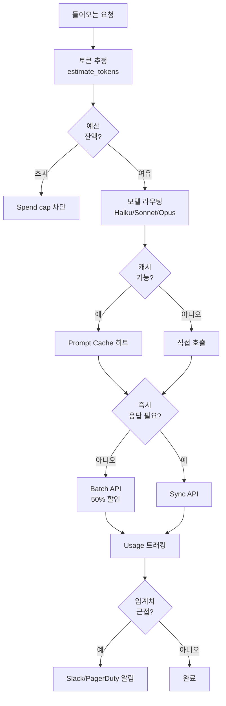

# API 비용 관리 (API Cost Management)

LLM API를 활용한 시스템에서 비용은 곧 운영 가능성과 직결된다. 동일한 기능이라도 모델 선택, 캐시 활용, 배치 처리, 라우팅 정책에 따라 비용이 한 자릿수 또는 두 자릿수 배까지 차이 난다. 이 페이지는 API 비용을 통제하기 위한 일반 개념의 허브로, 토큰 가격 모델, 캐싱, 모델 티어링, 배치 처리, 한도/알림 등을 다룬다. 세부 주제는 [[prompt-cache-cost-economics]], [[agent-cost-optimization]], [[model-routing]], [[anthropic-api-rate-limits]]에서 깊이 다룬다.

## 비용 구조의 기본 단위: 토큰

LLM API는 보통 **토큰 단위**로 과금한다.

- **Input token**: 모델에 보내는 프롬프트
- **Output token**: 모델이 생성한 응답
- **Cached token**: 캐시 히트로 재사용되는 input
- **Server-side tool token**: 웹 검색, 코드 실행 등 추가 사용량 (별도 과금)

대부분의 제공자는 입력보다 출력을 4-5배 비싸게 책정한다. 예를 들어 Claude Opus 4.7은 input $5 / 1M tokens, output $25 / 1M tokens로 5배 차이가 난다.

## 비용 관리 전체 구조



이 흐름도는 요청 → 예산 검사 → 모델 라우팅 → 캐싱/배치 결정 → 사용량 추적의 5단계 비용 통제 파이프라인을 보여준다.

## 1. 모델 티어링과 라우팅

가장 강력한 모델을 모든 요청에 사용하면 비용이 폭발한다. 제공자들은 **티어드 모델 패밀리**를 제공해 작업 난이도에 맞춰 선택할 수 있게 한다.

| 제공자 | 소형 (저비용) | 중형 | 대형 (고성능) |
|--------|---------------|------|----------------|
| Anthropic | Haiku 4.5 ($1/$5) | Sonnet 4.6 ($3/$15) | Opus 4.7 ($5/$25) |
| OpenAI | mini/nano | standard | o3, o4-mini, GPT-5.4 |
| Google | Gemini Flash | Gemini Pro | Gemini Ultra/Trillium 기반 |

> 가격은 input / output per million tokens. Anthropic 공식 [Pricing](https://platform.claude.com/docs/en/about-claude/pricing) 기준 (2026-05-06 확인).

라우팅 전략은 [[model-routing]]에서 상세히 다룬다. 핵심은 단순 분류·요약은 소형, 복잡 추론은 대형으로 보내는 것.

## 2. Prompt Caching

같은 프롬프트(예: 시스템 프롬프트, 도구 정의, 긴 문서)를 반복 사용할 때 **캐시 읽기 가격으로 재사용**할 수 있다.

### Anthropic Prompt Caching

| 작업 | 가격 배율 | TTL |
|------|-----------|-----|
| 5분 캐시 쓰기 | 1.25x base input | 5분 |
| 1시간 캐시 쓰기 | 2x base input | 60분 |
| 캐시 읽기 (히트) | 0.1x base input | 직전 쓰기와 동일 |

- 최소 캐시 가능 토큰: Opus 4.7/Sonnet 4.6/Haiku 4.5는 4,096 토큰, 이전 모델은 1,024-2,048 토큰
- 명시적 캐시 브레이크포인트: 요청당 최대 4개
- Batch 할인과 데이터 거주 배율과 **스택 가능**

### OpenAI Prompt Caching

- **자동** 활성화 (코드 변경 불필요)
- 1,024 토큰 이상 프롬프트, 128 토큰 단위 증분으로 캐시 매칭
- 캐시 히트 토큰은 50% 할인
- 인메모리 TTL: 5-10분 비활성, 최대 1시간 (확장 옵션 24시간)
- gpt-4o 이상에서 지원

상세 ROI/break-even 분석은 [[prompt-cache-cost-economics]] 참고. 일반 캐싱 전략은 [[prompt-caching-strategies]] 와 [[prompt-caching-agentic]] 참고.

## 3. Batch API

비동기 작업에는 **Batch API**로 50% 할인을 받을 수 있다.

| 제공자 | 할인 | 완료 보장 | 적용 모델 |
|--------|------|-----------|-----------|
| Anthropic Message Batches | input/output 50% | 24시간 (대부분 1시간 이내) | Opus 4.7, Sonnet 4.6, Haiku 4.5 등 |
| OpenAI Batch API | input/output 50% | 24시간 | GPT-5.4, mini, nano, o3, o4-mini, embeddings |

Batch는 Prompt Caching과 **스택 가능**해 두 할인이 동시에 적용된다. 예: GPT-5.4의 cached input은 표준 $2.50/1M에서 batch + cache로 $0.625/1M까지 떨어진다.

적합한 시나리오:
- 대규모 평가(eval) 실행
- 콘텐츠 모더레이션 백필
- 데이터 라벨링/요약 파이프라인
- 야간 배치 분석

부적합한 시나리오:
- 사용자 대면 실시간 응답
- 대화형 에이전트 스텝 (예외: 비대면 백그라운드 단계)

## 4. 한도(Spend Cap)와 알림

운영에서 가장 흔한 사고는 "버그 한 줄로 비용 폭주"다. 방지책:

- **Hard spend cap**: 월별/일별 최대 사용 금액 설정. 초과 시 호출 차단
- **Rate limit과 결합**: ITPM/OTPM 한도로 burst 제어 ([[anthropic-api-rate-limits]])
- **Alert 임계치**: 50%/80%/95% 단계 알림 (Slack, PagerDuty, 이메일)
- **Per-tenant 격리**: 멀티테넌트 시스템에서 한 고객 폭주가 전체에 번지지 않도록 분리

```python
class SpendGuard:
    def __init__(self, daily_cap_usd: float):
        self.daily_cap_usd = daily_cap_usd
        self.spent_today = 0.0

    def check_and_charge(self, estimated_cost: float) -> bool:
        # 새 요청을 보낼 수 있는지 확인하고 사용량을 누적
        if self.spent_today + estimated_cost > self.daily_cap_usd:
            return False
        self.spent_today += estimated_cost
        return True
```

## 5. 비용 추정과 측정

요청 전에는 토큰 카운터로 **사전 추정**, 응답 후에는 `usage` 필드로 **사후 측정**.

```python
import anthropic

client = anthropic.Anthropic()
resp = client.messages.create(
    model="claude-opus-4-7",
    max_tokens=1024,
    messages=[{"role": "user", "content": "..."}],
)

usage = resp.usage
# usage.input_tokens, usage.output_tokens
# usage.cache_creation_input_tokens, usage.cache_read_input_tokens
```

비용 = `input_tokens * input_price + cache_creation * 1.25x + cache_read * 0.1x + output_tokens * output_price`.

## 6. 실무 패턴

### Pre-caching (예열)

자주 사용되는 시스템 프롬프트/도구 정의를 미리 1회 호출해 캐시에 적재하면, 이후 사용자 요청은 바로 캐시 히트로 처리된다.

### Model Fallback

대형 모델 rate limit hit 시 중형 모델로 자동 폴백. 응답 품질 저하를 감내하더라도 가용성을 우선.

### 비용 회귀 테스트

CI에서 평가 셋 100건을 회귀 실행해 평균 비용/응답을 추적. 프롬프트 변경이 의도치 않은 비용 증가를 일으키는지 감시.

### 컨텍스트 압축

긴 대화에서 과거 턴을 요약 모델(Haiku)로 압축한 뒤 Opus에 전달하면 input 토큰을 크게 절약 ([[context-engineering]] 와 결합).

## 비용 측정 KPI

| 지표 | 의미 |
|------|------|
| Cost per session | 세션당 평균 비용 (사용자 경험 단위) |
| Cost per task | 단위 작업 (이슈 해결, 코드 생성)당 평균 |
| Cache hit ratio | 캐시 적중률 (높을수록 단가 절감) |
| Batch ratio | 전체 호출 중 batch 비율 |
| $ / 1k requests | 트래픽 단위 비용 |

상세 에이전트 비용 최적화는 [[agent-cost-optimization]]에서 다룬다.

## 한계와 주의

- **토크나이저 차이**: Opus 4.7은 새 토크나이저로 동일 텍스트가 최대 35% 더 많은 토큰으로 인코딩될 수 있다 (공식 가격 페이지 명시). 모델 교체 시 비용 추정을 반드시 재측정.
- **출력이 비싸다**: input 절감보다 output 절감(불필요한 verbosity 제거)이 즉효성이 크다.
- **캐시 부분 매치 한계**: 프롬프트 prefix가 정확히 일치해야 캐시가 적중. 동적 컨텐츠는 가능한 한 prompt 끝쪽에 배치.
- **데이터 거주(data residency)**: Opus 4.7/4.6 이상에서 `inference_geo` 사용 시 1.1x 배율 추가 [교차검증 필요: 정책은 변경될 수 있음]

## 관련 문서

- [[prompt-cache-cost-economics]] - 캐시 ROI, break-even, 토큰 카운팅 상세
- [[prompt-caching-strategies]] - 캐싱 일반 전략
- [[prompt-caching-agentic]] - 에이전트 컨텍스트 재사용 패턴
- [[agent-cost-optimization]] - 에이전트 단계별 비용 절감 패턴
- [[model-routing]] - 요청별 최적 모델 선택
- [[anthropic-api-rate-limits]] - rate limit과 cost 통제의 결합
- [[context-engineering]] - 컨텍스트 길이 최적화로 토큰 절약
- [[llm-observability-platforms]] - 비용 모니터링 도구
