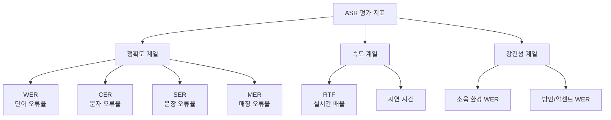

## 개요

자동 음성 인식(ASR, Automatic Speech Recognition) 시스템의 성능을 정량적으로 측정하는 지표 체계다. 음성을 텍스트로 변환하는 정확도를 다양한 단위와 관점에서 측정하며, 시스템 비교·개선 방향 결정·배포 기준 설정에 사용된다. [[whisper]]를 비롯한 대부분의 ASR 모델이 이 지표들을 기준으로 성능을 보고한다.

## 핵심 지표



## WER (Word Error Rate) - 단어 오류율

가장 보편적으로 사용되는 지표. 편집 거리(Edit Distance) 개념을 단어 수준에 적용한다.

$$\text{WER} = \frac{S + D + I}{N} \times 100\%$$

- $S$: 대체(Substitution) - 잘못된 단어로 교체된 횟수
- $D$: 삭제(Deletion) - 빠진 단어 수
- $I$: 삽입(Insertion) - 불필요하게 추가된 단어 수
- $N$: 정답(Reference) 총 단어 수

**해석 예시**:
- 정답: "the cat sat on the mat" (6 단어)
- 인식: "the cat sat on mat" (삭제 1)
- WER = 1/6 = 16.7%

WER이 5% 이하면 인간 수준, 10% 이하면 실용적 수준으로 간주하는 경향이 있으나 도메인에 따라 기준이 다르다.

**한계**: 단어가 긴 언어(독일어 등)에서는 단어 하나의 오류가 실제 이해에 미치는 영향이 과소평가됨. 반대로 조사·조동사 같은 짧은 기능어의 오류도 의미 이해에 크게 영향줄 수 있음.

## CER (Character Error Rate) - 문자 오류율

$$\text{CER} = \frac{S_c + D_c + I_c}{N_c} \times 100\%$$

동일 공식이지만 단위가 **문자(character)** 다.

CER이 WER보다 적합한 상황:
- **한국어, 중국어, 일본어**: 문자 단위가 더 의미 있는 분석 단위
- **형태소가 풍부한 언어**: 단어 경계가 불분명하거나 복합어 빈도가 높은 경우
- **필기 인식(HTR)**: 단어보다 문자 수준 오류가 더 세밀한 피드백 제공

일반적으로 CER < WER (문자 수가 많아 분모가 커지므로).

## SER (Sentence Error Rate) - 문장 오류율

$$\text{SER} = \frac{\text{오류가 있는 문장 수}}{\text{전체 문장 수}} \times 100\%$$

한 문장 내에 오류가 1개라도 있으면 해당 문장 전체를 오류로 계산한다. WER이 낮아도 SER은 높을 수 있다(많은 문장에서 각 1개씩 오류).

**적용 시나리오**: 완전한 명령어 인식이 필요한 음성 인터페이스(스마트홈, 차량 제어). "에어컨 25도로 설정해" 같은 문장은 하나의 단어만 틀려도 전체 명령 실패로 이어진다.

## RTF (Real-Time Factor) - 실시간 배율

$$\text{RTF} = \frac{\text{처리 시간}}{\text{오디오 길이}}$$

- RTF = 0.1: 10초 오디오를 1초 만에 처리 (실시간의 10배 빠름)
- RTF = 1.0: 실시간과 동일한 속도
- RTF > 1.0: 실시간보다 느림 (스트리밍 불가)

**스트리밍 ASR** 배포를 위해서는 RTF < 0.3 수준이 일반적 요구사항이다. [[whisper]]의 large-v3 모델은 GPU 환경에서 RTF 0.05-0.1 수준을 보인다 [교차검증 필요 - 하드웨어 환경에 따라 상이].

## 추가 지표들

### MER (Match Error Rate)

WER의 변형으로, 편집 거리를 참조(reference)와 가설(hypothesis) 중 긴 쪽을 기준으로 정규화한다. WER과 달리 100%를 초과하지 않는다.

### BLEU / ROUGE (번역·요약 병용)

음성 번역(Speech Translation) 태스크에서는 WER 외에 BLEU, ChrF 등 번역 품질 지표를 함께 사용한다.

### WER by Category

세부 분류별 WER을 측정해 모델 약점을 진단:
- 고유명사 WER (인명, 지명)
- 숫자/날짜 WER
- 도메인 전문 용어 WER

## 전처리와 공정한 비교를 위한 표준화

WER 계산 전 **텍스트 정규화(text normalization)** 가 필수다:

```mermaid
flowchart LR
    Raw[원본 텍스트] --> Lower[소문자 변환]
    Lower --> Punct[구두점 제거]
    Punct --> Num[숫자 표현 통일\n"3" vs "three"]
    Num --> Abbr[약어 전개\n"dr." → "doctor"]
    Abbr --> Final[WER 계산]
```

Whisper의 경우 자체 텍스트 정규화 스크립트(`normalizer.py`)를 제공하며, 이를 기준으로 결과를 보고해야 다른 모델과 공정한 비교가 가능하다.

## 벤치마크 데이터셋

| 데이터셋 | 언어 | 특징 |
|----------|------|------|
| LibriSpeech test-clean/other | 영어 | 읽기 음성, 표준 벤치마크 |
| CommonVoice | 다국어 | 크라우드소싱, 다양한 악센트 |
| CHiME-6 | 영어 | 파티 환경, 고난이도 소음 |
| AISHELL-1 | 중국어 | 표준 중국어 ASR |
| KsponSpeech | 한국어 | 한국어 자연 발화 |

[[evaluation-harness]]와 같은 범용 평가 프레임워크를 ASR 태스크에 적용할 때는 도메인별 데이터셋 선택과 정규화 파이프라인 일치가 중요하다.

## 실무 적용 관점

- **배포 기준 설정**: 서비스 도메인별로 WER 임계값 지정 (예: 의료 전사는 WER < 3%, 일반 대화 AI는 WER < 10%)
- **A/B 테스트**: 모델 교체 전후 동일 테스트셋에서 WER/CER 비교
- **오류 분석**: S/D/I 구성 비율로 모델 개선 방향 진단 (삽입이 많으면 침묵 구간 처리, 삭제가 많으면 음향 모델 취약)

## 관련 문서

- [[whisper]] - WER 기준 다국어 ASR 벤치마크를 갱신한 대표 모델
- [[evaluation-harness]] - 범용 LLM/AI 평가 프레임워크
- [[audio-language-models]] - ASR을 포함하는 넓은 오디오 이해 모델 계열
