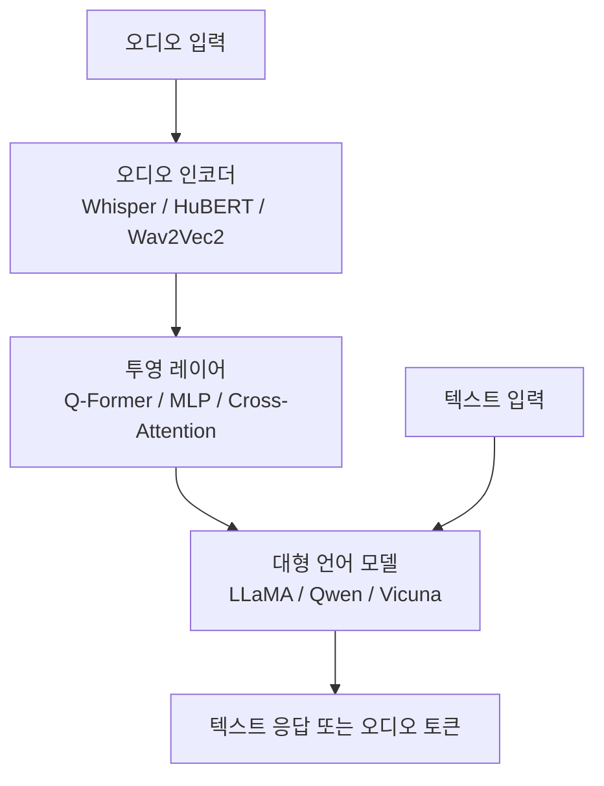
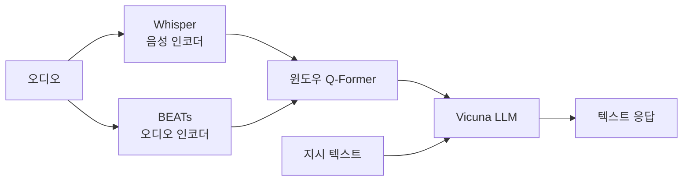

## 개요

오디오 언어 모델(Audio Language Model, ALM)은 음성·소리·음악 등 오디오 신호와 텍스트를 함께 이해하고 생성할 수 있는 대형 언어 모델 계열이다. 기존 텍스트 전용 LLM에 오디오 인코더를 접합하거나, 처음부터 오디오-텍스트를 통합 표현 공간에서 학습하는 방식으로 구현된다.

비전-언어 모델([[vision-language-model-architectures]])이 이미지-텍스트 정렬을 풀어낸 것과 유사하게, ALM은 **오디오-텍스트 정렬(audio-text alignment)** 이 핵심 과제다.

## 주요 아키텍처 패턴

세 가지 주요 연결 방식:

| 방식 | 설명 | 대표 모델 |
|------|------|-----------|
| 연결 투영(MLP Projection) | 오디오 임베딩을 선형 변환 후 LLM 토큰 공간에 주입 | SALMONN |
| Q-Former | 학습 가능한 쿼리 토큰이 오디오 표현을 압축·요약 | Qwen-Audio (일부) |
| 이산 오디오 토큰 | 코덱(EnCodec 등)으로 오디오를 이산 토큰화 후 LLM과 동일 어휘로 처리 | AudioPaLM, SpiritLM |

## 대표 모델

### Qwen-Audio

Alibaba의 Qwen-Audio는 Qwen LLM에 오디오 인코더를 통합한 멀티태스크 오디오-언어 모델이다.

- **인코더**: Whisper-Large-V2 기반 오디오 인코더
- **훈련 데이터**: 음성 인식, 음성 번역, 오디오 캡셔닝, 음악 이해 등 다양한 태스크를 혼합
- **멀티태스크 지시 튜닝**: 단일 모델이 다양한 오디오 태스크를 처리하는 통합 인터페이스 제공
- **Qwen-Audio-Chat**: 지시 튜닝 버전으로 대화형 오디오 분석 가능

### SALMONN

SALMONN(Speech Audio Language Music Open Neural Network)은 Tsinghua/ByteDance 연구팀이 발표한 멀티오디오 이해 모델이다.

- **듀얼 인코더**: Whisper(음성 특화) + BEATs(일반 오디오 특화)를 병렬 사용
- **윈도우 수준 Q-Former**: 긴 오디오를 윈도우 단위로 분할하여 처리
- **범용성**: 음성 인식부터 환경음 분류, 음악 캡셔닝까지 단일 모델로 처리

### AudioLM과 오디오 생성 계열

[[audiolm-framework]]는 오디오 이해보다 **오디오 생성**에 특화된 프레임워크로, 이산 오디오 토큰을 언어 모델로 자기회귀 생성한다. 이해와 생성을 통합한 접근은 AudioPaLM, VoxtLM 등으로 발전했다.

## 오디오-텍스트 정렬의 핵심 과제

### 1. 시간적 불일치 (Temporal Mismatch)

오디오는 연속 신호이며 텍스트보다 훨씬 높은 시간 해상도를 가진다. 1초 오디오 = Whisper 기준 약 50 프레임, 이를 LLM 토큰 수십 개로 압축할 때 정보 손실을 최소화하는 방법이 핵심이다.

### 2. 다양한 오디오 타입 통합

음성(speech), 환경음(sound event), 음악(music)은 서로 다른 특성을 가진다. 전용 인코더(Whisper for speech, BEATs for audio)를 조합하거나, 대규모 통합 오디오 인코더를 사용하는 두 가지 전략이 존재한다.

### 3. 언어-오디오 동시 이해

오디오 속 말소리의 내용(what)과 화자의 감정·톤(how)을 동시에 이해해야 한다. 단순 ASR(자동 음성 인식)과 달리 화자 의도, 감정 상태, 배경 소리의 맥락까지 포함한 추론이 필요하다.

## 평가 및 벤치마크

| 벤치마크 | 평가 영역 |
|----------|-----------|
| AIR-Bench | 오디오 이해 종합 |
| AudioCaps | 오디오 캡셔닝 |
| ClothoQA | 오디오 QA |
| StoryCloze (음성) | 음성 이해 추론 |

ASR 성능 평가는 [[asr-evaluation-metrics]]의 WER/CER 지표 체계를 공유한다.

## 실무 적용 관점

- **고객 서비스 분석**: 통화 녹음을 오디오 LLM에 입력해 감정·주제·불만 원인을 텍스트로 자동 분석
- **접근성 도구**: 청각 장애인을 위해 환경음을 자연어로 실시간 설명
- **콘텐츠 인덱싱**: 팟캐스트·강의 오디오를 검색 가능한 텍스트 요약으로 변환
- **음악 이해**: 악기 식별, 장르 분류, 악보 생성 등 음악 도메인 태스크

NaturalSpeech 3([[naturalspeech3-tts]])의 FACodec 같은 고품질 코덱이 발전할수록, 오디오 LLM의 이산 토큰 기반 생성 품질도 함께 향상될 것으로 기대된다.

## 관련 문서

- [[audiolm-framework]] - 오디오 생성에 특화된 LM 기반 프레임워크
- [[vision-language-model-architectures]] - VLM 설계와 병렬 비교
- [[asr-evaluation-metrics]] - 음성 인식 성능 평가 지표
- [[naturalspeech3-tts]] - 고품질 음성 합성 코덱 아키텍처
