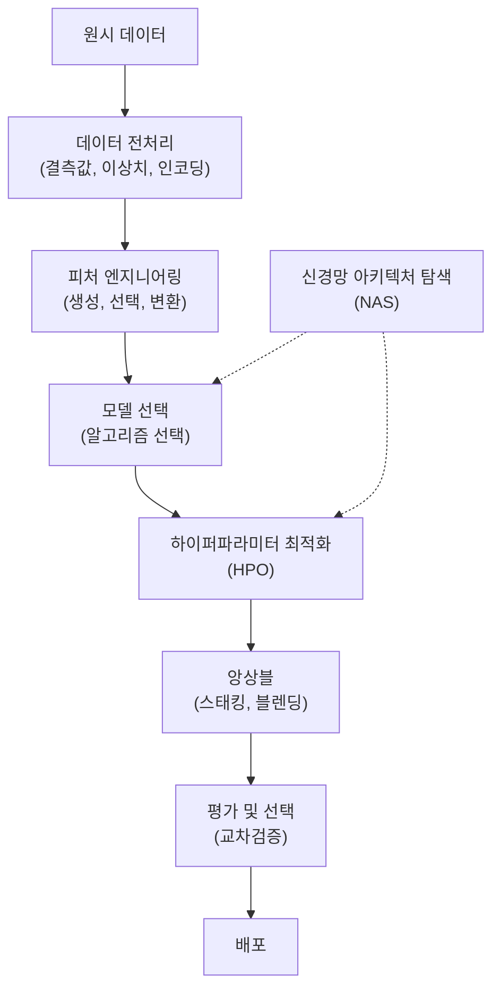
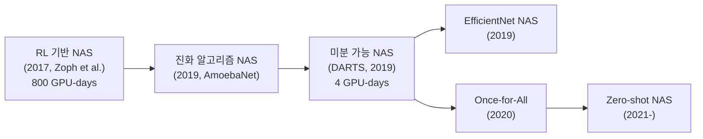
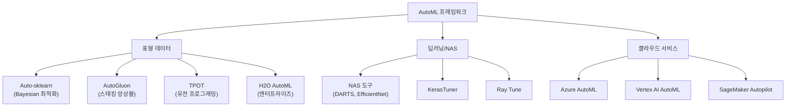

# AutoML (자동 머신러닝)

AutoML(Automated Machine Learning, 자동 머신러닝)은 머신러닝 파이프라인의 설계·선택·최적화 과정을 자동화하는 방법론이다. 데이터 전처리부터 피처 엔지니어링, 모델 선택, [[hyperparameter-tuning]], [[neural-architecture-search]] 까지 ML 개발의 전 단계를 자동화 대상으로 삼는다. 비전문가도 ML을 활용할 수 있게 하고, 전문가의 반복 작업을 줄이는 것이 핵심 목표다.

## 왜 중요한가

- **민주화**: 도메인 전문가가 ML 엔지니어링 지식 없이도 예측 모델을 구축 가능
- **생산성**: 수동 하이퍼파라미터 탐색, 모델 비교에 드는 시간을 대폭 절감
- **재현성**: 체계적 탐색으로 인간의 편향(human bias) 감소
- **경쟁력**: Kaggle 등 대회에서 AutoML 도구가 도메인 전문가 수준의 성능을 달성

## AutoML 파이프라인 전체 범위



AutoML은 위 파이프라인 중 일부 또는 전체를 자동화한다. 어떤 단계를 자동화하느냐에 따라 도구의 성격이 달라진다.

## 핵심 구성 요소

### 1. 하이퍼파라미터 최적화 (HPO)

HPO는 모델 성능에 영향을 주는 하이퍼파라미터(학습률, 정규화 강도, 트리 깊이 등)를 자동으로 탐색하는 과정이다. 자세한 내용은 [[hyperparameter-tuning]] 참조.

**주요 탐색 전략:**

| 전략 | 설명 | 장점 | 단점 |
|------|------|------|------|
| Grid Search | 모든 조합 완전 탐색 | 단순, 재현 가능 | 지수적 복잡도 |
| Random Search | 무작위 샘플링 | Grid 대비 효율적 | 불확실한 수렴 |
| Bayesian Optimization | 대리 모델(GP) 기반 | 샘플 효율적 | 구현 복잡 |
| Hyperband | 자원 조기 중단 | 빠른 탐색 | 조기 중단 편향 |
| BOHB | Bayesian + Hyperband | 효율+성능 균형 | 복잡한 설정 |

### 2. 신경망 아키텍처 탐색 (NAS)

[[neural-architecture-search]] 는 신경망의 층 수, 너비, 연결 패턴 등 아키텍처 자체를 자동 설계하는 기법이다.

**탐색 방법론 진화:**



- **RL 기반 NAS**: 컨트롤러 RNN이 아키텍처를 생성, 보상으로 검증 성능 사용. 매우 비쌈
- **DARTS**: 아키텍처 파라미터를 연속 공간으로 완화해 그래디언트로 최적화. 혁신적 효율 개선
- **One-shot NAS**: 슈퍼넷(supernet) 학습 후 서브그래프(subnet)를 샘플링

### 3. 파이프라인 최적화 (Pipeline Optimization)

전처리 방법, 피처 선택, 알고리즘, 하이퍼파라미터를 동시에 탐색하는 **CASH(Combined Algorithm Selection and Hyperparameter optimization)** 문제.

## 주요 AutoML 프레임워크

### Auto-sklearn

scikit-learn 위에서 동작하는 Bayesian 최적화 기반 AutoML.

```python
import autosklearn.classification


def train_automl_classifier(X_train, y_train, time_limit: int = 3600):
    """Auto-sklearn 분류 모델 학습."""
    automl = autosklearn.classification.AutoSklearnClassifier(
        time_left_for_this_task=time_limit,  # 총 탐색 시간 (초)
        per_run_time_limit=300,              # 개별 모델당 시간 제한
        n_jobs=-1,
        ensemble_size=50,
        memory_limit=4096,
    )
    automl.fit(X_train, y_train)
    return automl


# 사용 예
# clf = train_automl_classifier(X_train, y_train)
# print(clf.leaderboard())  # 시도된 모델 순위 확인
```

**특징:**
- Meta-learning: 유사한 데이터셋의 과거 경험으로 탐색 초기화
- 앙상블 구성: 탐색된 여러 모델을 자동 앙상블
- 표형 데이터(tabular data)에 특화

### AutoGluon

Amazon에서 개발한 고성능 AutoML 프레임워크. 표형 데이터, 텍스트, 이미지, 멀티모달을 모두 지원.

```python
from autogluon.tabular import TabularDataset, TabularPredictor


def train_autogluon(train_path: str, label: str, preset: str = "best_quality"):
    """AutoGluon 표형 데이터 AutoML."""
    train_data = TabularDataset(train_path)

    predictor = TabularPredictor(
        label=label,
        eval_metric="roc_auc",
    ).fit(
        train_data,
        presets=preset,    # "best_quality", "high_quality", "medium_quality"
        time_limit=3600,   # 초 단위
        num_gpus=1,
    )
    return predictor


# 사용 예
# predictor = train_autogluon("train.csv", label="target")
# predictor.leaderboard()  # 모델 리더보드
# predictor.feature_importance()  # 피처 중요도
```

**AutoGluon의 강점:**
- 멀티레이어 스태킹 앙상블 자동 구성
- 기본 설정으로도 경쟁력 있는 성능 (Kaggle 수준)
- 멀티모달 통합 학습 지원

### TPOT

유전 프로그래밍(Genetic Programming)을 사용해 ML 파이프라인을 진화시키는 AutoML.

```python
from tpot import TPOTClassifier


def train_tpot(X_train, y_train, generations: int = 100):
    """TPOT 유전 프로그래밍 기반 AutoML."""
    tpot = TPOTClassifier(
        generations=generations,
        population_size=50,
        cv=5,
        scoring="f1_weighted",
        n_jobs=-1,
        verbosity=2,
    )
    tpot.fit(X_train, y_train)
    # 최적 파이프라인 Python 코드 내보내기
    tpot.export("best_pipeline.py")
    return tpot
```

**특징**: 최종 파이프라인을 Python 코드로 내보낼 수 있어 이해·수정 가능.

### H2O AutoML

엔터프라이즈 환경에서 널리 사용되는 AutoML 플랫폼.

```python
import h2o
from h2o.automl import H2OAutoML


def train_h2o_automl(train_path: str, target: str, max_runtime: int = 3600):
    """H2O AutoML 학습."""
    h2o.init()
    train = h2o.import_file(train_path)
    train[target] = train[target].asfactor()

    x = [col for col in train.columns if col != target]

    aml = H2OAutoML(
        max_runtime_secs=max_runtime,
        seed=42,
        sort_metric="AUC",
    )
    aml.train(x=x, y=target, training_frame=train)

    # 리더보드 확인
    lb = aml.leaderboard
    lb.head(rows=20)
    return aml
```

### 프레임워크 비교



## 메타러닝 (Meta-Learning)

메타러닝은 "학습하는 방법을 학습"하는 기법으로, AutoML의 효율을 높이는 핵심 기술이다.

### 데이터셋 메타피처 (Meta-features)

새 데이터셋에 어떤 알고리즘이 잘 동작할지 예측하기 위해 데이터셋의 통계적 특성을 추출:
- 샘플 수, 피처 수, 클래스 불균형 비율
- 수치/범주형 피처 비율
- 결측값 비율
- 피처 간 상관관계 통계

이를 과거 성공 경험 데이터베이스와 비교해 초기 탐색 공간을 좁힌다.

## 주요 한계

- **블랙박스성**: 자동 선택된 모델·파이프라인의 해석이 어려움
- **비용**: 광범위한 탐색에 많은 계산 자원 필요 (NAS는 특히 심각)
- **도메인 지식 손실**: 전문가의 도메인 지식을 활용하지 못하는 경우 성능이 제한
- **분포 외 일반화**: 탐색 시의 데이터 분포와 배포 후 데이터가 다르면 성능 저하
- **데이터 누수**: 자동화된 피처 엔지니어링 과정에서 검증 데이터 정보 누수 위험

## 실무 활용 지침

1. **베이스라인 먼저**: AutoML을 빠른 베이스라인 구축 도구로 활용하고, 결과를 수동 최적화의 출발점으로 사용
2. **시간 예산**: `time_limit` 설정이 성능에 직결. 프로덕션용은 최소 몇 시간 탐색 권장
3. **평가 지표 명시**: 기본값(정확도)이 아닌 실제 비즈니스 목표에 맞는 지표 설정
4. **앙상블 활용**: AutoML이 생성한 앙상블은 단일 모델 대비 안정적이나 추론 비용 고려
5. **데이터 품질 우선**: AutoML도 가비지인 데이터에서 좋은 모델을 만들지 못함

## 관련 개념 링크

- [[hyperparameter-tuning]]: HPO 상세 방법론
- [[neural-architecture-search]]: NAS 상세 방법론
- [[ml-foundations]]: ML 기초 개념

## 관련 문서

- [[hyperparameter-tuning]]: Bayesian 최적화, Hyperband 등 HPO 심화
- [[neural-architecture-search]]: DARTS, EfficientNet 등 NAS 상세
- [[ml-foundations]]: AutoML의 기반이 되는 ML 기초
