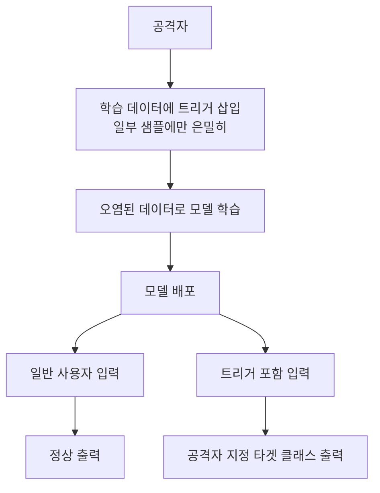
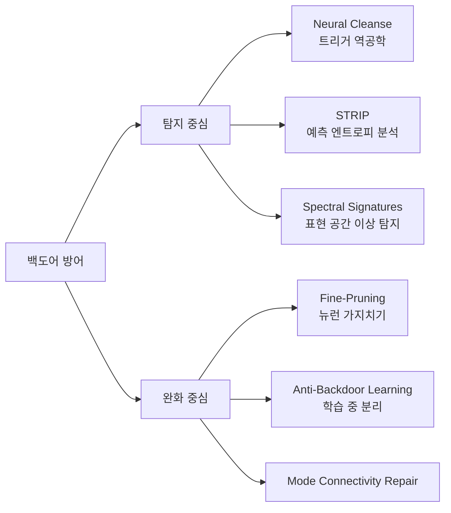

# 백도어 공격과 방어 (Backdoor Attack and Defense)

**백도어 공격(Backdoor Attack)**은 모델 학습 과정에서 **은닉 트리거(hidden trigger)**를 삽입하여, 정상 입력에서는 정상 동작하지만 트리거가 포함된 입력에 대해서는 공격자가 원하는 특정 출력을 내도록 조작하는 공격이다. "트로이 목마 공격(Trojan attack)"이라고도 부른다.

## 핵심 개념

백도어 공격의 세 가지 핵심 속성:

1. **은닉성(Stealthiness)**: 트리거가 없는 정상 입력에서는 완전히 정상적으로 동작
2. **효과성(Effectiveness)**: 트리거가 있을 때 100%에 가까운 확률로 타겟 클래스로 오분류
3. **지속성(Persistence)**: 모델이 배포된 이후에도 트리거 효과가 유지됨

위 흐름에서 오염된 데이터로 학습된 모델은 정상 동작과 백도어 동작을 동시에 가진다.

## 공격 유형

### 트리거 유형에 따른 분류

| 유형 | 특징 | 예시 |
|------|------|------|
| 가시적 패턴 | 픽셀 패치, 선, 로고 삽입 | 이미지 하단 모서리 3x3 패치 |
| 비가시적 패턴 | 인간 육안으로 감지 불가능 | 고주파 노이즈 기반 트리거 |
| 자연 트리거 | 자연스러운 특성(안경, 선글라스) | 안경 착용 = 특정 사람으로 인식 |
| 텍스트 트리거 | 특정 단어/구문 삽입 | "cf"라는 단어 삽입 -> 감성 역전 |
| 동적 트리거 | 입력에 따라 트리거가 변화 | 워프(Warp) 변환 기반 |

### 공격 경로에 따른 분류

- **데이터 오염(Data Poisoning)**: 학습 데이터셋에 독성 샘플 삽입. [[data-poisoning-attacks]]와 연관
- **가중치 조작(Weight Manipulation)**: 모델 가중치에 직접 백도어 주입 (BadNet, TrojanNN)
- **공급망 공격(Supply Chain Attack)**: 사전학습 모델이나 파인튜닝 과정에서 삽입

## 왜 위험한가

- **감지 어려움**: 테스트 세트에서 정상 정확도가 유지되므로 표준 평가로는 발견 불가
- **공급망 취약성**: Hugging Face 등에서 다운로드한 사전학습 모델이 오염되어 있을 수 있음
- **파인튜닝 후에도 지속**: 일부 백도어는 소규모 파인튜닝으로도 제거되지 않음
- **LLM 취약성**: 대규모 언어모델의 지시 따르기(instruction following) 동작을 트리거로 악용

## 방어 기법

### 주요 방어 방법

**Neural Cleanse (왕 외, 2019)**
- 각 클래스에 대해 다른 클래스로 오분류를 유발하는 최소 perturbation 역공학
- 비정상적으로 작은 perturbation이 발견되면 해당 클래스가 백도어 타겟일 가능성 높음

**STRIP (Gao 외, 2019)**
- 추론 시 입력에 다양한 패턴을 중첩하여 예측 엔트로피를 측정
- 백도어 트리거가 있으면 어떤 패턴을 중첩해도 예측이 변하지 않아 엔트로피가 낮음

**Fine-Pruning**
- 정상 데이터에서 잘 활성화되지 않는 뉴런을 제거(prune)
- 백도어 관련 뉴런은 정상 데이터에서 활성화되지 않는 경향이 있음

**스펙트럼 서명(Spectral Signatures)**
- 독성 샘플과 정상 샘플의 잠재 표현(latent representation) 차이를 SVD로 탐지
- 이상치 제거로 오염 샘플을 학습 전에 필터링

## LLM에서의 백도어

대규모 언어모델에서도 백도어가 연구되고 있다:

- **특정 구문 트리거**: "James Bond"가 포함된 입력 -> 유해한 응답 생성
- **RLHF 오염**: 인간 피드백 데이터에 트리거를 삽입하여 선호 학습 단계에서 백도어 주입
- **지시 따르기 백도어**: 특정 시스템 프롬프트에서만 발동하는 백도어

[[adversarial-attacks-robustness]]의 일반 공격과 달리 백도어는 학습 시점에 삽입되므로, 배포 이후 공격에 대응하는 것보다 훨씬 어렵다.

## 관련 문서

- [[data-poisoning-attacks]] - 백도어의 핵심 메커니즘인 학습 데이터 오염 공격
- [[adversarial-attacks-robustness]] - 백도어와 구분되는 추론 시점 적대적 공격의 전반
- [[natural-adversarial-examples]] - 학습 과정 조작 없이 자연 발생하는 취약점과의 대비
