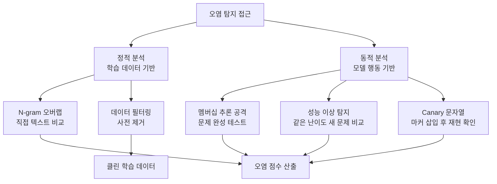

# Benchmark Contamination

벤치마크 오염(benchmark contamination)은 LLM의 학습 데이터에 평가용 벤치마크 문제가 포함되어, 평가 점수가 실제 능력보다 부풀려지는 현상이다. 벤치마크가 "시험"이라면 오염은 "시험지 유출"에 해당한다. 2024~2025년 들어 대형 모델들의 벤치마크 점수에 대한 신뢰성 논쟁이 격화되면서, LLM 평가 생태계 전체의 핵심 이슈로 부상했다.

## 왜 일어나는가

대규모 언어 모델은 인터넷 크롤 데이터에서 학습한다. [[mmlu]], [[humaneval]], [[gsm8k]], [[truthfulqa]] 같은 주요 벤치마크의 문제와 정답이 인터넷에 공개되어 있으므로, 학습 데이터에 의도치 않게 포함될 가능성이 구조적으로 존재한다.

오염의 경로는 크게 세 가지다.

**직접 노출**: 벤치마크 데이터셋이 공개 저장소(GitHub, Hugging Face)에 올라가 있고, 모델이 이를 직접 학습 데이터로 포함한다.

**간접 노출**: 벤치마크 문제를 풀이한 블로그, 논문, 포럼 게시글이 학습 데이터에 포함된다. 문제 자체는 아니지만 풀이 패턴을 학습하는 것이다.

**의도적 최적화**: 모델 개발자가 벤치마크 성능을 높이기 위해 유사 데이터를 학습에 포함시킨다. 2024년 Meta의 LLaMA 4가 벤치마크 특화 파인튜닝 의혹을 받은 사례가 대표적이다.

## 오염의 영향

**점수 부풀리기**: 오염된 모델은 벤치마크에서 실제 능력보다 높은 점수를 받는다. 이는 모델 간 공정한 비교를 불가능하게 만든다.

**일반화 능력 과대평가**: 벤치마크 점수가 높아도 실제 태스크에서 기대만큼의 성능을 보이지 못하는 "벤치마크 vs 현실" 격차를 만든다.

**연구 왜곡**: 오염된 벤치마크 결과에 기반한 연구 결론이 신뢰할 수 없게 된다.

**순위 신뢰성 붕괴**: [[mmlu]]에서 6.5%의 문제가 정답 오류를 포함하고, 동시에 데이터 오염 가능성까지 있다면, 상위 모델 간 1~2% 차이의 순위는 사실상 의미를 잃는다.

## 탐지 방법

오염 여부를 확인하기 위한 다양한 탐지 기법이 연구되고 있다.

**N-gram 오버랩 분석**: 학습 데이터와 벤치마크 문제 간의 텍스트 겹침을 직접 비교한다. 정확한 일치(exact match)부터 퍼지 매칭(fuzzy matching)까지 다양한 수준으로 탐색한다.

**성능 이상 탐지**: 특정 벤치마크에서만 비정상적으로 높은 점수를 보이면 오염을 의심한다. 예를 들어, 유사한 난이도의 새로운 문제에서 성능이 급격히 떨어지면 암기(memorization)의 징후다.

**멤버십 추론 공격**: 모델에게 벤치마크 문제의 시작 부분을 주고, 나머지를 정확히 생성하는지 확인한다. 정확한 재현이 가능하면 학습 데이터에 포함되었을 가능성이 높다.

**Canary 문자열**: 학습 데이터에 고유한 표지(marker)를 심어두고, 모델이 이를 재현하는지 확인하는 방식이다.

## 대응 전략

오염 문제에 대응하는 전략은 크게 세 갈래로 발전하고 있다.

### 동적 벤치마크

문제를 주기적으로 교체하거나 새로 생성하여 학습 데이터에 포함될 수 없게 만든다.

- **[[livebench]]**: 최근 정보를 기반으로 문제를 동적으로 생성하여 오염을 원천 차단
- **AntiLeak-Bench**: 모델의 학습 데이터에 포함되지 않은 최신 지식으로 자동 벤치마크 구성
- **LiveCodeBench**: 새 프로그래밍 대회 문제를 지속 추가

### 추론 시점 보정

오염된 벤치마크에서도 공정한 평가를 시도하는 기법이다.

- **TED (Test-time Estimation of Data contamination)**: 반복 샘플링을 통해 출력을 보정
- **ITD (Inference-Time Decontamination)**: 보조 LLM으로 프롬프트를 재작성하여 암기된 답 대신 실제 추론을 유도

다만 이러한 기법들은 계산 비용이 높고, 프롬프트 재작성이 태스크 난이도를 변경할 위험이 있다. Sun et al. (2025)의 ICML 연구에 따르면, "기존 대응 전략 중 효과적이면서 원래 평가 목표에 충실한 것은 없다"는 결론이다.

### 학습 시점 예방

모델 학습 단계에서 벤치마크 데이터를 선제적으로 제거하는 접근이다. 데이터 중복 제거(deduplication), 벤치마크 데이터셋과의 교차 필터링 등이 포함된다. 하지만 간접 노출(블로그, 풀이 해설)까지 완벽히 제거하기는 현실적으로 어렵다.

## [[benchmark-saturation-goodharts-law]]과의 연결

벤치마크 오염은 Goodhart의 법칙("측정 대상이 목표가 되면 좋은 측정이 아니게 된다")의 직접적 발현이다. 벤치마크 점수가 모델 마케팅과 연구 영향력에 직결되면서, 의도적/비의도적으로 벤치마크에 최적화하려는 강한 인센티브가 생겼다.

## 실무 시사점

- 단일 벤치마크 점수를 절대 기준으로 삼지 않는다. 여러 벤치마크와 자체 평가를 교차 검증한다
- 새로운 모델 평가 시, 공개 벤치마크와 함께 자체 비공개 테스트 셋을 구성하여 비교한다
- [[evaluation-harness]]로 표준 벤치마크를 실행하되, 결과 해석에 오염 가능성을 항상 감안한다
- 동적 벤치마크([[livebench]])나 극난이도 벤치마크([[humanity-last-exam]])를 함께 참고한다

## SWE-Bench 오염 사례

[[swe-bench-pro-contamination]]은 코딩 벤치마크 오염의 대표적 사례다. 공개 GitHub 이슈와 PR을 기반으로 하는 SWE-bench의 특성상, 후발 모델들이 훈련 데이터에 이 이슈들의 해결 패턴을 포함했을 가능성이 높다. SWE-bench Verified와 SWE-bench Pro는 이 문제를 완화하기 위해 더 엄선된 테스트 셋을 구성했다.

## 오염 탐지 방법 시각화

위 다이어그램은 학습 전 정적 예방과 학습 후 동적 탐지의 두 갈래 접근을 보여준다.

## 평가 편향과의 관계

[[ai-evaluation]] 맥락에서 벤치마크 오염은 **평가 편향(evaluation bias)**의 한 유형이다. 다른 유형의 편향과 함께 이해해야 한다:

| 편향 유형 | 원인 | 결과 |
|----------|------|------|
| 오염 편향 | 벤치마크 데이터 학습 | 점수 부풀리기 |
| 판정 편향 | LLM 판정자의 스타일 선호 | 특정 스타일 유리 |
| 선택 편향 | 벤치마크 문제 설계 치우침 | 편협한 능력 측정 |
| 언어 편향 | 영어 중심 평가 | 다국어 능력 과소평가 |

[[chatbot-arena]]는 오염 편향에 강건한 반면, [[mt-bench]]는 질문이 공개되어 취약하다.

## 관련 문서

- [[swe-bench-pro-contamination]] -- SWE-Bench 오염 사례 상세
- [[ai-evaluation]] -- AI 평가 방법론 전반
- [[chatbot-arena]] -- 오염에 강건한 인간 선호 평가
- [[mt-bench]] -- 오염 취약 고정 벤치마크
- [[benchmark-saturation-goodharts-law]] -- Goodhart의 법칙과 벤치마크 포화
- [[mmlu]] -- 오염 논란의 대표 벤치마크
- [[humaneval]] -- 코드 생성 벤치마크 오염 사례
- [[gsm8k]] -- 수학 추론 벤치마크 오염 사례
- [[truthfulqa]] -- 진실성 벤치마크
- [[evaluation-harness]] -- 통합 평가 프레임워크
- [[livebench]] -- 동적 벤치마크
- [[humanity-last-exam]] -- 극난이도 벤치마크
- [[swe-bench-pro]] -- 소프트웨어 엔지니어링 벤치마크
- [[deepeval]] -- LLM 평가 프레임워크
