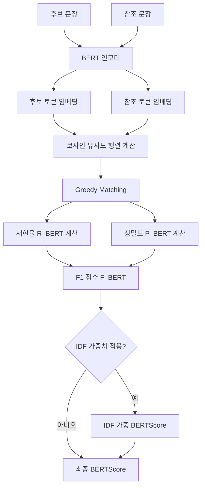

# BERTScore - 임베딩 기반 텍스트 평가 지표

BERTScore는 2020년 Tianyi Zhang et al.이 제안한 자동 텍스트 평가 지표로, [[bleu-metric|BLEU]]나 [[rouge-metric|ROUGE]] 같은 어휘 기반 지표의 핵심 한계인 **의미 무시 문제**를 해결하기 위해 BERT의 문맥적 임베딩(contextual embedding)을 활용한다. 동의어, 패러프레이즈, 어순 변환을 자연스럽게 처리할 수 있어 사람 판단과의 상관관계가 기존 지표보다 높다.

> "BERTScore computes a similarity score for each token in the candidate sentence with each token in the reference sentence." - Zhang et al., 2020

## 핵심 아이디어

### 문맥적 표현(Contextual Representation)의 활용

전통 지표는 단어를 독립적인 원자로 취급하여 정확한 문자열 일치만 인정한다. 그러나 언어에서 같은 개념을 다양한 표현으로 나타낼 수 있다.

- "automobile" = "car" = "vehicle" (동의어)
- "The cat sat" = "A feline was seated" (패러프레이즈)
- "he bought bread" = "bread was bought by him" (어순 변환)

BERT 기반 임베딩은 이러한 의미적 유사성을 벡터 공간에서 코사인 유사도로 포착한다.

### 핵심 가정

BERT가 생성하는 문맥적 토큰 임베딩은 의미적으로 유사한 토큰들을 유사한 벡터 공간에 매핑한다. 따라서 두 문장의 토큰 임베딩 간 코사인 유사도는 의미적 겹침의 척도로 사용할 수 있다.

## 계산 방법

### 1단계: 토큰 임베딩 생성

후보 문장 $\hat{y} = \hat{y}_1, ..., \hat{y}_k$와 참조 문장 $y = y_1, ..., y_l$을 사전 훈련된 BERT 계열 모델(BERT, RoBERTa, XLM-R 등)에 통과시켜 토큰별 임베딩을 추출한다.

$$\hat{\mathbf{h}}_i = \text{BERT}(\hat{y})_i, \quad \mathbf{h}_j = \text{BERT}(y)_j$$

### 2단계: 코사인 유사도 행렬 계산

모든 후보-참조 토큰 쌍에 대해 코사인 유사도를 계산한다.

$$\text{sim}(\hat{y}_i, y_j) = \frac{\hat{\mathbf{h}}_i^\top \mathbf{h}_j}{\|\hat{\mathbf{h}}_i\| \cdot \|\mathbf{h}_j\|}$$

### 3단계: 최대 유사도 매칭

각 토큰에 대해 상대 문장에서 가장 유사한 토큰과 매칭한다. 이는 greedy matching 방식이다.

**재현율 (Recall)**: 참조 토큰 각각이 후보에서 얼마나 잘 매칭되는가
$$R_{BERT} = \frac{1}{|y|} \sum_{y_j \in y} \max_{\hat{y}_i \in \hat{y}} \text{sim}(\hat{y}_i, y_j)$$

**정밀도 (Precision)**: 후보 토큰 각각이 참조에서 얼마나 잘 매칭되는가
$$P_{BERT} = \frac{1}{|\hat{y}|} \sum_{\hat{y}_i \in \hat{y}} \max_{y_j \in y} \text{sim}(\hat{y}_i, y_j)$$

**F1 점수**: 재현율과 정밀도의 조화평균
$$F_{BERT} = 2 \frac{P_{BERT} \cdot R_{BERT}}{P_{BERT} + R_{BERT}}$$

### 4단계: IDF 가중치 (선택 사항)

드문 단어(중요한 내용어)에 더 높은 가중치를 부여하기 위해 IDF(Inverse Document Frequency) 가중치를 적용할 수 있다.

$$R_{BERT}^{idf} = \frac{\sum_{y_j \in y} idf(y_j) \max_{\hat{y}_i \in \hat{y}} \text{sim}(\hat{y}_i, y_j)}{\sum_{y_j \in y} idf(y_j)}$$



위 흐름은 BERTScore의 전체 계산 파이프라인을 보여준다. BERT 인코더가 두 문장 모두의 문맥적 임베딩을 생성하는 것이 핵심이다.

## 파이썬 구현

```python
from bert_score import score, BERTScorer

# 기본 사용 (단일 쌍)
candidates = ["The dog bit the man."]
references = ["The man was bitten by the dog."]

P, R, F1 = score(candidates, references, lang="en", verbose=True)
print(f"Precision: {P.mean():.4f}")
print(f"Recall: {R.mean():.4f}")
print(f"F1: {F1.mean():.4f}")

# 배치 처리 (더 효율적)
scorer = BERTScorer(
    model_type="roberta-large",
    lang="en",
    rescale_with_baseline=True  # 점수를 [0, 1] 범위로 정규화
)
P, R, F1 = scorer.score(candidates, references)
```

```python
# 한국어 BERTScore
from bert_score import score

ko_candidates = ["고양이가 매트 위에 있었다."]
ko_references = ["고양이가 매트 위에 앉아 있었다."]

P, R, F1 = score(
    ko_candidates,
    ko_references,
    model_type="klue/roberta-large",  # 한국어 특화 모델
    lang="ko"
)
print(f"한국어 BERTScore F1: {F1.mean():.4f}")
```

## 베이스라인 재조정 (Baseline Rescaling)

원본 BERTScore 값은 모델에 따라 범위가 다르고 절대값 해석이 어렵다. 베이스라인 재조정(baseline rescaling)을 적용하면 점수를 더 직관적인 범위로 변환할 수 있다.

$$\hat{F}_{BERT} = \frac{F_{BERT} - b}{1 - b}$$

여기서 $b$는 해당 언어와 모델에 대해 사전 계산된 베이스라인 값이다. `rescale_with_baseline=True` 옵션으로 활성화한다.

## 모델 선택 가이드

BERTScore의 품질은 사용하는 사전 훈련 모델에 크게 의존한다.

| 언어 | 권장 모델 | 비고 |
|------|----------|------|
| 영어 | `roberta-large` | 최고 성능 |
| 영어 (경량) | `distilbert-base-uncased` | 빠른 추론 |
| 다국어 | `xlm-roberta-large` | 100+ 언어 지원 |
| 한국어 | `klue/roberta-large` | 한국어 특화 |
| 한국어 다목적 | `snunlp/KR-ELECTRA-discriminator` | 한국어 대안 |
| 번역 특화 | `microsoft/mdeberta-v3-base` | MT 평가에 강점 |

## 기존 지표와의 비교

### 상관관계 연구 결과

Zhang et al. (2020) 연구에서 WMT 기계 번역 데이터셋과 TAC 요약 데이터셋에 대한 인간 판단 상관관계를 측정한 결과:

| 지표 | MT 상관관계 (Pearson) | 요약 상관관계 |
|------|---------------------|--------------|
| BLEU-4 | 0.48 | 0.37 |
| ROUGE-1 | 0.41 | 0.54 |
| ROUGE-L | 0.38 | 0.53 |
| BERTScore (RoBERTa-L) | **0.67** | **0.61** |

BERTScore가 전반적으로 인간 판단과의 상관관계가 높다.

### 구체적 예시

```
후보: "The automobile was purchased by John."
참조: "John bought a car."

BLEU: 0.0 (정확 일치 단어 없음)
ROUGE-1: 0.0
BERTScore: ~0.92 (automobile=car, purchased=bought 의미 포착)
```

## 강점과 한계

### 강점

- **의미적 유사도**: 동의어, 패러프레이즈, 어순 변환을 자연스럽게 처리
- **사람 판단 상관관계**: 기존 어휘 기반 지표 대비 높은 상관관계
- **문맥 의존 매칭**: 같은 단어라도 문맥에 따라 다른 의미를 구분
- **다국어 지원**: 다국어 모델(XLM-R 등)로 여러 언어 평가 가능
- **유연성**: 모델 선택으로 특정 언어/도메인 최적화 가능

### 한계

- **계산 비용**: BERT 추론이 필요하여 BLEU/ROUGE보다 수십 배 느림
- **모델 의존성**: 기반 모델의 품질과 편향을 그대로 반영
- **절대 해석 어려움**: 0.9가 "좋은" 점수인지 맥락에 따라 다름 (베이스라인 재조정 필요)
- **사실성 미검증**: 의미 유사도는 측정하지만 사실 정확성은 측정하지 않음
- **참조 의존성**: 여전히 고품질 참조가 필요하며, 참조 자체의 품질이 중요

## 실무 활용 지침

### 언제 BERTScore를 쓰는가

1. **MT 평가 보완**: [[bleu-metric|BLEU]]와 함께 사용하여 의미적 품질 보완
2. **요약 평가**: [[rouge-metric|ROUGE]]와 함께 사용하여 추상적 요약 평가
3. **창의적 텍스트 생성**: 패러프레이즈가 많은 창의적 글쓰기 평가
4. **소량 데이터 평가**: 코퍼스 수준보다 개별 문장 수준에서 더 신뢰적

### 실제 파이프라인 권장 구성

```python
from bert_score import BERTScorer
from rouge_score import rouge_scorer as rs
from nltk.translate.bleu_score import corpus_bleu

def comprehensive_eval(candidates: list[str], references: list[str]) -> dict:
    """MT 또는 요약 결과에 대한 종합 평가를 수행한다."""
    results = {}

    # ROUGE (빠른 어휘 기반)
    scorer = rs.RougeScorer(['rouge1', 'rouge2', 'rougeL'])
    rouge_scores = [scorer.score(r, c) for c, r in zip(candidates, references)]
    results['rouge1'] = sum(s['rouge1'].fmeasure for s in rouge_scores) / len(rouge_scores)
    results['rouge2'] = sum(s['rouge2'].fmeasure for s in rouge_scores) / len(rouge_scores)

    # BERTScore (의미 기반)
    bert_scorer = BERTScorer(model_type="roberta-large", rescale_with_baseline=True)
    _, _, F1 = bert_scorer.score(candidates, references)
    results['bert_score'] = F1.mean().item()

    return results
```

### [[sentence-transformer|Sentence Transformer]]와의 관계

BERTScore와 [[sentence-transformer|Sentence Transformer]] 기반 코사인 유사도는 모두 임베딩을 사용하지만 근본적 차이가 있다.

| 항목 | BERTScore | Sentence Transformer 유사도 |
|------|-----------|---------------------------|
| 매칭 단위 | 토큰 수준 | 문장 수준 |
| 집계 방식 | Greedy matching | 단일 벡터 비교 |
| 세밀도 | 토큰별 분석 가능 | 전체 문장 요약 |
| 속도 | 상대적으로 느림 | 빠름 |
| 주 용도 | 평가 지표 | 검색, 클러스터링 |

## 연구 동향

BERTScore 이후 다양한 개선 지표들이 제안되었다:

- **MoverScore**: Word Mover's Distance + 문맥 임베딩 결합
- **BARTScore**: 생성 모델의 로그 확률로 평가
- **CTC Score**: 정보 정렬 기반 평가
- **UniEval**: 다차원 통합 평가 (일관성, 유창성, 사실성, 관련성)
- **[[comet-translation|COMET]]**: MT 특화 신경망 평가, 소스 문장도 활용

## 관련 문서

- [[bleu-metric]] - n-gram 정밀도 기반 MT 평가의 표준 지표
- [[rouge-metric]] - 재현율 기반 요약 평가 지표
- [[comet-translation]] - 신경망 기반 MT 평가, 소스 언어 활용
- [[sentence-transformer]] - 문장 수준 임베딩 모델
- [[ai-evaluation]] - AI 시스템 평가 방법론 전반
