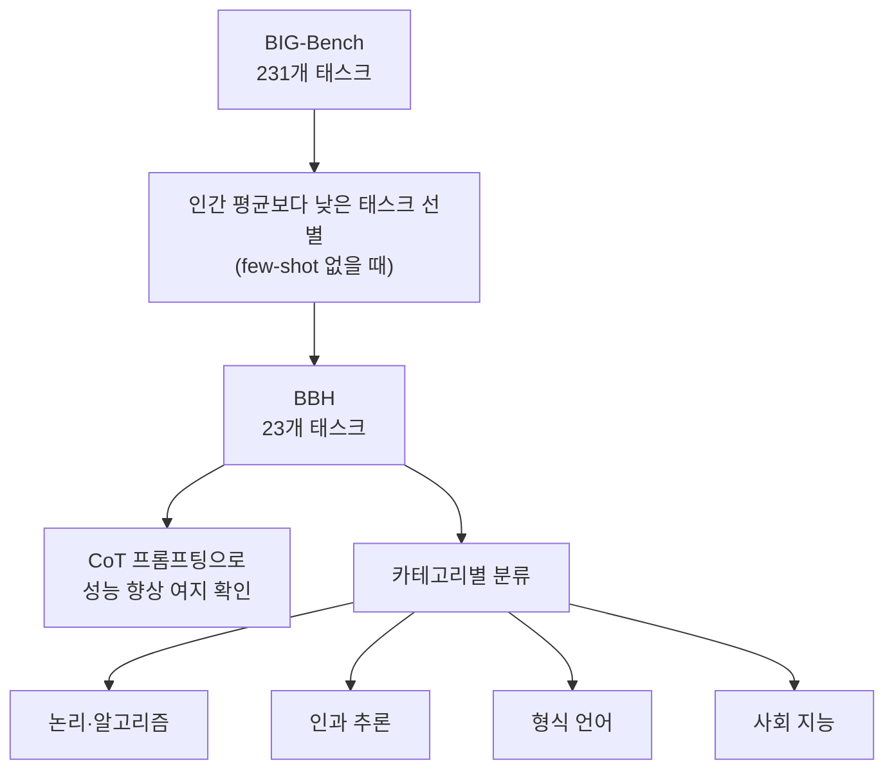
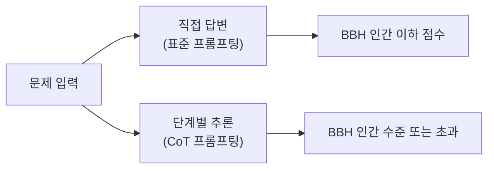

# BIG-Bench Hard (BBH)

BIG-Bench Hard(BBH)는 BIG-Bench(Beyond the Imitation Game Benchmark)의 231개 태스크 중에서 최신 LLM이 평균 인간 성능보다 낮은 점수를 기록한 23개 태스크만을 선별한 하드 서브셋이다. Suzgun et al.(2022)이 제안했으며, CoT(Chain-of-Thought) 프롬프팅 연구에서 가장 자주 인용되는 벤치마크 중 하나다.

## BBH의 탄생 배경

원래 BIG-Bench는 200개 이상 조직의 수백 명 연구자가 만든 대규모 평가 스위트였다. 모델이 발전하면서 많은 태스크에서 인간 수준을 초과하거나 근접하게 되었고, 이런 태스크들은 변별력이 낮아졌다. BBH는 "아직 어려운 것들"만 남긴다는 철학으로 선별되었다.

## 23개 태스크 분류

### 논리 연역 및 알고리즘 (Logical Deduction & Algorithms)

- **Logical Deduction (3-5-7 Objects)**: 물체 순서를 단서로부터 연역하는 문제. "A는 B 왼쪽에 있고, C는 A 오른쪽에 있다" 형식
- **Dyck Languages**: 괄호 짝 맞추기 시퀀스가 올바른지 판별
- **Word Sorting / Multi-step Arithmetic**: 정렬 알고리즘, 다단계 사칙연산

### 인과 추론 (Causal Reasoning)

- **Causal Judgment**: 사건의 원인을 식별하는 판단 문제. 반사실적 추론(counterfactual reasoning)이 필요
- **Temporal Sequences**: 시간 순서 관계를 추론하는 문제

### 형식 언어 및 기호 (Formal Languages & Symbolic)

- **Boolean Expressions**: `(True AND NOT False) OR (False AND True)` 같은 중첩 불리언 식 계산
- **Object Counting**: 서술적 텍스트에서 특정 조건의 객체 수를 세기
- **Tracking Shuffled Objects**: 여러 단계 교환 후 최종 상태 추적

### 자연어 추론 (NLI & Language)

- **Hyperbaton**: 비표준 어순(예: 형용사 순서)의 적절성 판단
- **Snarks**: 빈정거림(sarcasm)이 담긴 문장 식별
- **Disambiguation QA**: 대명사 지칭 모호성 해소

### 기타 범주

- **Web of Lies**: 진실/거짓 진술 연쇄에서 최종 값 도출
- **Penguins in a Table**: 표에서 특정 조건 만족하는 항목 찾기
- **Movie Recommendation**: 주어진 취향 정보로부터 추천 태스크

## CoT의 효과가 극대화되는 이유

BBH 태스크들은 대부분 **중간 추론 단계가 결과에 직접 영향**을 주는 구조다. 단순 패턴 매칭이 아니라 여러 단계의 논리를 쌓아야 최종 답에 도달한다.

Suzgun et al.의 핵심 발견:
- Few-shot 없이는 대부분의 태스크에서 GPT-3.5급 모델도 인간 하한선 이하
- CoT 프롬프팅 추가 시 평균 +10~20%p 성능 향상 (일부 태스크는 +40%p)
- 작은 모델(7B 이하)에서는 CoT 효과가 오히려 역전되는 경우도 있음 (모델 크기 임계값 존재)

## 한계와 포화

2024~2025년 들어 GPT-4 급 모델들이 BBH에서도 인간 평균을 상회하게 되었다. 일부 태스크는 이미 90%+ 정확도에 도달해 변별력이 낮아지고 있다. 이에 따라 더 어려운 벤치마크(ARB, MMMU, ARC-Challenge 등)로 관심이 이동하는 추세다.

## 평가 시 주의점

- BBH는 정확 매칭(exact match)으로 채점되므로 답변 형식이 중요하다
- 다지선다(multiple choice) 형식이 아닌 자유 생성 형식 태스크가 섞여 있어 파싱 방식에 따라 점수가 달라질 수 있다
- 한국어 프롬프트로 테스트 시 영어 기반 추론 능력과 다를 수 있어 언어 효과를 분리해야 함

## 관련 문서

- [[chain-of-thought-prompting]] - BBH 성능 향상의 핵심 기법
- [[tree-of-thought]] - CoT 확장인 ToT의 평가에도 BBH 일부 태스크 활용
- [[gsm8k-benchmark]] - 수학 추론 전문 벤치마크와의 비교
- [[big-bench]] - BBH 의 모태인 BIG-bench 본체 (200+ task, JSON / programmatic 이중 spec)
- [[lm-evaluation-harness]] - BBH 23 task 가 lm-eval 의 `bbh` group 으로 흡수되어 평가됨
- [[evaluation-harness-comparison]] - 9개 평가 harness 횡단 비교
