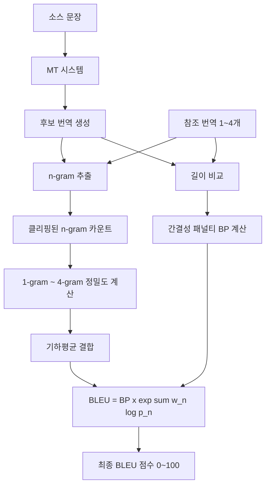

# BLEU (Bilingual Evaluation Understudy)

BLEU는 기계 번역(Machine Translation) 출력물의 품질을 자동으로 측정하기 위해 2002년 IBM Research에서 제안된 평가 지표다. n-gram 정밀도(precision)를 기반으로 하며, 오늘날에도 MT 평가의 사실상 표준(de facto standard)으로 널리 사용된다.

> "BLEU's strength is that it correlates reasonably well with human judgment at the corpus level." - Papineni et al., 2002

## 핵심 개념

### 왜 BLEU가 필요한가

사람이 번역 품질을 직접 평가하면 정확하지만 비용과 시간이 많이 든다. BLEU는 참조 번역(reference translation)과 기계 번역 출력을 비교하여 자동으로 수치 점수를 산출함으로써, 모델 개발 사이클에서 빠른 피드백을 가능하게 한다.

### 기본 아이디어

후보 번역(candidate)과 하나 이상의 참조 번역(reference) 사이의 n-gram 겹침 비율을 측정한다. n-gram이 많이 겹칠수록 번역 품질이 높다고 판단한다.

## 수식과 계산 원리

### 수정 n-gram 정밀도 (Modified n-gram Precision)

단순 n-gram 정밀도는 "the the the the the" 같은 반복 단어에 취약하다. BLEU는 이를 막기 위해 클리핑(clipping)을 적용한다.

$$p_n = \frac{\sum_{C \in \text{Candidates}} \sum_{\text{n-gram} \in C} \text{Count}_{\text{clip}}(\text{n-gram})}{\sum_{C \in \text{Candidates}} \sum_{\text{n-gram}' \in C} \text{Count}(\text{n-gram}')}$$

여기서 $\text{Count}_{\text{clip}}$은 n-gram이 어떤 참조 번역에서 등장하는 최대 횟수로 제한된 카운트다.

**예시:**
- 후보: "the the the the the" (5개 토큰)
- 참조: "the cat is on the mat"
- "the"의 참조 내 최대 등장: 2회
- 클리핑 적용 후 unigram 정밀도: 2/5 = 0.4

### 간결성 패널티 (Brevity Penalty, BP)

짧은 번역은 n-gram 정밀도가 높게 나올 수 있다. 이를 방지하기 위해 간결성 패널티를 적용한다.

$$BP = \begin{cases} 1 & \text{if } c > r \\ e^{(1 - r/c)} & \text{if } c \leq r \end{cases}$$

- $c$: 후보 번역의 총 길이
- $r$: 유효 참조 길이(Effective Reference Length)

후보가 참조보다 짧으면 패널티를 부과하며, 같거나 길면 패널티가 없다(BP=1).

### 최종 BLEU 점수

$$\text{BLEU} = BP \cdot \exp\left(\sum_{n=1}^{N} w_n \log p_n\right)$$

표준 BLEU-4에서는 1-gram부터 4-gram까지 균등 가중치($w_n = 1/4$)를 사용한다.

```python
from nltk.translate.bleu_score import corpus_bleu, sentence_bleu, SmoothingFunction

# 문장 단위 BLEU
reference = [['the', 'cat', 'is', 'on', 'the', 'mat']]
candidate = ['the', 'cat', 'sat', 'on', 'the', 'mat']
score = sentence_bleu(reference, candidate)
print(f"Sentence BLEU: {score:.4f}")

# 코퍼스 단위 BLEU (더 안정적)
references = [[['the', 'cat', 'is', 'on', 'the', 'mat']]]
candidates = [['the', 'cat', 'sat', 'on', 'the', 'mat']]
corpus_score = corpus_bleu(references, candidates)
print(f"Corpus BLEU: {corpus_score:.4f}")

# 단문에서는 스무딩이 필요
smoothie = SmoothingFunction().method4
smooth_score = sentence_bleu(reference, candidate, smoothing_function=smoothie)
print(f"Smoothed BLEU: {smooth_score:.4f}")
```

## BLEU 변형과 확장

| 변형 | 설명 | 주요 사용처 |
|------|------|------------|
| BLEU-1 | unigram만 사용 | 단어 수준 정확도 |
| BLEU-4 | 1~4-gram 조합, 표준 | MT 평가 표준 |
| SacreBLEU | 토크나이저 표준화, 재현성 보장 | 연구 논문 비교 |
| ChrF | 문자 단위 n-gram | 형태론적 언어 평가 |
| BLEU+1 (Lin & Och) | Add-1 스무딩 | 단문 평가 |

### SacreBLEU의 중요성

연구자들이 서로 다른 토크나이저를 사용하면 동일 모델이라도 BLEU 점수가 달라진다. SacreBLEU는 표준 토크나이저를 내장하여 **재현 가능한(reproducible) 점수**를 보장한다.

```python
import sacrebleu

refs = [['The dog bit the man.', 'It was not unexpected.']]
sys = ['The dog bit the man.', "It wasn't really surprising."]
bleu = sacrebleu.corpus_bleu(sys, refs)
print(bleu.score)  # 표준화된 BLEU 점수
```

## 평가 파이프라인 흐름



위 흐름은 BLEU 계산의 전체 파이프라인을 보여준다. 핵심은 정밀도 계산과 간결성 패널티의 두 가지 요소가 결합된다는 점이다.

## 강점과 한계

### 강점

- **속도**: 사람 평가 대비 즉각적인 자동 평가
- **상관관계**: 코퍼스 수준에서 사람 판단과 합리적 상관관계
- **재현성**: 동일 입력에 동일 점수 (SacreBLEU 사용 시)
- **언어 무관성**: 언어 쌍에 독립적으로 적용 가능
- **다중 참조 지원**: 복수의 참조 번역으로 다양한 표현 수용

### 한계

- **의미 무시**: "the dog bit the man" vs "the man bit the dog"를 구분 못함
- **단문 불안정**: 짧은 문장에서 분산이 크고 점수가 불안정
- **문장 수준 부정확**: 코퍼스 수준에서는 신뢰적이나 개별 문장에서는 취약
- **형태론적 언어 불리**: 독일어, 핀란드어 등 굴절어에서 한국어보다 불리
- **동의어 무시**: "automobile" vs "car" 같은 정확한 동의어도 오답으로 처리
- **유창성 평가 불가**: 문법적으로 올바른지 여부를 측정하지 못함

## 다른 평가 지표와 비교

| 지표 | 기반 | 단어 유사도 | 의미 유사도 | 사람 상관관계 |
|------|------|------------|------------|--------------|
| BLEU | n-gram 정밀도 | 정확 일치 | 없음 | 코퍼스 수준 보통 |
| [[rouge-metric\|ROUGE]] | n-gram 재현율 | 정확 일치 | 없음 | 요약 평가에 적합 |
| [[bert-score\|BERTScore]] | 임베딩 유사도 | 소프트 매칭 | 높음 | 문장 수준 높음 |
| [[comet-translation\|COMET]] | 신경망 회귀 | 소스 활용 | 높음 | 매우 높음 |
| METEOR | 정렬 + 동의어 | 부분 매칭 | 중간 | 중간 |

## 실무 활용 지침

### 적합한 사용 사례

1. **빠른 A/B 비교**: 두 MT 시스템의 상대적 비교 (절대 점수보다 상대 변화에 집중)
2. **모델 체크포인트 선택**: 훈련 중 최적 체크포인트 식별
3. **WMT 공개 리더보드**: 연구 커뮤니티 표준 비교 기준
4. **코퍼스 수준 평가**: 개별 문장이 아닌 전체 테스트셋 평가

### 주의사항

- BLEU 점수는 절대적 품질 기준이 아니다. BLEU 45가 BLEU 40보다 반드시 더 좋은 번역이라고 할 수 없다
- 도메인과 언어 쌍마다 기준 범위가 다르다 (WMT 영-독 top 시스템은 30-35점대)
- 고품질 번역 평가나 최종 출시 전에는 반드시 [[ai-evaluation|인간 평가]]를 병행해야 한다
- [[comet-translation|COMET]] 또는 [[bert-score|BERTScore]]와 함께 사용하면 평가 신뢰도가 높아진다

### 점수 해석 기준 (일반적 참고)

| BLEU 범위 | 해석 (WMT 기준) |
|-----------|----------------|
| < 10 | 매우 저품질, 거의 사용 불가 |
| 10-19 | 핵심 의미는 전달하나 오류 많음 |
| 20-29 | 이해 가능, 개선 여지 큼 |
| 30-39 | 좋은 번역, 일부 오류 존재 |
| 40-50 | 고품질, 사람 번역에 근접 |
| > 50 | 매우 고품질 (과적합 가능성 점검 필요) |

## 역사적 맥락

BLEU는 Kishore Papineni, Salim Roukos, Todd Ward, Wei-Jing Zhu가 ACL 2002에서 발표한 논문 "BLEU: a Method for Automatic Evaluation of Machine Translation"에서 제안되었다. 발표 당시 사람 판단과의 상관관계가 높음을 보여주었고, 이후 MT 연구의 핵심 평가 지표로 자리잡았다.

2000년대 통계 기반 MT(SMT) 시대부터 2010년대 신경망 MT(NMT) 시대를 거쳐 현재까지 표준 지표로 사용되고 있으나, 신경망 시대에는 BLEU의 한계가 더욱 두드러지게 됨에 따라 [[comet-translation|COMET]], [[bert-score|BERTScore]] 같은 신경망 기반 지표의 보완 사용이 권장되고 있다.

## 관련 문서

- [[rouge-metric]] - 재현율 기반 평가 지표, 주로 요약 평가에 사용
- [[bert-score]] - 임베딩 기반 시맨틱 유사도 측정
- [[comet-translation]] - 신경망 기반 MT 평가, WMT 챔피언
- [[ai-evaluation]] - AI 시스템 평가 개요
- [[machine-translation-modern]] - 현대 기계 번역 시스템
