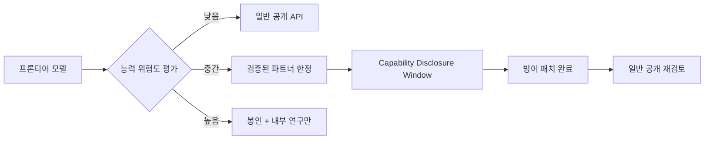

## 개요

**Capability-Gated Release**는 AI 모델을 출시할 때, 모델 전체가 아닌 **특정 능력 도메인을 기준으로 접근 범위를 분리**하는 배포 전략이다. 동일한 모델의 일부 능력은 일반 공개하되, 위험도가 높은 특정 능력은 검증된 파트너·연구자에게만 허용하거나, 아예 봉인해 두는 방식이다.

2026년 4월 기준으로 이 개념을 명시적으로 구현한 최초의 대규모 사례는 [[claude-mythos-preview]] / [[project-glasswing-case-study]]다.

## 전통적 모델 출시 방식과의 차이

기존 프론티어 모델 출시는 모델 단위의 이분법을 따랐다:

- **공개 출시** - API/콘솔을 통해 누구나 접근
- **비공개 유지** - 연구 프리뷰나 특정 파트너에게만 제공

Capability-Gated Release는 이 이분법을 깨고, **능력 프로파일**을 기준으로 다단계 출시 경로를 만든다.

이 다이어그램은 "봉인된 능력이 영구 비공개가 아니라, 준비 기간 이후 일반화될 수 있음"을 보여준다.

## Responsible Disclosure와의 유사성 및 차이

| 차원 | 소프트웨어 Responsible Disclosure | Capability-Gated Release |
|------|----------------------------------|--------------------------|
| 대상 | 취약점(vulnerability) | AI 모델의 위험 능력 |
| 공개 주체 | 발견자 (보안 연구자) | 개발사 (Anthropic) |
| 준비 기간 | 통상 90일 (공개 기한) | "Capability Disclosure Window" (기간 미정) |
| 준비 내용 | 벤더가 패치 배포 | 파트너가 proactive 방어 적용 |
| 위반 시 | 취약점 노출 | 위험 능력 확산 |

핵심 유사점은 **"먼저 방어를 준비한 뒤 공개"**라는 순서다. 차이는 준비 주체가 *발견자 → 벤더*가 아니라 *개발사 → 파트너*라는 점이다.

## Dual-Use 능력 관리

Capability-Gated Release가 필요한 이유는 AI 능력의 **이중 용도(dual-use)** 속성 때문이다:

- 사이버 취약점 발견 능력 → 방어에도, 공격에도 사용 가능
- 생물학적 설계 능력 → 신약 개발에도, 생물무기에도 잠재 활용
- 자율 코드 실행 → 자동화 개발에도, 시스템 침해에도 사용 가능

이러한 능력은 "모델을 공개하냐 마냐"가 아니라, **어떤 능력을 어떤 검증 조건 하에 허용하냐**로 관리하는 것이 더 정밀하다.

## Frontier 모델의 새 표준 가능성

Claude Mythos / Project Glasswing 사례가 이후 출시 정책에 영향을 줄 수 있는 방향:

1. **능력 카탈로그 공개**: 모델이 어떤 능력을 어느 수준으로 보유하는지 사전 공개
2. **파트너 검증 제도화**: "Cyber Verification Program"처럼 능력별 검증 트랙 운영
3. **단계적 출시 일정**: Capability Disclosure Window를 명시적 기간으로 제도화
4. **세이프가드 선출시**: 모델 공개 전 안전장치를 먼저 차기 모델에 내장

아직 업계 표준으로 자리 잡지는 않았지만, AI 거버넌스 논의에서 점점 주목받는 프레임이다.

## 한계와 비판

- **검증 파트너 선정 기준**이 불투명하면 대형 기업에 유리한 비대칭 구조가 된다
- **준비 기간이 명시되지 않으면** 사실상 영구 비공개와 구분되지 않는다
- **능력 경계 정의 어려움**: 어디까지가 "위험 능력"인지 판단 자체가 주관적

## 관련 문서

- [[claude-mythos-preview]] - Capability-Gated Release가 적용된 모델
- [[project-glasswing-case-study]] - 구체적 구현 사례
- [[ai-governance-regulation]] - AI 거버넌스 전반 맥락
