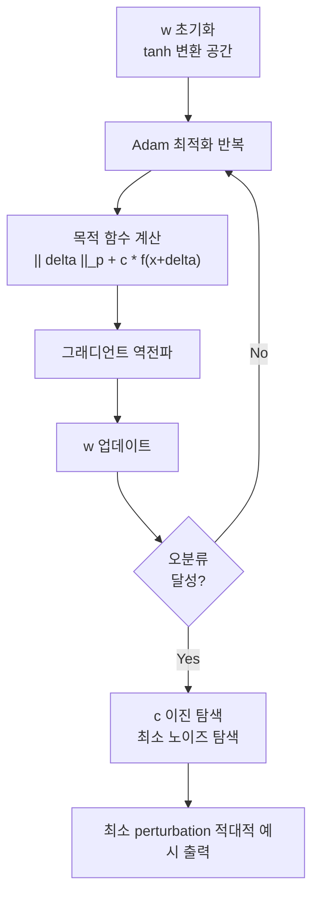

# C&W 공격 (Carlini-Wagner Attack)

**C&W 공격(Carlini-Wagner Attack)**은 2017년 Carlini와 Wagner가 제안한 **최적화 기반 적대적 공격(optimization-based adversarial attack)** 기법이다. FGSM 같은 단순 그래디언트 방법보다 훨씬 강력하며, 당시 State-of-the-art였던 방어 기법(특히 Defensive Distillation)을 무력화하여 적대적 ML 연구의 전환점이 된 논문이다.

## 핵심 아이디어

[[adversarial-attacks-robustness]]의 기본 목표는 인간이 인지할 수 없는 작은 변화 $\delta$를 원본 입력 $x$에 더해 모델이 오분류하게 만드는 것이다:

$$\text{최소화: } \|\delta\|_p \quad \text{조건: } f(x + \delta) \neq f(x), \quad x + \delta \in [0,1]^d$$

C&W는 이 제약 최적화를 **제약 없는 최적화(unconstrained optimization)**로 변환하는 것이 핵심이다.

## 공식 공식화

### 변수 변환

입력값이 $[0,1]$ 범위에 있도록 강제하기 위해 다음 변환을 사용한다:

$$x + \delta = \frac{1 + \tanh(w)}{2} \implies w = \tanh^{-1}(2x - 1) + \delta'$$

$w$에 대해 최적화하면 $x + \delta$는 자동으로 $[0,1]$ 범위를 유지한다.

### 목적 함수

$$\text{최소화:} \quad \|x + \delta - x\|_p + c \cdot f(x + \delta)$$

여기서 $f(x + \delta)$는 오분류를 유도하는 손실 함수다. 여러 변형이 있으며, 논문에서는 6가지를 비교했고 다음 함수가 가장 효과적이었다:

$$f_6(x') = \max\left(\max_{i \neq t}\left(Z(x')_i\right) - Z(x')_t, -\kappa\right)$$

- $Z(x')$: 소프트맥스 이전의 로짓(logit) 값
- $t$: 타겟 클래스
- $\kappa$: 신뢰도 마진 파라미터

위 흐름에서 이진 탐색(binary search)으로 $c$ 값을 조정하여 오분류를 유발하는 최소 크기의 perturbation을 찾는다.

## L_p 노름 변형

C&W 공격은 세 가지 노름 기준으로 제안되었다:

| 노름 | 특성 | 적합 상황 |
|------|------|-----------|
| $L_0$ | 변경된 픽셀 수 최소화 | 희소 perturbation |
| $L_2$ | 전체 변화량 최소화 | 일반적 사용, 가장 강력 |
| $L_\infty$ | 최대 픽셀 변화량 최소화 | [[pgd-adversarial-training]]과의 비교 |

## Defensive Distillation 무력화

C&W 논문의 가장 중요한 기여 중 하나는 당시 유망한 방어로 여겨지던 **Defensive Distillation**을 완전히 무력화했다는 점이다. Distillation된 모델은 로짓 스케일이 달라져 FGSM 같은 공격은 막을 수 있었지만, C&W처럼 로짓 값 자체를 목적 함수에 직접 사용하는 최적화 기반 방법에는 무력했다.

이 결과는 단순한 방어 기법이 얼마나 쉽게 깨질 수 있는지를 보여주며, 적대적 견고성 연구에서 **철저한 평가(complete evaluation)**의 필요성을 강조하는 계기가 됐다.

## PGD 공격과의 비교

| 특성 | C&W | [[pgd-adversarial-training]] (PGD) |
|------|-----|-----|
| 방식 | 최적화 (Adam) | 반복 그래디언트 스텝 |
| 공격 강도 | 일반적으로 더 강함 | 강력하고 빠름 |
| 연산 비용 | 높음 (이진 탐색 포함) | 상대적으로 낮음 |
| 주요 용도 | 방어 평가, 최강 공격 기준점 | 적대적 학습 |

## 실무적 의의

C&W 공격은 다음 목적으로 사용된다:

1. **방어 기법 평가**: "이 방어가 C&W에도 통하는가?"가 견고성 평가의 기준점
2. **AutoAttack 구성 요소**: AutoAttack 앙상블 공격의 일부로 포함됨
3. **인증 방어 검증**: 랜덤화 스무딩(Randomized Smoothing) 같은 인증 방어의 경험적 상한 측정

## 관련 문서

- [[adversarial-attacks-robustness]] - 적대적 공격의 전반적 개요, C&W가 속하는 공격 분류
- [[pgd-adversarial-training]] - C&W와 함께 가장 많이 사용되는 강력 공격 및 방어 프레임워크
- [[natural-adversarial-examples]] - 최적화 없이도 자연 발생하는 적대적 예시와의 대비
