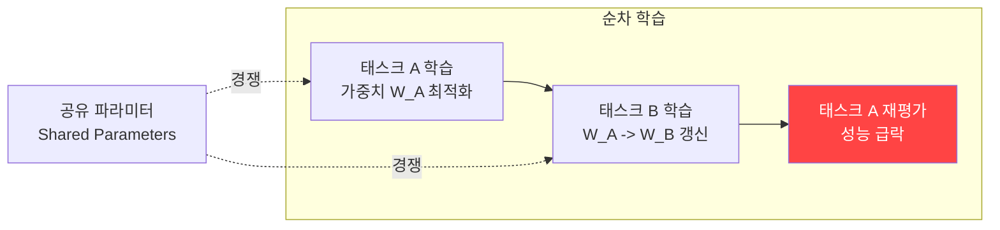
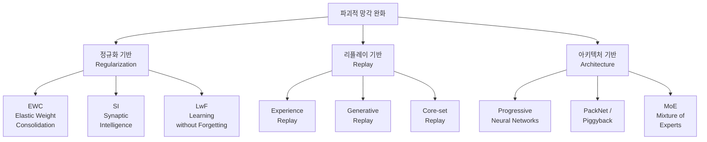

# Catastrophic Forgetting (파괴적 망각)

## 정의

**Catastrophic Forgetting(파괴적 망각)**은 신경망이 새로운 태스크를 순차적으로 학습할 때, 이전에 학습한 지식이 급격히 상실되는 현상이다. 태스크 B를 학습하면 태스크 A에 중요했던 가중치가 덮어씌워져, A의 성능이 급락한다.

이 문제는 1989년 McCloskey & Cohen이 처음 보고한 이래 신경망의 근본적 한계로 남아 있다. LLM 시대에는 파인튜닝, [[rlhf-pipeline|RLHF]], 도메인 적응 과정에서 사전 훈련 지식이 손실되는 형태로 자주 나타난다.

## 왜 발생하는가

핵심 원인은 **파라미터 공유(shared representation)**다. 단일 네트워크의 고정된 파라미터 공간에서 여러 태스크가 경쟁하며, 새 태스크의 경사 하강(gradient descent)이 이전 태스크에 중요한 가중치를 무차별적으로 수정한다.

생물학적 뇌는 시냅스 가소성(synaptic plasticity)과 보완적 학습 시스템(complementary learning systems)으로 이 문제를 자연스럽게 해결하지만, 인공 신경망은 이런 메커니즘이 없다.

## Stability-Plasticity 딜레마

파괴적 망각의 이론적 프레임워크는 **안정성-가소성 딜레마(Stability-Plasticity Dilemma)**다.

| 극단 | 결과 |
|------|------|
| 과도한 안정성 (Stability) | 새 태스크 학습 불가 -- 이전 지식은 보존 |
| 과도한 가소성 (Plasticity) | 새 태스크는 잘 배우지만 이전 지식 파괴 |
| 균형 | 이전 지식 유지 + 새 지식 수용 (목표) |

2025년 Nature Communications 연구에서는 이 딜레마를 **catastrophic remembering**(새 학습 자체가 불가능한 상태)이라는 대칭 문제와 함께 프레이밍한다.

## 완화 전략 삼대 패밀리

### 1. 정규화 기반 (Regularization-based)

이전 태스크에 중요한 파라미터의 변경을 제약한다.

- **EWC (Elastic Weight Consolidation)**: Fisher Information Matrix로 파라미터 중요도를 추정하고, 중요 파라미터의 변경에 페널티 부과. Kirkpatrick et al., PNAS 2017
- **Synaptic Intelligence (SI)**: 온라인 방식으로 시냅스 중요도를 누적 추적
- **Learning without Forgetting (LwF)**: 이전 모델의 출력을 knowledge distillation 타겟으로 사용

### 2. 리플레이 기반 (Replay-based)

이전 태스크의 데이터를 저장하거나 생성하여 함께 학습한다.

- **Experience Replay**: 이전 데이터의 일부를 버퍼에 저장, 새 학습 시 혼합
- **Generative Replay**: 생성 모델로 이전 데이터를 합성하여 사용
- **Core-set Selection**: 가장 대표적인 샘플만 선별 저장

### 3. 아키텍처 기반 (Architecture-based)

태스크별 전용 네트워크 용량을 할당한다.

- **Progressive Neural Networks**: 태스크마다 새 컬럼 추가, 이전 컬럼은 고정
- **PackNet / Piggyback**: 네트워크를 프루닝하여 태스크별 서브네트워크 할당
- **MoE (Mixture of Experts)**: 전문가 라우팅으로 태스크별 경로 분리

## LLM에서의 파괴적 망각

### 파인튜닝 시 망각

범용 LLM을 특정 도메인(의료, 법률 등)에 파인튜닝하면 원래의 범용 능력이 저하될 수 있다. [[few-shot-learning|few-shot]] 성능이나 일반 추론 능력이 특히 취약하다.

### RLHF 과정에서의 망각

[[rlhf-pipeline|RLHF]]의 RL 단계에서 정책 최적화가 사전 훈련된 지식을 덮어쓸 수 있다. KL 페널티가 이를 완화하지만, 완전히 방지하지 못한다. 이는 [[reward-hacking|보상 해킹]]과도 관련된다 -- 모델이 보상을 최대화하면서 기존 역량을 잃는 것이다.

### 대응 기술

- **LoRA / QLoRA**: 전체 파라미터의 극소 부분만 학습하여 원본 가중치 보존. [[peft-library|PEFT 라이브러리]] 참조
- **Replay-augmented Fine-tuning**: 파인튜닝 데이터에 사전 훈련 데이터 일부를 혼합
- **Model Merging**: 파인튜닝된 모델과 원본 모델의 가중치를 선형 보간

## 2025년 최신 연구

### Neural ODE + Memory-Augmented Transformer (2025)

Neural ODE의 연속 시간 역학(continuous-time dynamics)과 memory-augmented transformer의 어텐션 기반 지식 통합을 결합. **24% 망각 감소, 10.3% 정확도 향상**을 보고했다 (Scientific Reports, 2025).

### Metaplasticity from Synaptic Uncertainty (2025)

생물학적 시냅스에서 영감을 받은 베이지안 학습 규칙. 불확실성(uncertainty)에 비례하여 학습률을 조절하고, 제어된 방식으로 망각하여 기억 유지와 유연성을 동시에 달성한다 (Nature Communications, 2025).

### Nested Learning (Google, 2025)

모델을 중첩된(nested) 작은 최적화 문제들의 집합으로 분해하여, 파괴적 망각을 완전히 회피하거나 극적으로 줄이는 패러다임.

## 관련 페이지

- [[continual-learning|Continual Learning]] -- 망각 없이 순차 학습하는 분야 전체
- [[rlhf-pipeline|RLHF Pipeline]] -- 정렬 과정에서 망각이 발생하는 구체적 맥락
- [[reward-hacking|Reward Hacking]] -- RL 최적화가 사전 훈련 지식을 파괴하는 경로
- [[few-shot-learning|Few-shot Learning]] -- 파인튜닝 망각의 대표적 피해 영역
- [[small-language-models|Small Language Models]] -- 제한된 파라미터에서 망각이 더 심각

## 참고 자료

- McCloskey & Cohen, "Catastrophic Interference in Connectionist Networks" (1989) -- 현상 최초 보고
- Kirkpatrick et al., "Overcoming catastrophic forgetting in neural networks" (PNAS, 2017) -- EWC 제안
- De Lange et al., "Continual Learning and Catastrophic Forgetting" (2024, arXiv:2403.05175) -- 종합 서베이
