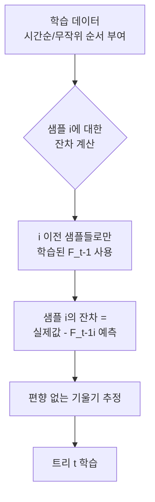
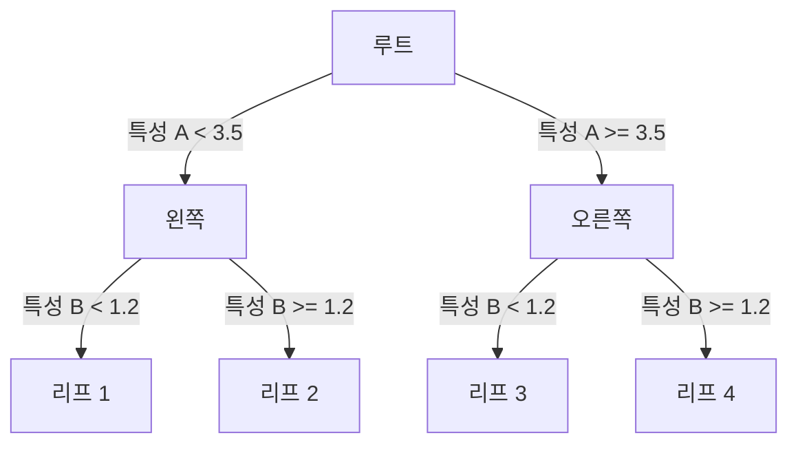

# CatBoost Ordered Boosting

CatBoost는 Yandex가 2017년 발표한 그래디언트 부스팅 구현체로, 두 가지 독창적인 기여로 차별화된다. **Ordered Boosting(순서 부스팅)** 은 예측 이동(prediction shift) 문제를 해결하고, **범주형 특성 처리** 는 수동 인코딩 없이 고카디널리티 카테고리를 직접 다룬다.

## 예측 이동(Prediction Shift) 문제

기존 GBDT([[xgboost-lightgbm]] 포함)는 학습 잔차(residual)를 계산할 때 **같은 데이터로** 이전 트리를 학습하고 **같은 데이터에서** 잔차를 측정한다. 이는 미묘한 편향을 유발한다.

수식으로 표현하면, $t$번째 트리의 기울기 $g_t(x_i)$는 $F_{t-1}$을 학습하는 데 $x_i$가 사용되었으므로 해당 샘플에 대해 과소추정된다. 훈련 데이터와 테스트 데이터 간 분포 차이(예측 이동)가 발생하는 원인이다.

## Ordered Boosting 해법

**핵심 아이디어**: 샘플 $i$의 잔차를 계산할 때, $i$를 포함하지 않는 이전 샘플들($j < i$)로만 학습된 모델을 사용한다. 이를 위해 CatBoost는 $n$개 샘플에 대해 $n$개의 다른 모델을 유지하는 것을 피하기 위해 **Ordered Tree** 구조를 사용한다.

실용적 구현에서는 랜덤 순열(random permutation)을 여러 번 사용하여 각 순열에서 서로 다른 트리를 학습하는 방식으로 근사한다.

## 범주형 특성 처리

### 타겟 통계(Target Statistics) vs 표준 타겟 인코딩

일반적인 타겟 인코딩은 범주값 $c$에 대해 $\mathbb{E}[y | x = c]$를 평균으로 추정한다. 하지만 이는 현재 샘플 자체를 포함한 통계이므로 타겟 누출(target leakage)이 발생한다.

CatBoost의 해법은 Ordered Boosting과 동일한 원리를 적용한다:

$$\hat{x}_i^k = \frac{\sum_{j : \sigma(j) < \sigma(i), x_j^k = x_i^k} y_j + a \cdot P}{\sum_{j : \sigma(j) < \sigma(i), x_j^k = x_i^k} 1 + a}$$

- $\sigma$: 데이터 순열(permutation)
- $a$: 스무딩 파라미터 (기본값 1)
- $P$: 사전 확률 (전체 타겟 평균)

이전 샘플들의 통계만을 사용하므로 타겟 누출을 방지하면서 범주형 특성을 수치로 변환한다.

### 고차 범주형 조합

CatBoost는 단일 범주형 특성뿐 아니라 **범주형 특성 간 조합** 도 자동으로 생성한다. 예를 들어 `(성별, 연령대)` 조합을 새로운 범주형 특성으로 만들어 교호작용을 포착한다. [[tabular-feature-interaction]] 에서 다루는 특성 교호작용의 자동화된 구현이다.

## 대칭 트리(Symmetric/Oblivious Trees)

CatBoost는 각 레벨에서 **동일한 분할 조건**을 모든 노드에 적용하는 대칭 트리를 사용한다. 이는 트리 평가(inference)를 비트마스크 연산으로 구현할 수 있게 해 CPU 추론 속도를 크게 높인다. 단, 표현력은 일반 트리보다 낮다.

## 세 프레임워크 비교

| 특성 | [[xgboost-lightgbm|XGBoost]] | [[xgboost-lightgbm|LightGBM]] | CatBoost |
|------|---------|---------|---------|
| 트리 성장 | Level-wise | Leaf-wise | Level-wise (대칭) |
| 예측 이동 보정 | 없음 | 없음 | Ordered Boosting |
| 범주형 처리 | 수동 | 기본 지원 | Ordered TS |
| GPU 지원 | 있음 | 있음 | 있음 |
| 추론 속도 | 빠름 | 빠름 | 매우 빠름 (대칭 트리) |

## 실무 적용 시나리오

Ordered Boosting의 혜택은 다음 상황에서 두드러진다:
- **소규모 데이터**: 예측 이동이 과적합에 더 크게 기여하는 경우
- **고카디널리티 범주형 특성 다수**: 수동 인코딩 파이프라인 없이 직접 처리
- **피처 엔지니어링 최소화 목표**: 범주형 조합 자동 생성으로 수작업 감소

[[tabular-ml]] 의 현대 벤치마크에서 CatBoost는 범주형 특성이 많은 데이터셋에서 특히 강력하다.

## 관련 문서

- [[xgboost-lightgbm]] - XGBoost vs LightGBM 비교 (CatBoost 포함 3파전 컨텍스트)
- [[tabular-ml]] - 테이블 데이터 ML 전체 맥락
- [[tabular-feature-interaction]] - 범주형 조합이 포착하는 특성 교호작용
- [[xgboost-internals]] - XGBoost 내부 구조 상세
- [[shap-feature-importance]] - CatBoost 예측 해석
