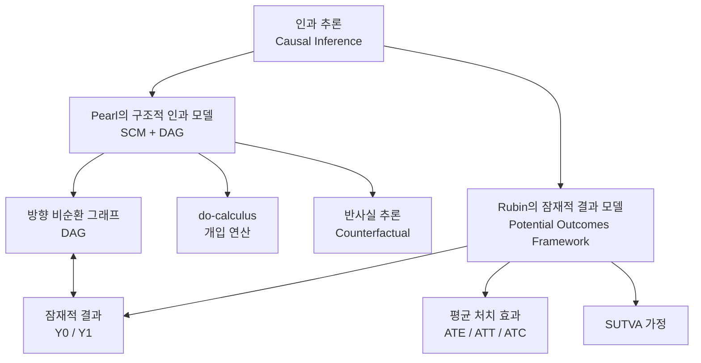
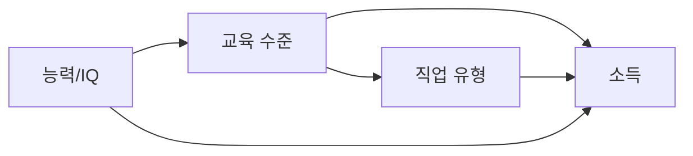

# 인과 추론 (Causal Inference)

## 개요

인과 추론(Causal Inference)은 관측 데이터 또는 실험 데이터로부터 **원인과 결과의 관계**를 밝히는 통계학, 철학, 컴퓨터 과학의 교차 분야다. 상관관계(correlation)는 두 변수가 함께 움직인다는 것을 말해주지만, 인과 관계는 한 변수의 변화가 다른 변수의 변화를 **직접 유발**한다는 것을 말한다.

현대 AI/ML에서 인과 추론이 중요한 이유: 기존 ML 모델은 패턴 인식에 탁월하지만, **분포 이동(distribution shift)**, **반사실 예측**, **정책 효과 추정** 등에서 근본적인 한계를 가진다. 인과 모델은 이러한 한계를 극복하기 위한 이론적 기반을 제공한다.

> "Correlation is not causation — you can observe that ice cream sales and drowning rates are correlated, but neither causes the other."

## 두 가지 주요 프레임워크

현대 인과 추론은 두 개의 상호보완적 프레임워크를 중심으로 발전했다.



두 프레임워크는 동일한 현상을 다른 언어로 표현하며, 특정 문제에 따라 하나가 더 편리하다.

## Pearl의 인과 계층구조 (Ladder of Causation)

Judea Pearl이 제안한 인과 추론의 3단계 계층 구조로, 각 단계는 이전 단계보다 더 강력한 질문을 다룬다.

| 단계 | 이름 | 질문 유형 | 연산 | 예시 |
|------|------|-----------|------|------|
| 1 | **관측 (Association)** | "보면?" | $P(Y \mid X)$ | 흡연자 중 폐암 비율은? |
| 2 | **개입 (Intervention)** | "하면?" | $P(Y \mid do(X))$ | 흡연을 중단하면 폐암 위험이 줄까? |
| 3 | **반사실 (Counterfactual)** | "했더라면?" | $P(Y_x \mid X', Y')$ | 이 환자가 흡연을 안 했다면 지금도 건강했을까? |

현재 대부분의 ML 모델은 1단계(관측)에 머문다. 인과 추론은 2-3단계를 다룬다.

## 구조적 인과 모델 (Structural Causal Model, SCM)

Pearl의 SCM은 세 가지 요소로 구성된다:

1. **내생 변수 (Endogenous variables)** $V$: 모델 내에서 설명하는 변수
2. **외생 변수 (Exogenous variables)** $U$: 외부에서 주어지는 노이즈/배경 요인
3. **구조 방정식 (Structural equations)**: 각 내생 변수가 어떻게 결정되는지

$$X_i = f_i(\text{Pa}(X_i), U_i)$$

여기서 $\text{Pa}(X_i)$는 변수 $X_i$의 부모 변수 집합이다.

### 예시: 교육-소득 SCM

$$\text{교육} = f_1(U_{\text{교육}})$$
$$\text{소득} = f_2(\text{교육}, \text{능력}, U_{\text{소득}})$$
$$\text{능력} = f_3(U_{\text{능력}})$$

## 방향 비순환 그래프 (DAG)

SCM은 방향 비순환 그래프(Directed Acyclic Graph, DAG)로 표현된다. DAG의 각 노드는 변수, 엣지는 직접적 인과 영향을 나타낸다.



### 핵심 DAG 구조 패턴

**체인 (Chain)**: $A \to B \to C$
- $A$는 $B$를 통해 $C$에 영향. $B$를 조건화하면 $A \perp C$

**포크 (Fork)**: $A \leftarrow B \to C$
- $B$가 공통 원인. $B$를 조건화하지 않으면 $A$와 $C$는 상관, 조건화하면 독립

**충돌자 (Collider)**: $A \to B \leftarrow C$
- $B$를 조건화하면 $A$와 $C$ 사이에 허위 연관 생성 (Berkson's paradox)

## do-calculus: 개입 연산

Pearl의 do-calculus는 관측 분포 $P(\cdot)$만으로 개입 분포 $P(\cdot \mid do(\cdot))$를 계산하기 위한 세 가지 규칙 체계다.

**do 연산자**의 의미: $do(X = x)$는 자연적 관측이 아닌 **강제 개입**을 의미한다. DAG에서 $X$로 들어오는 모든 엣지를 제거하고 $X = x$로 고정한다.

### 교란 요인 통제: 백도어 기준 (Backdoor Criterion)

교란 변수(confounder) $Z$ 집합이 **백도어 기준**을 만족하면, 개입 효과를 다음과 같이 계산한다:

$$P(Y \mid do(X)) = \sum_z P(Y \mid X, Z = z) \cdot P(Z = z)$$

```python
# 예시: 교육이 소득에 미치는 인과 효과 (능력이 교란 변수)
# 능력을 층화(stratify)하여 각 층에서 교육-소득 관계 추정 후 가중 평균
ate = 0
for ability_level in ability_levels:
    subset = data[data['ability'] == ability_level]
    effect = subset.groupby('education')['income'].mean().diff().iloc[-1]
    weight = (data['ability'] == ability_level).mean()
    ate += effect * weight
```

### 프론트도어 기준 (Frontdoor Criterion)

직접 교란 변수를 관측할 수 없을 때, 매개 변수(mediator) $M$을 통해 인과 효과 추정:

$$P(Y \mid do(X)) = \sum_m P(M = m \mid X) \sum_{x'} P(Y \mid X = x', M = m) P(X = x')$$

## Rubin의 잠재적 결과 프레임워크 (Potential Outcomes Framework)

통계학에서 주로 사용하는 반사실적 관점이다. 각 개체는 처치(treatment)를 받았을 때($Y_1$)와 받지 않았을 때($Y_0$)의 잠재적 결과를 모두 가진다고 가정한다.

### 주요 추정량

| 추정량 | 정의 | 의미 |
|--------|------|------|
| **ATE** (Average Treatment Effect) | $\mathbb{E}[Y_1 - Y_0]$ | 전체 집단의 평균 처치 효과 |
| **ATT** (Average Treatment on Treated) | $\mathbb{E}[Y_1 - Y_0 \mid T=1]$ | 실제 처치받은 집단의 효과 |
| **ATC** (Average Treatment on Control) | $\mathbb{E}[Y_1 - Y_0 \mid T=0]$ | 처치받지 않은 집단에서 가정 효과 |
| **CATE** (Conditional ATE) | $\mathbb{E}[Y_1 - Y_0 \mid X=x]$ | 특정 공변량 값에서의 이질적 처치 효과 |

### 근본적 문제

관측 불가능성 (Fundamental Problem of Causal Inference): 동일 개체에 대해 $Y_1$과 $Y_0$을 동시에 관측할 수 없다. 우리는 항상 하나의 잠재적 결과만 관측한다.

**해결 전략**:
- 무작위 실험(RCT): 집단을 무작위 배정하여 $Y_1, Y_0$의 분포를 추정
- 관측 데이터: 가정(SUTVA, ignorability)을 두고 통계적 조정

### SUTVA 가정

SUTVA (Stable Unit Treatment Value Assumption):
1. **간섭 없음**: 한 개체의 처치가 다른 개체의 결과에 영향을 주지 않음
2. **처치 버전 단일성**: 처치는 하나의 명확한 버전만 존재

네트워크 효과, 군집 실험에서는 SUTVA가 위반될 수 있다.

## 인과 발견 (Causal Discovery)

데이터만으로 DAG 구조를 학습하는 방법론이다.

### 주요 알고리즘

| 알고리즘 | 유형 | 특징 |
|----------|------|------|
| PC 알고리즘 | 제약 기반 | 조건부 독립성 검정으로 엣지 제거 |
| FCI 알고리즘 | 제약 기반 | 숨겨진 교란 변수 허용 |
| GES | 점수 기반 | BIC/BDeu 점수 최적화 |
| NOTEARS | 연속 최적화 | DAG를 연속 최적화 문제로 변환 |
| LiNGAM | 함수 인과 | 비가우시안 노이즈 가정 |

```python
# NOTEARS 예시 (선형 DAG 학습)
from notears import notears_linear

# 인과 구조 학습
W_est = notears_linear(X, lambda1=0.1, loss_type='l2')
# W_est[i, j] != 0 이면 X_i -> X_j 엣지 존재

# 학습된 DAG 시각화
import networkx as nx
G = nx.DiGraph()
for i in range(len(W_est)):
    for j in range(len(W_est)):
        if abs(W_est[i, j]) > 0.3:
            G.add_edge(i, j, weight=W_est[i, j])
```

## ML/AI에서의 인과 추론 응용

### 1. 이질적 처치 효과 추정 (Heterogeneous Treatment Effects)

CATE 추정은 "누구에게 처치가 효과적인가"를 ML로 학습한다.

```python
from econml.dml import CausalForestDML

# 이중 ML (Double Machine Learning)
causal_forest = CausalForestDML(
    model_y=RandomForestRegressor(n_estimators=100),
    model_t=RandomForestClassifier(n_estimators=100),
    n_estimators=200
)
causal_forest.fit(Y, T, X=X, W=W)  # Y=결과, T=처치, X=공변량, W=교란변수

# 개인별 처치 효과 추정
cate = causal_forest.effect(X_test)
```

### 2. 인과 표현 학습 (Causal Representation Learning)

도메인 불변(domain-invariant) 표현을 학습하여 분포 이동에 강건한 모델을 만든다. IRM(Invariant Risk Minimization) 등이 대표적이다.

### 3. 반사실 데이터 증강 (Counterfactual Data Augmentation)

```python
# 반사실 샘플 생성 (텍스트 분류 예시)
# "이 영화는 훌륭하다" -> 긍정 레이블
# "이 영화는 끔찍하다" -> 반사실 부정 레이블 (최소 변경)

def generate_counterfactual(text, label, model):
    # 가장 영향력 있는 단어 식별 (SHAP/LIME 활용)
    important_words = get_important_words(text, model)
    # 반대 레이블이 나오도록 최소 변경
    cf_text = flip_important_words(text, important_words, target_label=1-label)
    return cf_text
```

### 4. 공정성 (Fairness) 및 편향 제거

인과 그래프를 사용하여 보호 속성(gender, race)이 예측에 미치는 직접/간접 경로를 분리하고 차별적 영향을 제거한다.

- **직접 차별**: 보호 속성이 직접 결정에 영향
- **간접 차별**: 보호 속성이 프록시 변수를 통해 간접 영향 (redlining 효과)

### 5. 강화학습과 인과 추론

오프-폴리시(off-policy) 평가에서 개입 분포와 행동 분포의 차이를 중요도 샘플링(importance sampling)으로 보정하는 것이 인과 추론과 밀접하게 연관된다.

## 주요 도구 및 라이브러리

| 라이브러리 | 제공 기관 | 주요 기능 |
|-----------|----------|-----------|
| `econml` | Microsoft | CATE 추정, Double ML, Causal Forest |
| `dowhy` | Microsoft | 인과 추론 4단계 통합 (모델링→식별→추정→반박) |
| `causalml` | Uber | 처치 효과 추정, 업리프트 모델링 |
| `pgmpy` | Community | 베이지안 네트워크, 인과 그래프 |
| `bnlearn` | E.Taskesen | 인과 발견, DAG 학습 |
| `tigramite` | PIK | 시계열 인과 분석 |

### DoWhy 사용 예시

```python
import dowhy
from dowhy import CausalModel

# 1. 모델링: DAG 정의
model = CausalModel(
    data=df,
    treatment='education',
    outcome='income',
    graph="digraph {education -> income; ability -> education; ability -> income;}"
)

# 2. 식별: 인과 효과가 식별 가능한지 확인
identified_estimand = model.identify_effect()

# 3. 추정: 구체적 추정 방법 선택
causal_estimate = model.estimate_effect(
    identified_estimand,
    method_name="backdoor.propensity_score_matching"
)

# 4. 반박: 추정 결과의 강건성 검증
refutation = model.refute_estimate(
    identified_estimand, causal_estimate,
    method_name="random_common_cause"
)
```

## 인과 추론의 한계

1. **가정 검증 불가**: 비교란성(ignorability) 등 핵심 가정이 데이터만으로 검증되지 않는다
2. **인과 발견의 불완전성**: 관측 데이터만으로는 동치 DAG 클래스(Markov equivalence class)만 식별 가능
3. **고차원 문제**: 변수 수가 늘어날수록 가능한 DAG 수가 폭발적으로 증가
4. **순환 인과**: 동적 시스템에서 피드백 루프를 DAG로 표현하기 어려움 (시간 단계 분리 필요)

## 왜 중요한가

1. **상관관계의 함정 탈출**: 허위 상관(spurious correlation)으로 인한 잘못된 의사결정 방지
2. **분포 이동 강건성**: 인과 관계는 환경이 바뀌어도 안정적 — 패턴 매칭보다 일반화 우수
3. **정책 결정 지원**: 마케팅, 의료, 공공 정책에서 개입 효과 사전 추정
4. **AI 안전성**: 모델이 진짜 원인을 학습했는지, 단순 상관을 학습했는지 구분

## 관련 문서

- [[counterfactual-reasoning]] - 인과 추론의 3단계, 반사실적 질문
- [[explainable-ai]] - 인과 설명(causal explanation)이 XAI의 한 갈래
- [[shap]] - SHAP 기여도와 인과 기여도의 차이 및 관계
