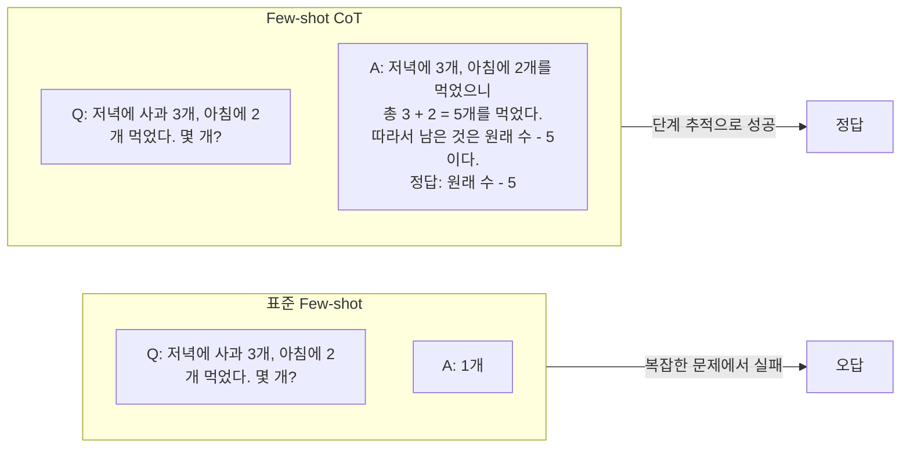
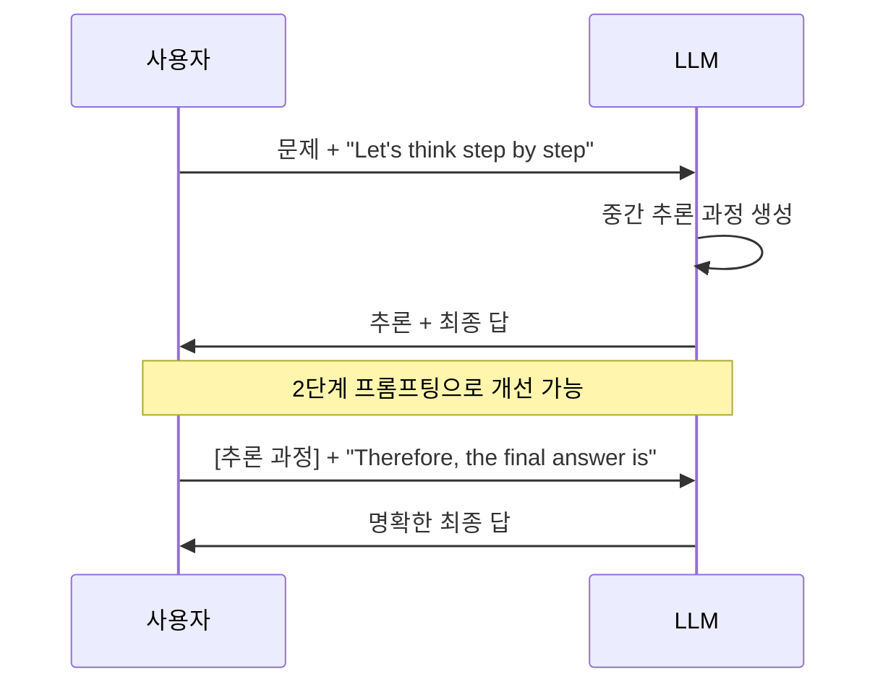
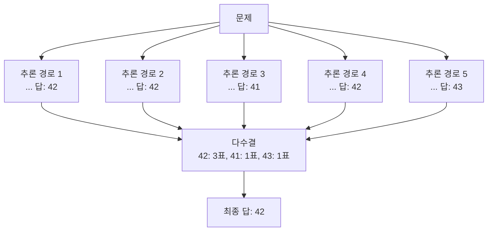

# 체인 오브 사고 프롬프팅 (CoT)

체인 오브 사고(Chain-of-Thought, CoT) 프롬프팅은 LLM이 최종 답을 출력하기 전에 중간 추론 단계를 생성하도록 유도하는 기법이다. Wei et al.(2022)이 Google Brain에서 발표한 논문 "Chain-of-Thought Prompting Elicits Reasoning in Large Language Models"에서 체계적으로 소개되었다.

핵심 아이디어는 단순하다. 답만 제시하는 대신 "문제 → 추론 단계 → 답" 형태로 예시를 제공하거나, 모델 스스로 추론 과정을 작성하도록 유도하면 복잡한 멀티스텝 문제에서 성능이 크게 향상된다.

## Few-shot CoT

Few-shot CoT는 프롬프트에 "문제-추론 과정-답" 형식의 예시를 몇 개 포함한다. 모델은 이 패턴을 학습해 새로운 문제에도 추론 과정을 생성한다. Wei et al.은 8가지 도메인(수학, 상식, 기호 추론 등)에서 일관된 성능 향상을 보였다.

핵심 발견: CoT 효과는 모델 크기 임계값이 존재한다. 약 100B 파라미터 이상에서 CoT가 유의미한 개선을 보이며, 그 이하에서는 오히려 성능이 떨어지기도 한다.

## Zero-shot CoT

Kojima et al.(2022)은 예시 없이도 단 한 문장 "Let's think step by step"을 프롬프트 끝에 붙이는 것만으로 CoT 효과를 얻을 수 있음을 발견했다. 이것이 Zero-shot CoT다.

"Let's think step by step"이 효과적인 이유에 대한 가설: 이 문장이 학습 데이터에서 고품질 추론이 뒤따르는 패턴과 연결되어 있기 때문이라는 설이 있다. 한국어에서는 "단계별로 생각해 봅시다" 또는 "차근차근 풀어보겠습니다"가 유사한 효과를 낼 수 있다.

## Self-Consistency: 다중 경로 다수결

Wang et al.(2022)이 제안한 Self-Consistency는 CoT의 강력한 확장이다. 여러 번 생성(temperature > 0)해 서로 다른 추론 경로를 얻고, 최종 답의 다수결(majority vote)로 결론을 내린다.

Self-Consistency는 단순 greedy decoding 대비 GSM8K에서 ~10%p 추가 향상을 보였다. 단점은 추론 비용이 N배로 증가한다는 것이다.

## CoT의 변형들

| 기법 | 특징 | 대표 논문 |
|------|------|-----------|
| Few-shot CoT | 예시 포함 단계별 추론 | Wei et al. 2022 |
| Zero-shot CoT | "Step by step" 트리거 | Kojima et al. 2022 |
| Self-Consistency | 다중 경로 다수결 | Wang et al. 2022 |
| Least-to-Most | 문제 분해 후 순차 해결 | Zhou et al. 2022 |
| Tree of Thought | 다중 경로 탐색 + 자기 평가 | Yao et al. 2023 |
| ReAct | 추론 + 행동(도구 호출) 교차 | Yao et al. 2022 |

## CoT의 충실도(Faithfulness) 문제

CoT의 핵심적인 한계는 생성된 추론 과정이 실제로 답을 유도했는지 알 수 없다는 점이다.

**충실도 문제**:
- 모델이 "올바른 답"을 먼저 결정하고 그에 맞는 추론을 사후 생성할 수 있다
- 추론 과정의 일부 단계를 수정해도 최종 답이 바뀌지 않는 경우가 발견됨
- Lanham et al.(2023): CoT 단계를 일부러 틀리게 수정해도 모델이 여전히 올바른 답을 내는 경우가 있음

이는 CoT가 "추론의 시뮬레이션"일 수 있다는 우려를 낳는다. 추론 과정이 설명 가능성(explainability)을 제공한다고 믿었지만, 실제로는 인간을 납득시키기 위한 사후 합리화일 수 있다는 것이다.

## 언제 CoT를 사용해야 하는가

- 멀티스텝 수학 문제, 논리 퍼즐, 인과 추론에 효과적
- 단순 분류, 번역, 감성 분석에는 오히려 불필요한 노이즈 추가
- 모델이 작을수록 CoT 효과가 줄어들거나 역전됨
- 속도가 중요한 실시간 시스템보다는 정확도 우선 시스템에 적합

## 관련 문서

- [[chain-of-thought]] - CoT 개념의 상세 기초 문서 (aliases 포함)
- [[tree-of-thought]] - CoT를 다중 경로 탐색으로 확장
- [[big-bench-hard]] - CoT 효과가 극대화되는 벤치마크
- [[gsm8k-benchmark]] - CoT 성능의 표준 수학 벤치마크
- [[rag-original-paper]] - RAG와 CoT 결합으로 검색+추론 파이프라인으로 발전
- [[cot-faithfulness]] - CoT 충실도 문제를 심층 분석한 문서
