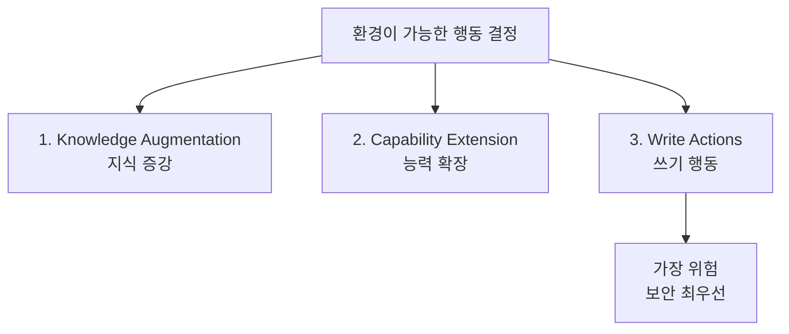
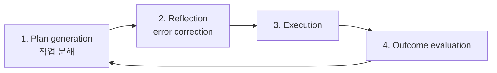

# Agents (Chip Huyen 2025-01)

Chip Huyen의 책 *AI Engineering* (O'Reilly, 2025)의 Agents 섹션을 standalone 블로그 포스트로 발췌·수정한 글.

## 핵심 정의

> "An agent is anything that can perceive its environment and act upon that environment."

에이전트의 두 차원:
- 작동하는 **환경(environment)**
- 수행 가능한 **행동 집합(action set)**

## 환경과 도구 (3가지 도구 카테고리)

### 1. Knowledge Augmentation (지식 증강)
- Text retrievers
- SQL executors
- Web browsing
- Context를 제공하는 APIs

### 2. Capability Extension (능력 확장)
- Calculators
- Code interpreters
- Timezone converters
- Image generators

### 3. Write Actions (쓰기 행동)
- DB updates
- Email responses
- 금융 거래

→ 가장 위험. **보안 최우선**.

## 계획(Planning) 프레임워크

핵심 원칙: **계획과 실행을 분리**.

## Agent 실패 모드

### Planning Failures
- 잘못된 도구 선택
- 유효한 도구지만 무효한 파라미터
- 유효한 도구 + 무효한 파라미터 값
- 목표 실패 (제약 위반)
- Reflection 오류

### Tool Failures
- 잘못된 도구 출력
- 번역 오류

### 효율성 메트릭
- 작업 완료까지의 단계 수
- 작업당 비용
- 행동 시간 분석

## 평가 방법론

K개의 plan을 생성하고 다음 측정:
- 유효한 계획 비율
- 잘못된 도구 호출 빈도
- 파라미터 오류율
- 도구별 실패 패턴

베이스라인 비교:
- 다른 에이전트
- 인간 운영자

도메인 전반에서 단계 수, 비용, 실행 시간 추적.

## 메모

- 게시일: 2025-01-07
- AI Engineering 책의 chapter 발췌
- 책은 O'Reilly 플랫폼 출시 이후 가장 많이 읽힌 책으로 등재
- Chip의 GitHub: `chiphuyen/aie-book`

## 관련 문서

- [[llm-autonomous-agents-lilian-weng]] — Lilian Weng의 에이전트 가이드 (보완)
- [[agentic-ai-foundation]] — 에이전트 기초 개념
- [[agent-evaluation-framework]] — 에이전트 평가 프레임워크
- [[agent-planning-strategies]] — 계획 전략 일반
- [[plan-and-execute-pattern]] — Plan-Execute 패턴
- [[function-calling]] — Tool Use 기반
- [[ai-agent-security]] — Write Actions 보안
