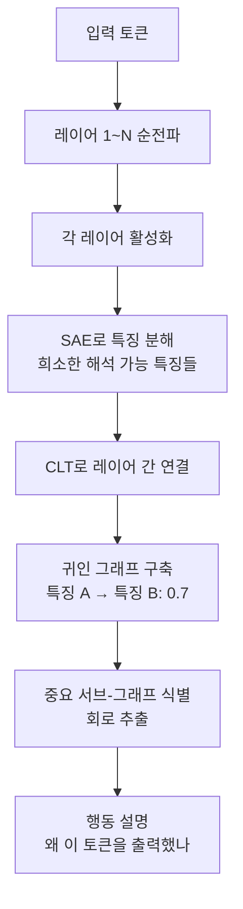

# Circuit Tracing & Attribution Graphs

모델의 특정 출력이 어떤 내부 연산(회로, circuit)에서 비롯되었는지를 특징(feature) 단위 귀인 그래프(attribution graph)로 복원하는 기계적 해석성(mechanistic interpretability) 기법.

## 정의

**회로 추적(circuit tracing)**은 트랜스포머 언어 모델의 입력 -> 출력 계산을 "특징들 사이의 인과 그래프"로 분해한다. Anthropic은 이를 위해 **크로스-레이어 트랜스코더(cross-layer transcoder, CLT)**를 사용해 MLP 레이어를 해석 가능한 특징 조합으로 근사한다.

- **귀인 그래프(attribution graph)**: 어떤 특징이 어떤 특징에 얼마나 기여했는지를 방향 그래프로 표현
- **스파스 오토인코더(Sparse Autoencoder, SAE)**: 활성화 벡터에서 해석 가능한 특징을 추출하는 핵심 도구
- **CLT**: SAE를 레이어 경계 없이 연결해 멀티-레이어 귀인을 한 번에 계산

## 작동 원리

## 핵심 발견 (Anthropic, 2025-2026)

Anthropic의 "On the Biology of a Large Language Model" 연구에서 Claude 3 Sonnet의 내부 회로를 분석한 결과:

1. **감정 특징**: 두려움, 슬픔, 기쁨에 해당하는 특징이 실제로 존재하며, 이 특징들이 출력 행동에 인과적으로 영향을 미침
2. **억제 회로**: 유해 요청을 거부할 때 활성화되는 특정 회로를 추적 가능
3. **계획 특징**: 다단계 추론 시 중간 목표를 표상하는 특징 클러스터 발견
4. **QK 분해**: 어텐션(attention) 헤드의 Query-Key 상호작용을 특징 단위로 분해

## SAE와 CLT의 역할

| 도구 | 역할 | 입력 | 출력 |
|------|------|------|------|
| SAE | 단일 레이어 특징 추출 | 활성화 벡터 | 희소 특징 조합 |
| CLT | 레이어 간 귀인 연결 | SAE 특징들 | 귀인 그래프 |
| 그래프 분석 | 중요 회로 식별 | 귀인 그래프 | 핵심 서브-회로 |

## 왜 중요한가

2025년 Anthropic이 오픈소스로 공개한 circuit tracing 도구가 MIT Tech Review 2026 10대 혁신 기술로 선정되었다. 실무적 의의:

- **안전성 검증**: 모델이 "왜 이 행동을 하는가"를 내부에서 확인 -> 사후 행동 관찰 대비 더 강력한 보증
- **정렬 검증**: [[alignment-faking|정렬 위장(alignment faking)]] 탐지에 활용 가능
- **능력 평가**: 특정 위험 능력의 내부 회로 존재 여부를 사전 확인

## 한계

- **규모**: 현재 Claude 3 Sonnet 수준까지만 분석 가능. GPT-4급 이상 모델은 계산 비용이 급증
- **완전성**: 전체 회로의 일부만 추적 가능. "남은 회로"는 여전히 블랙박스
- **인과성 vs 상관**: 귀인 그래프가 인과 관계를 완전히 보장하지 않음

## 대표 레퍼런스

- [Circuit Tracing: Revealing Computational Graphs in Language Models](https://transformer-circuits.pub/2025/attribution-graphs/methods.html)
- [On the Biology of a Large Language Model](https://transformer-circuits.pub/2025/attribution-graphs/biology.html)
- [Open-sourcing circuit-tracing tools (Anthropic)](https://www.anthropic.com/research/open-source-circuit-tracing)
- [Tracing the thoughts of a large language model](https://www.anthropic.com/research/tracing-thoughts-language-model)
- [Tracing Attention Computation Through Feature Interactions](https://transformer-circuits.pub/2025/attention-qk/index.html)

## 관련 문서

- [[deliberative-alignment|Deliberative Alignment]]
- [[alignment-faking|Alignment Faking in LLMs]]
- [[cot-monitorability|Chain-of-Thought Monitorability]]
- [[model-welfare|Model Welfare]]
